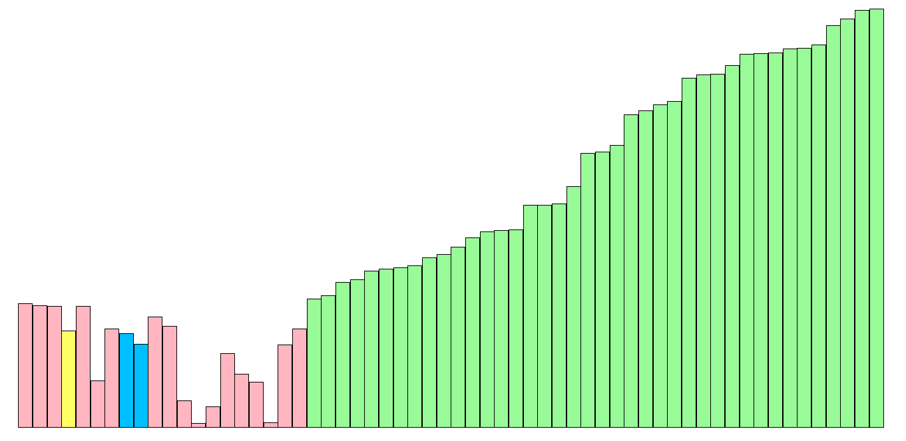
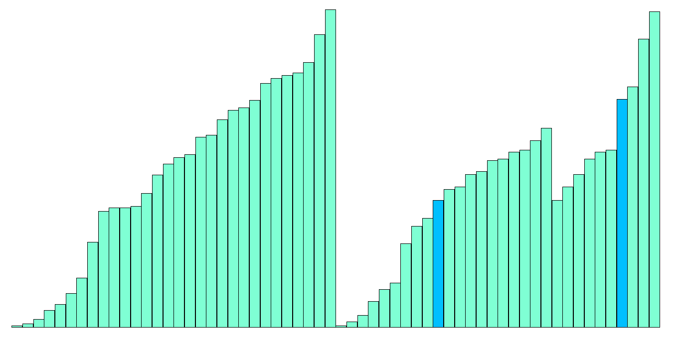

# 排序和查找算法教学软件

作者：2019 级 CS 专业的 ailanxier

简介：一个软 A 课程项目，辅助「数据结构」课程教学使用。

## 开发背景

排序和查找是数据结构和算法设计中的重点。而排序和查找算法比较抽象，在教材书中较难得到形象体现，显得过于枯燥和难以理解，导致学生难以完全掌握算法的本质，缺乏兴趣。

同时老师为了体现算法的流程，需要做大量带动画效果的PPT，而且展示时只能使用有限的几组数据，不够灵活，也不利于学生课下自学。

现有的可视化算法演示网站 [VisuAlgo](https://visualgo.net/zh) 经常卡顿，操作具有一定门槛，不易调节进度和速度，也不利于根据老师的节奏进行上课演示。

我们想开发一款操作简单的演示软件，帮助同学们理解排序和查找算法。

## 使用说明

在本仓库下将 .zip 文件下载到本地，或者到 [本软件原仓库](https://github.com/ailanxier/Visual-Sorting-Searching-Algorithm) 下载。

解压后，打开「排序和查找算法教学软件.exe」即可使用啦。

具体软件使用说明可以点击软件的「帮助」，提供了（简陋的）帮助文档快速入门。如果有用求star。

## 软件截图

> 分别为：
>
> - 快速排序
> - 堆排序
> - 归并排序
> - 归并排序 - 自定义

