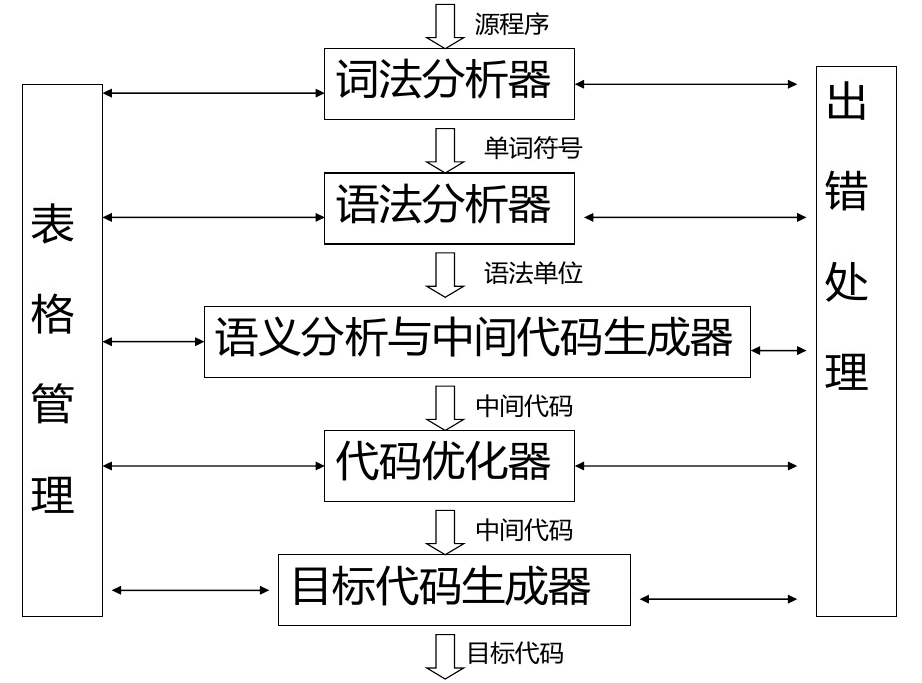
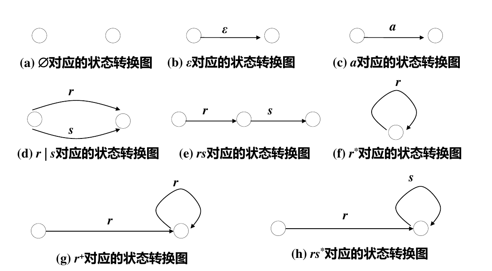

# 编译原理 1：编译器结构与词法分析

## 编译器的结构

​

* 词法分析器从左到右扫描组成源程序的字符串，并将其转换成单词（记号-token）串；同时查词法错误，进行标识符登记——符号表管理。
* 语法分析器的功能是「组词成句」，分层给出程序的组成结构，指出语法错误，制导语义翻译。
* 语义分析器分析由语法分析器识别出来的语法成分的语义，获取标识符的属性，进行语义检查，并对子程序和变量进行静态绑定。
* 中间代码生成器以中间代码的形式实现对语义分析结果进行表示。
* 代码优化器对中间代码进行优化处理，使程序运行能够尽量节省存储空间，更有效地利用机器资源。
* 目标代码生成器完成从中间代码到目标机器上的机器指令代码或汇编代码的转换。

## 编译程序的生成

### T 形图

​

T 形图左边是「源语言」，如 C 语言；右边是「目标语言」，如「x86 机器码」；下方是「用来完成这个转换过程的语言」，如「x86 汇编」。

## 从字符流到单词序列

一段高级语言代码，送入编译器后首先会被进行「词法分析」，将输入的程序代码（字符串）转化成与之「等价」的数据结构——单词序列。词法分析器的输入是一个「平滑的字符流」。空格 ` `、制表符 `\t` 和换行 `\n` 及 `\r` 都是字符。例如：

```C
#include <stdio.h>
int main() {
  int a = 10;
  printf("%d\n", a);
  return 0;
}
```

就是一个字符流。语法分析器的任务是把它分解成下面的一组「单词」：`#include` `<` `stdio.h` `>` `int` `main` `(` `)` `{` `int` `a` `=` `10` `;` `printf` `(` `"` `%d` `"` `)` `,` `a` `)` `;` `return` `0` `;` `}`。容易知道，词法分析器的工作，就是先根据语言的词法规则来识别和组合单词，检查词法，将无意义的空格、换行等剔除，同时忽略注释。词法分析器输出的是与原有代码等价的序列。

### 单词（Token）

单词是程序语言中具有独立意义的最小语法单位。分为下面的类型：

* 关键字：如 `if` `for` 等，又称为「基本字」。
* 标识符：如 `int a;` 中的 `a`，是用来表示变量、函数等名字的单词。
* 常数：以字面形式给出的量，如 `12` `3.14` `'z'` `"HIT"` 等。
* 运算符：如算术运算符 `+` `-` `/`，逻辑运算符 `||` `&&` `^`，关系运算符 `>` `<=` `!=` 等。
* 分界符：如行尾分号 `;`，分隔用逗号 `,` 和各种括号 `{()}` 等。

### 单词的描述

在组织上，单词由「种别」和「属性值」两个部分组成。种别即这个单词的种类，如「关键字」「标识符」「常数」等；「属性值」则根据种别而有不同，如常数的属性值就是这个数本身，而运算符就没有属性值。

例如，对于代码

```C
if (cnt > 7) result = 3.14;
```

下面是对它的单词序列的一种可能的描述：

```plaintext
(if, 0)
(left_parenthesis, 0)
(id, -> cnt)
(greater_than, 0)
(const, 7)
(id, -> result)
(assign, 0)
(const, 3.14)
(semicolon, 0)
```

## 正则文法与正则表达式

文法 $G$ 是一个四元组 $(V, T, P, S)$，其中

* $V$ 是「变元」的有穷集。
* $T$ 是「终结符」的有穷集。在上面的例子中，具体的 `if` `greater_than` 等都是终结符。
* $P$ 是「产生式」的有穷集。一个产生式包含：

  * 一个变元，称为产生式的「头」。
  * 一个产生符号 $\to$。
  * 一个 $(V\cup T)^*$ 中的串，称为产生式的「体」。
* $S$ 是「初始符号」，$S\in V$，是文法开始的地方。

正则文法要求，对 $P$ 中的产生式 $\alpha\to\beta$，均具有形式 $A\to w$ 或 $A\to wB$（$A\to Bw$），其中 $A, B\in V$，$w\in T^+$。例如，表示 Pascal 语言中的「标识符」，可以用下面的正则文法：

$$
\begin{aligned}
  \lang\mathrm{id}\rang&\to A|B|\cdots|Y|Z|a|b|\cdots|y|z \\
  \lang\mathrm{id}\rang&\to\lang\mathrm{id}\rang a|\lang\mathrm{id}\rang b|\cdots|\lang\mathrm{id}\rang z \\
  \lang\mathrm{id}\rang&\to\lang\mathrm{id}\rang A|\lang\mathrm{id}\rang B|\cdots|\lang\mathrm{id}\rang Z \\
  \lang\mathrm{id}\rang&\to\lang\mathrm{id}\rang0|\lang\mathrm{id}\rang1|\cdots|\lang\mathrm{id}\rang9 \\
\end{aligned}
$$

用这样的产生式表示文法很不方便，因此人们发明了正则表达式。上面的方法可以用下面的表达式表示：

$$
\mathrm{letter}(\mathrm{letter}|\mathrm{digit})^*
$$

进一步使用字符类扩展 $\mathrm{letter}$ 和 $\mathrm{digit}$，得到今天计算机中常用的正则表达式：

```plaintext
[A-Za-z][A-Za-z0-9]*
```

可以证明正则文法与正则表达式的表达能力等价。下面是正则表达式与状态机的转换图。

​

## 小结

* 单词的识别相当于正则语言的识别。
* 词法的等价描述形式有正则文法、有穷状态自动机、正则表达式，其中有穷状态自动机可以用状态转换图表示。
