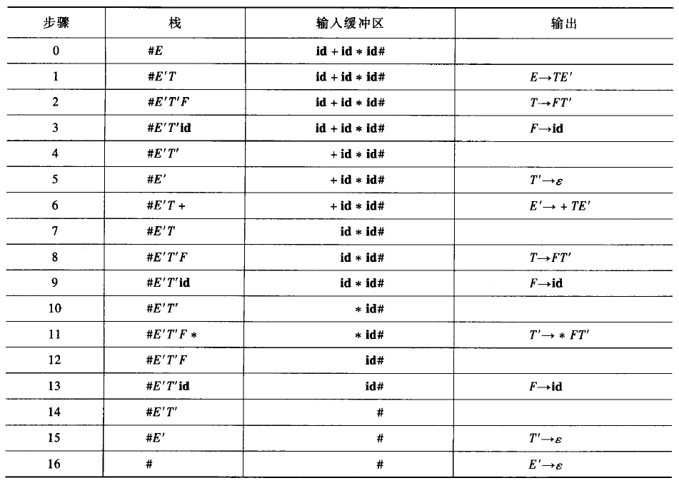
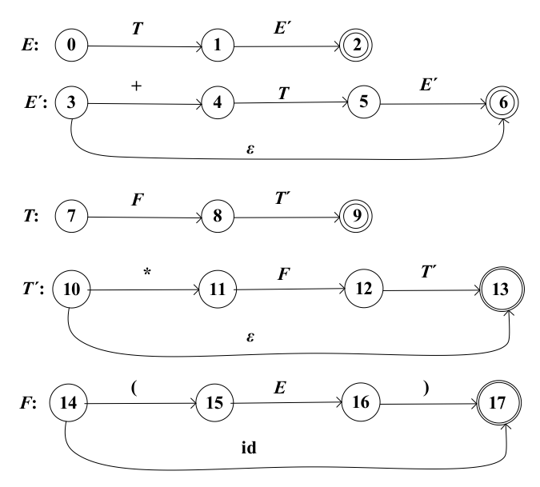
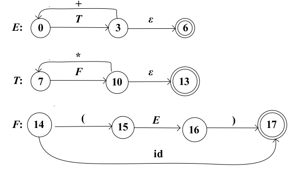
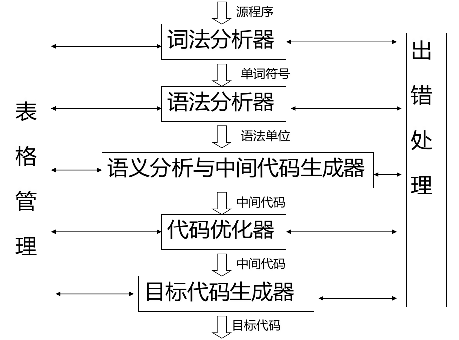
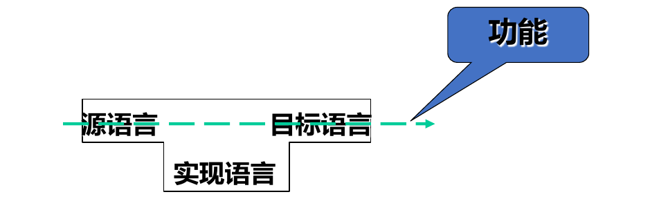
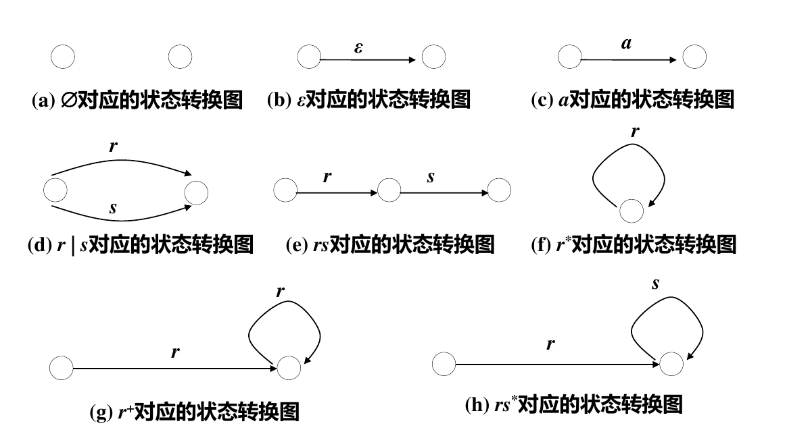

# 编译原理 2：自顶向下的语法分析

词法分析器[^1] 将输入的源代码字符串变成「单词」序列和符号表，相当于「看懂」源程序。而语法分析则需要在词法分析的结果之上，按照给定的文法，构造出一棵「语法树」，相当于理清源程序的结构。

所谓「自顶向下的语法分析」指的是，语法分析的过程是从文法的开始符号出发，寻找一个最左推导。无疑，这是一个「试探」的过程——通过对文法的产生式不断组合尝试，找到一个最终能「套」上形式的推导。这种分析方法存在一些问题，在实际应用它前，我们需要对文法进行一些改造。

## 自顶向下分析存在的问题

### 二义性问题

由于文法构造过程中的不严谨，一个句子在某一文法中可能有两棵或更多不同的语法树，这称为文法的二义性。例如下面的表达式文法：

$$
E\to\mathbf{id}|c|E+E|E-E|E*E|E/E|(E)
$$

那么对于句子 $\mathbf{id}+\mathbf{id}*\mathbf{id}$，是无法区分「先算加」还是「先算乘」两件事的。对于这个句子，先算加和先算乘就对应着两棵不同的语法树，此文法是二义性的。

对于二义性的消除，可以通过重新构造文法来解决。通过引入新的语法变元，可以「强制」确定文法的产生顺序，从而消除二义性。如上面的表达式可以改成

$$
\begin{aligned}
  E &\to E+T|E-T|T \\
  T &\to T*F|T/F|F\\
  F &\to c|\mathbf{id}|(E)
\end{aligned}
$$

来消除二义性。

### 无穷左递归问题

如果文法 $G$ 中存在推导 $A\xRightarrow{+}\alpha A\beta$，称文法 $G$ 是「递归」的。如果 $\alpha=\varepsilon$，称「左递归」；如果推导至少要两步，称「间接递归」，反之若产生式中有 $A\to\alpha A\beta$，称「直接递归」。

如果文法 $G$ 是左递归的，那么会出现无穷推导问题，如对于文法

$$
E\to E+T
$$

就会产生如下的无限循环：

$$
E\Rightarrow E+T\Rightarrow E+T+T\Rightarrow\cdots
$$

可以通过将左递归转化成右递归来消除它们。对于直接左递归产生式 $A\to A\alpha_1|A\alpha_2|\cdots|A\alpha_m|\beta_1|\beta_2|\cdots|\beta_n$（$\beta_i$ 不以 $A$ 开头），可以将它替换为如下的右递归产生式组：

$$
\begin{aligned}
  A &\to \beta_1 A'|\beta_2A'|\cdots|\beta_nA'\\
  A' &\to \alpha_1 A'|\alpha_2A'|\cdots|\alpha_mA'|\varepsilon
\end{aligned}
$$

而对于间接左递归，我们进行下面的过程。对于没有循环推导 $A\xRightarrow{*}A$ 和 $\varepsilon$-产生式 $A\to\varepsilon$ 的文法 $G$，用下面的算法消除所有左递归：

1. 将 $G$ 中的语法变元用 $A_1, A_2,\cdots,A_n$ 重新命名
2. 执行

    ```Scala
    for (i <- 1 to n) {
      for (j <- 1 to (i - 1)) {
        对 A_i -> A_jb，将 A_j 代入
      }
      消除 A_i 中的所有直接左递归
    }
    ```

例如，对于文法：

$$
\begin{aligned}
  S&\to Ac|c\\
  A&\to Bb|b \\
  B&\to Sa|a
\end{aligned}
$$

显然它是间接左递归的（$S\xRightarrow{*}Sabc$）。记 $S, A, B$ 分别为 $A_1, A_2, A_3$。先处理 $S$，即 $i=1$，有

$$
\begin{aligned}
  j=2\Rightarrow S&\to Bbc|bc|c \\
  j=3 \Rightarrow S&\to Sabc|abc|bc|c \\
  \text{消除左递归}\Rightarrow S&\to abcS'|bcS'|cS' \\
  S'&\to abcS'|\varepsilon
\end{aligned}
$$

此时 $S$ 的产生式已经不含有 $A$ 和 $B$，它们不可达，故 $A\to Bb|b$ 和 $B\to Sa|a$ 删去。最终化简结果就是

$$
\begin{aligned}S&\to abcS'|bcS'|cS' \\
  S'&\to abcS'|\varepsilon\end{aligned}
$$

### 回溯问题

前文说过，自顶向下的分析过程是「试探」的过程。试探就有可能探错，因此当试探不成功时，回到上一步推导看是否还有其他候选式的过程就叫做「回溯」。

例如，考虑前面的表达式文法，对 $\mathbf{id} + \mathbf{id} * \mathbf{id}$ 进行推导。从开始符号 $E$ 出发，按产生式的顺序进行试探，有

$$
\begin{aligned}
  & E\Rightarrow T\\
  & E\Rightarrow T \Rightarrow F\\
  & E\Rightarrow T\Rightarrow F\Rightarrow (E)
\end{aligned}
$$

第三行得到的句型 $(E)$ 的第一个字符 $($ 不能与输入串 $\mathbf{id}+\mathbf{id}*\mathbf{id}$ 的任何一个前缀匹配，所以需要回溯到第二行 $E\Rightarrow T\Rightarrow F$，然后选用下一个 $F$ 的产生式 $F\to\mathbf{id}$ 进行匹配。当然这种匹配也是错误的，之后需要不断重复「试探」过程，直到找到一个完整的 $\mathbf{id} + \mathbf{id}* \mathbf{id}$ 的推导为止。

显然，这样不停地回溯对资源的占用是显著的。我们对文法进行改造来减少回溯的次数。这个过程就是「提取左因子」。将具有相同前缀的产生式进行处理，来推迟「试探」的发生。具体来说，对每个语法变元 $A$，找出它的所有候选式的最长公共前缀 $\alpha$，有 $A\to\alpha\beta_1|\alpha\beta_2|\cdots|\alpha\beta_n|\gamma_1|\gamma_2|\cdots|\gamma_m$，将其改成

$$
\begin{aligned}
  A&\to\alpha A'|\gamma_1|\gamma_2|\cdots|\gamma_m\\
  A'&\to\beta_1|\beta_2|\cdots|\beta_n
\end{aligned}
$$

重复上述过程，就能使得所有的产生式都没有两个候选式具有相同的前缀。

## LL(1) 文法

前文提到，要想进行自顶向下的语法分析，对文法本身有很多的要求。同时，前文在介绍回溯时介绍的那种「试探」分析方法是「不确定」的，代价高、效率低。引入一种「确定」的语法分析方法，在这样的背景下显得尤其重要。在那之前，先说明两种「符号集」的概念。

### 首符号集 FIRST(α) 和后随符号集 FOLLOW(A)

设 $\alpha$ 是文法 $G=(V, T, P, S)$ 的符号串，即 $\alpha\in(V\cup T)^*$。对 $\alpha$ 的首符号集 $\mathrm{FIRST}(\alpha)$ 定义如下：

$$
\mathrm{FIRST}(\alpha)=\{a|\alpha\xRightarrow{*}a\beta, a\in T, \beta\in(V\cup T)^*\}
$$

用朴素的语言描述，首符号集就是「**顺着我继续推，能推出的所有式子的最左侧终结符**」。同时，若 $\alpha\xRightarrow{*}\varepsilon$，则 $\varepsilon\in\mathrm{FIRST}(\alpha)$。

再引入一个「后随符号集」的概念。设 $A$ 是 $G$ 的语法变元即 $A\in V$，对 $A$ 的后随符号集定义如下：

$$
\mathrm{FOLLOW}(A)=\{a|S\xRightarrow{*}\alpha Aa\beta, a\in T, \alpha, \beta\in (V\cup T)^*\}
$$

再用朴素的语言描述，后随符号集就是「**从开始符号 $S$ 开始，能推出的式子中，跟在 $A$ 后面的终结符**」。同时，若 $A$ 本身就是某个句型的最右符号，那么句子的结束符号 $\#$ 也在 $\mathrm{FOLLOW}(A)$ 中。

> 规定所有输入的单词序列都是以 $\#$ 结束的，可以理解为文件尾 `EOF`。
>

### LL(1) 文法的引入

考虑 $A$ 是文法 $G$ 的某一语法变元，候选式为 $\alpha_i, i=1, 2,\cdots, m$。若 $\alpha_i$ 都不能推出 $\varepsilon$（即 $\varepsilon\not\in\mathrm{FIRST}(\alpha_i)$），且若对任意输入字符 $a$，$a\in\mathrm{FIRST}(\alpha_i)$ 最多只有一个成立（即，最多只有一个候选式能产生出 $a$ 开头的式子），那么显然当遇到 $a$ 时，产生式的选择是很容易的——找出那个使得 $a\in\mathrm{FIRST}(\alpha_i)$ 成立的 $i$，如果找不到就说明不存在合理的推导。

根据这一分析，扩展到一般情况（不再谈论具体的 $a$），对于文法 $G$ 若有 $A\to\alpha_1|\alpha_2|\cdots|\alpha_m$，且

$$
\left\{
\begin{aligned}
  & \varepsilon\not\in\mathrm{FIRST}(\alpha_1)\cup\mathrm{FIRST}(\alpha_2)\cup\cdots\mathrm{FIRST}(\alpha_m) \\
  & \mathrm{FIRST}(\alpha_i)\cap\mathrm{FIRST}(\alpha_j)=\varnothing, \forall i\neq j\in[1, m]
\end{aligned}
\right.
$$

则进行确定的自顶向下分析是容易的。只要根据输入 $a$ 是否在当前句型的最左语法变元 $A$ 的各候选式的首符号集中即可进行分析。

但是，当存在 $\alpha$ 能推出 $\varepsilon$ 时，问题会变得复杂。我们无法抉择「这一步凑出 $a$」和「这一步用 $\varepsilon$ 顶住，下一步再凑出 $a$」。这时，我们可以借助后随符号集。如果某个 $A$ 的候选 $\alpha_j$ 能推出 $\varepsilon$，但也只有 $\alpha_j$ 能产生出 $a$ 开头的式子，如果有 $a\in\mathrm{FOLLOW}(A)$，那就可以选 $\alpha_j$。

扩展到一般情况，对文法 $G$ 若有 $A\to\alpha_1|\alpha_2|\cdots|\alpha_m$，且如果有 $\alpha_j\xRightarrow{*}\varepsilon$ 就有 $\forall i\in[1, m], i\ne j, \mathrm{FIRST}(\alpha_i)\cap\mathrm{FOLLOW}(A)=\varnothing$，那么也可以进行确定的自顶向下的分析。

将两种情况合并，得到能进行确定的自顶向下分析文法的充要条件：$G$ 的任意两个有相同左部的产生式 $A\to\alpha|\beta$ 满足：

* **第 1 条**：若 $\alpha$ 和 $\beta$ 都不能推导出 $\varepsilon$，则 $\mathrm{FIRST}(\alpha)\cap\mathrm{FIRST}(\beta)=\varnothing$。
* **第 2 条**：$\alpha$ 和 $\beta$ 至多只有一个能推导出 $\varepsilon$。
* **第 3 条**：若 $\beta\xRightarrow{*}\varepsilon$，则 $\mathrm{FIRST}(\alpha)\cap\mathrm{FOLLOW}(A)=\varnothing$。

将满足这些条件的文法称为 LL(1) 文法，即用于「自左向右扫描，产生最左推导，每次读入一个字符」的文法。LL(1) 文法没有二义性，不含左递归，可以进行确定的自顶向下分析。

### LL(1) 文法的判定

判定一个文法是否是 LL(1) 文法，先要写出它所有的语法变元的首字符集和后随字符集。以下面的文法为例（保留加法和乘法的表达式）：

$$
\begin{aligned}
  E&=TE'\\
  E'&=+TE'|\varepsilon \\
  T&=FT' \\
  T'&=*FT'|\varepsilon \\
  F&=\mathbf{id}|(E)
\end{aligned}
$$

对 $\mathrm{FIRST}$ 集，先从终结符开始写：

$$
\begin{aligned}
  & \mathrm{FIRST}(\mathbf{id})=\{\mathbf{id}\} \\
  & \mathrm{FIRST}(()=\{(\} \\
  & \mathrm{FIRST}())=\{)\} \\
  & \mathrm{FIRST}(+)=\{+\} \\
  & \mathrm{FIRST}(*)=\{*\} \\
\end{aligned}
$$

接着，对于每一个产生式，它的 $\mathrm{FIRST}$ 集是它右部各个候选式最左元素的 $\mathrm{FIRST}$ 集的并。如对于 $F$，有

$$
\begin{aligned}
  \mathrm{FIRST}(F)=\mathrm{FIRST}(\mathbf{id})\cup\mathrm{FIRST}(()=\{\mathbf{id}, (\}
\end{aligned}
$$

同理

$$
\begin{aligned}
  & \mathrm{FIRST}(T')=\mathrm{FIRST}(*)\cup\{\varepsilon\}=\{*, \varepsilon\} \\
  & \mathrm{FIRST}(E')=\{+,\varepsilon\} \\
  & \mathrm{FIRST}(T)=\mathrm{FIRST}(F)=\{\mathbf{id}, (\}\\
  & \mathrm{FIRST}(E)=\mathrm{FIRST}(T)=\{\mathbf{id}, (\}
\end{aligned}
$$

而 $\mathrm{FOLLOW}$ 集的计算略显麻烦。对于 $G=(V, T, P, S)$，我们执行下面的算法：

1. $\forall X\in V$，$\mathrm{FOLLOW}=\varnothing$。
2. $\mathrm{FOLLOW}(S)=\{\#\}$。
3. 对 $\forall A\in V$，重复操作直到不变：

    1. 若有 $A\to \alpha\textcolor{red}{B} \textcolor{blue}{\beta}$，则 $\mathrm{FOLLOW}(\textcolor{red}B)$ 在原来的基础上并一个 $\mathrm{FIRST}(\textcolor{blue}\beta)-\{\varepsilon\}$。
    2. 若有 $\textcolor{purple}A\to\alpha \textcolor{red}B$ 或 $\textcolor{purple}A\to\alpha \textcolor{red}B\beta$ 且 $\beta\xRightarrow{*}\varepsilon$，则 $\mathrm{FOLLOW}(\textcolor{red}B)$ 在原来的基础上并一个 $\mathrm{FOLLOW}(\textcolor{purple}A)$。

仍然以上面的例子为例。首先所有变元的 $\mathrm{FOLLOW}$ 集都是 $\varnothing$，但 $E$ 的是 $\{\#\}$。

对于每一个语法变元，观察每个产生式的右部去「找」它们：

* 对于 $E$，其只在 $F\to(E)$ 中出现，符合格式 $A\to\alpha B\beta$，故 $\mathrm{FOLLOW}(E)$ 并上 $\mathrm{FIRST}(\beta)-\{\varepsilon\}$ 得到 $\{\#, )\}$。
* 对于 $E'$，有两次出现：

  * $E\to TE'$，符合格式 $A\to\alpha B$，所以并上 $\mathrm{FOLLOW}(E)$ 有 $\{\#, )\}$。
  * $E'\to+TE'$，符合格式 $A\to\alpha B$，按理说要并上 $\mathrm{FOLLOW}(E')$ 但不用自己并自己了。
* 对于 $T$，有两次出现：

  * $E\to TE'$，符合格式 $A\to\alpha B\beta$（$\beta\xRightarrow{*}\varepsilon$）。先并上 $\mathrm{FIRST}(E')-\{\varepsilon\}$（第一条 $\alpha B\beta$），再并上 $\mathrm{FOLLOW}(A)$（第二条）。
  * $E'\to+TE'$，在上条基础上并上 $\mathrm{FOLLOW}(E')$。
* 对于 $T'$，并上 $\mathrm{FOLLOW}(T)$。分析略。
* 对于 $F$，并上 $\mathrm{FIRST}(T')$、$\mathrm{FOLLOW}(T)$ 和 $\mathrm{FOLLOW}(T')$。分析略。

容易写出各个集合具体的内容。

在写出各个 $\mathrm{FIRST}$ 和 $\mathrm{FOLLOW}$ 集后，我们就能简单地用定义来判定一个文法是否是 LL(1) 文法了。还是以上面的例子为例，我们只要关注候选式多于一个的产生式。有

* $E'\to+TE'|\varepsilon$，满足 $\mathrm{FIRST}(+TE')=\mathrm{FIRST}(+)=+\not\in\mathrm{FOLLOW}(E')$，满足第 2+3 条。
* $T'\to*FT'|\varepsilon$，同样满足 $\mathrm{FIRST}(*FT')\not\in\mathrm{FOLLOW}(T')$，满足 2+3 条。
* $F\to(E)|\mathbf{id}$，满足 $\mathrm{FIRST}((E))\cap\mathrm{FIRST}(\mathbf{id})=\varnothing$，满足第 1 条。

所以上面例子的简化表达式文法是 LL(1) 文法。

## 预测分析法

预测分析法是一种对 LL(1) 文法执行确定的自顶向下分析的方法。

### 预测分析法的过程

预测分析法的分析过程可以类比成一台带有栈的自动机：在分析过程中，系统维护一张「分析表」（从文法构造而来）和一个栈。系统每读入一个字符，就根据分析表对栈顶元素进行操作。栈顶元素就是当前分析的最左语法变元。

以上面的简化表达式文法为例。它的分析表如下（构造方法后文提及）：

|栈顶⬇️读入➡️<br />|$\mathbf{id}$<br />|$+$<br />|$*$|$($|$)$<br />|$\#$|
| --------------------| ----------------------| ----------------------| ---------------| --------------| ----------------------| --------------------|
|$E$|$\to TE'$|||$\to TE'$|||
|$E'$||$\to+TE'$|||$\to\varepsilon$|$\to\varepsilon$|
|$T$|$\to FT'$|||$\to FT'$|||
|$T'$||$\to\varepsilon$<br />|$\to*FT'$<br />||$\to\varepsilon$<br />|$\to\varepsilon$|
|$F$|$\to\mathbf{id}$<br />|||$\to(E)$<br />|||

现在我们读入串 $\mathbf{id}+\mathbf{id}*\mathbf{id}$。起始时，栈底为 $\#$，栈中有一个元素即起始变元 $E$。每读入一个字符，就在表格中根据当前的「栈顶」和「读入」将栈顶元素进行对应的替换。靠左方的符号在栈的上方。

这个替换是可以进行多次的，直到栈顶符号和当前输入符号相同时，它们才能「消去」，此时这个符号的归约完成。下表是整个过程分析的过程。

​

### 分析表的构造

显然，预测分析法的关键是如何从文法自动、高效地构造出分析表。事实上，构造它的算法非常简单。对于文法 $G$ 的每个产生式 $A\to\alpha$，执行：

1. 对 $\forall a\in\mathrm{FIRST}(\alpha)$，将 $A\to\alpha$ 填入 $M[A, a]$，即表格中「栈顶 $A$ 输入 $a$」的格子。
2. 如果 $\varepsilon\in\mathrm{FIRST}(\alpha)$，则对 $\forall a\in \mathrm{FOLLOW}(A)$，将 $A\to\alpha$ 填入 $M[A, a]$。
3. 如果 $\varepsilon\in\mathrm{FIRST}(\alpha)$ 且 $\#\in\mathrm{FOLLOW}(A)$，则将 $A\to\alpha$ 填入 $M[A, \#]$。

观察我们的的简单表达式文法，容易写出和上文一样的分析表。事实上，就是我们之前对 LL(1) 文法分析过程的规范化记录。

## 递归下降分析法

所谓「递归下降分析法」，是指根据每个候选式的结构，为文法的每个语法变元编写一个子处理程序来识别其对应的语法成分。例如，对于产生式 $E'\to+TE'$，它的处理程序即是

```Scala
def E'() = {
  match('+')
  T()
  E'()
}
```

显然这样的程序是可以递归调用的。递归下降分析法也仅适用于 LL(1) 文法。

### 语法图

将产生式描述的「产生」过程描述成状态机，这些状态机的状态图就称为「语法图」。上面的表达式方法的语法图如下：

​

过多的递归会降低性能，我们可以通过化简语法图来减少递归的次数。化简之后的语法图为：

​

### 递归下降过程

在启动时，机器状态为状态 0（即起始符号的第一个状态），输入指针指向第一个字符。

在某个时刻，机器在状态 $s$，状态 $s$ 到状态 $t$ 有一条标记为 $X$ 的边。

* 如果 $X$ 是终止符 $a$，且指针刚好指向的也是 $a$，则指针移动，进入状态 $t$。
* 如果 $X$ 是语法变元 $A$，则指针不动，状态跳转到 $A$ 的初始状态。现在，重复这些过程，直到状态进入 $A$ 的终止状态，就立即转移到 $t$ 状态。
* 如果 $X$ 是 $\varepsilon$，则指针不动，直接进入状态 $t$。

以 $\mathbf{id}+\mathbf{id}*\mathbf{id}$ 为例：

1. 状态 0，指向 $\mathbf{id}$，到状态 3 有 $T$ 标记的边，转移到状态 7。

    1. 状态 7，指向 $\mathbf{id}$，到状态 10 有 $F$ 标记的边，转移到状态 14。

        1. 状态 14，指向 $\mathbf{id}$，转移到状态 17，指针前移。
    2. 状态 10，指向 $+$，$\varepsilon$ 转移到状态 13。
2. 状态 3，指向 $+$，转移到状态 0，指针前移。
3. 状态 0，指向 $\mathbf{id}$，转移到状态 7。

    1. 状态 7，指向 $\mathbf{id}$，到状态 10 有 $F$ 标记的边，转移到状态 14。

        1. 状态 14，指向 $\mathbf{id}$，转移到状态 17，指针前移。
    2. 状态 10，指向 $*$，转移到状态 7，指针前移。
    3. 状态 7，指向 $\mathbf{id}$，转移到状态 14。

        1. 状态 14，指向 $\mathbf{id}$，转移到状态 17，指针移动到字符串尾。
    4. 状态 10，转移到状态 13
4. 状态 3，转移到状态 6，结束。

## 小结

* 自顶向下分析法是从文法的起点开始，构造出给定句子的一个最左推导，需要解决文法二义性问题、回溯问题和无穷左递归问题。
* LL(1) 是一类文法，它可以进行确定的自顶向下分析。利用 $\mathrm{FIRST}$ 集和 $\mathrm{FOLLOW}$ 集可以判定一个文法是否是 LL(1) 文法。
* 预测分析法和递归下降分析法是两种适用于 LL(1) 文法的确定自顶向下分析法。

*本节笔记到此结束。*


[^1]: # 编译原理 1：编译器结构与词法分析

    ## 编译器的结构

    ​

    * 词法分析器从左到右扫描组成源程序的字符串，并将其转换成单词（记号-token）串；同时查词法错误，进行标识符登记——符号表管理。
    * 语法分析器的功能是「组词成句」，分层给出程序的组成结构，指出语法错误，制导语义翻译。
    * 语义分析器分析由语法分析器识别出来的语法成分的语义，获取标识符的属性，进行语义检查，并对子程序和变量进行静态绑定。
    * 中间代码生成器以中间代码的形式实现对语义分析结果进行表示。
    * 代码优化器对中间代码进行优化处理，使程序运行能够尽量节省存储空间，更有效地利用机器资源。
    * 目标代码生成器完成从中间代码到目标机器上的机器指令代码或汇编代码的转换。

    ## 编译程序的生成

    ### T 形图

    ​

    T 形图左边是「源语言」，如 C 语言；右边是「目标语言」，如「x86 机器码」；下方是「用来完成这个转换过程的语言」，如「x86 汇编」。

    ## 从字符流到单词序列

    一段高级语言代码，送入编译器后首先会被进行「词法分析」，将输入的程序代码（字符串）转化成与之「等价」的数据结构——单词序列。词法分析器的输入是一个「平滑的字符流」。空格 ` `、制表符 `\t` 和换行 `\n` 及 `\r` 都是字符。例如：

    ```C
    #include <stdio.h>
    int main() {
      int a = 10;
      printf("%d\n", a);
      return 0;
    }
    ```

    就是一个字符流。语法分析器的任务是把它分解成下面的一组「单词」：`#include` `<` `stdio.h` `>` `int` `main` `(` `)` `{` `int` `a` `=` `10` `;` `printf` `(` `"` `%d` `"` `)` `,` `a` `)` `;` `return` `0` `;` `}`。容易知道，词法分析器的工作，就是先根据语言的词法规则来识别和组合单词，检查词法，将无意义的空格、换行等剔除，同时忽略注释。词法分析器输出的是与原有代码等价的序列。

    ### 单词（Token）

    单词是程序语言中具有独立意义的最小语法单位。分为下面的类型：

    * 关键字：如 `if` `for` 等，又称为「基本字」。
    * 标识符：如 `int a;` 中的 `a`，是用来表示变量、函数等名字的单词。
    * 常数：以字面形式给出的量，如 `12` `3.14` `'z'` `"HIT"` 等。
    * 运算符：如算术运算符 `+` `-` `/`，逻辑运算符 `||` `&&` `^`，关系运算符 `>` `<=` `!=` 等。
    * 分界符：如行尾分号 `;`，分隔用逗号 `,` 和各种括号 `{()}` 等。

    ### 单词的描述

    在组织上，单词由「种别」和「属性值」两个部分组成。种别即这个单词的种类，如「关键字」「标识符」「常数」等；「属性值」则根据种别而有不同，如常数的属性值就是这个数本身，而运算符就没有属性值。

    例如，对于代码

    ```C
    if (cnt > 7) result = 3.14;
    ```

    下面是对它的单词序列的一种可能的描述：

    ```plaintext
    (if, 0)
    (left_parenthesis, 0)
    (id, -> cnt)
    (greater_than, 0)
    (const, 7)
    (id, -> result)
    (assign, 0)
    (const, 3.14)
    (semicolon, 0)
    ```

    ## 正则文法与正则表达式

    文法 $G$ 是一个四元组 $(V, T, P, S)$，其中

    * $V$ 是「变元」的有穷集。
    * $T$ 是「终结符」的有穷集。在上面的例子中，具体的 `if` `greater_than` 等都是终结符。
    * $P$ 是「产生式」的有穷集。一个产生式包含：

      * 一个变元，称为产生式的「头」。
      * 一个产生符号 $\to$。
      * 一个 $(V\cup T)^*$ 中的串，称为产生式的「体」。
    * $S$ 是「初始符号」，$S\in V$，是文法开始的地方。

    正则文法要求，对 $P$ 中的产生式 $\alpha\to\beta$，均具有形式 $A\to w$ 或 $A\to wB$（$A\to Bw$），其中 $A, B\in V$，$w\in T^+$。例如，表示 Pascal 语言中的「标识符」，可以用下面的正则文法：

    $$
    \begin{aligned}
      \lang\mathrm{id}\rang&\to A|B|\cdots|Y|Z|a|b|\cdots|y|z \\
      \lang\mathrm{id}\rang&\to\lang\mathrm{id}\rang a|\lang\mathrm{id}\rang b|\cdots|\lang\mathrm{id}\rang z \\
      \lang\mathrm{id}\rang&\to\lang\mathrm{id}\rang A|\lang\mathrm{id}\rang B|\cdots|\lang\mathrm{id}\rang Z \\
      \lang\mathrm{id}\rang&\to\lang\mathrm{id}\rang0|\lang\mathrm{id}\rang1|\cdots|\lang\mathrm{id}\rang9 \\
    \end{aligned}
    $$

    用这样的产生式表示文法很不方便，因此人们发明了正则表达式。上面的方法可以用下面的表达式表示：

    $$
    \mathrm{letter}(\mathrm{letter}|\mathrm{digit})^*
    $$

    进一步使用字符类扩展 $\mathrm{letter}$ 和 $\mathrm{digit}$，得到今天计算机中常用的正则表达式：

    ```plaintext
    [A-Za-z][A-Za-z0-9]*
    ```

    可以证明正则文法与正则表达式的表达能力等价。下面是正则表达式与状态机的转换图。

    ​

    ## 小结

    * 单词的识别相当于正则语言的识别。
    * 词法的等价描述形式有正则文法、有穷状态自动机、正则表达式，其中有穷状态自动机可以用状态转换图表示。
