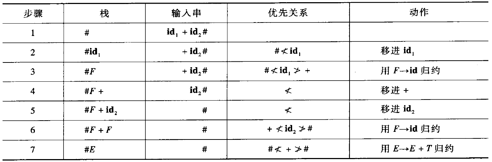
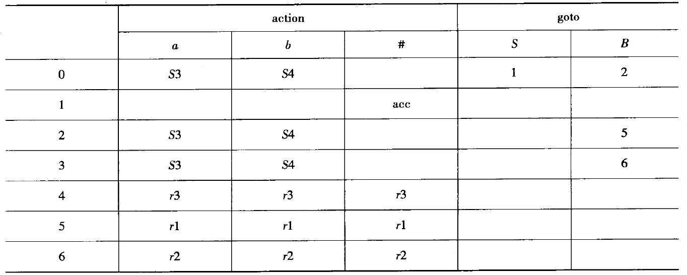
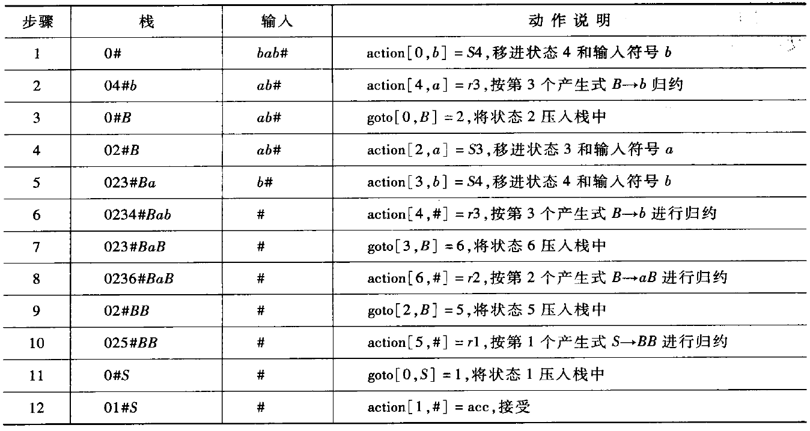
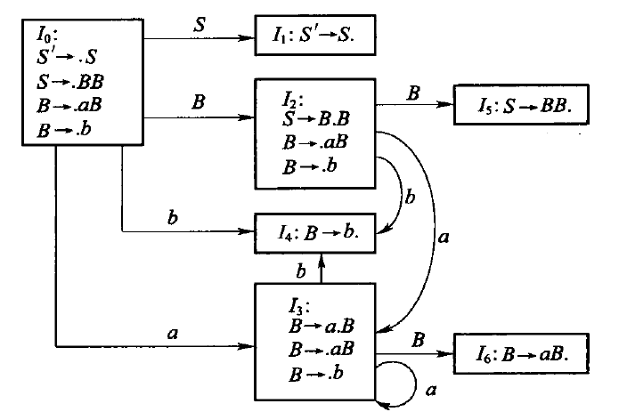
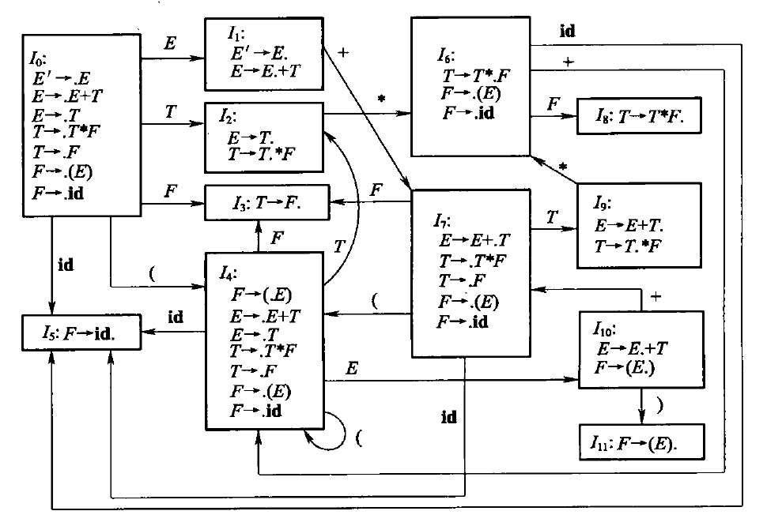
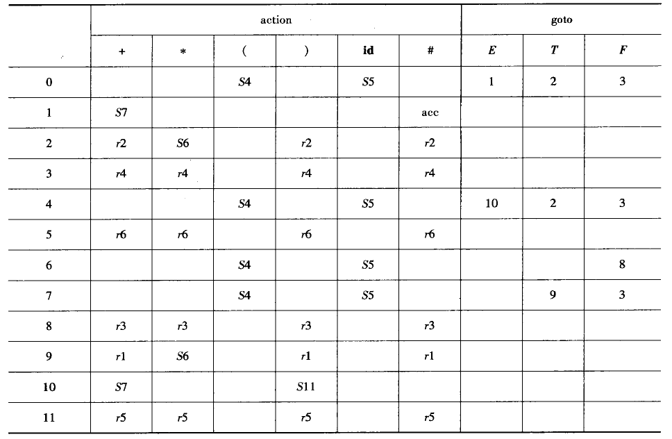
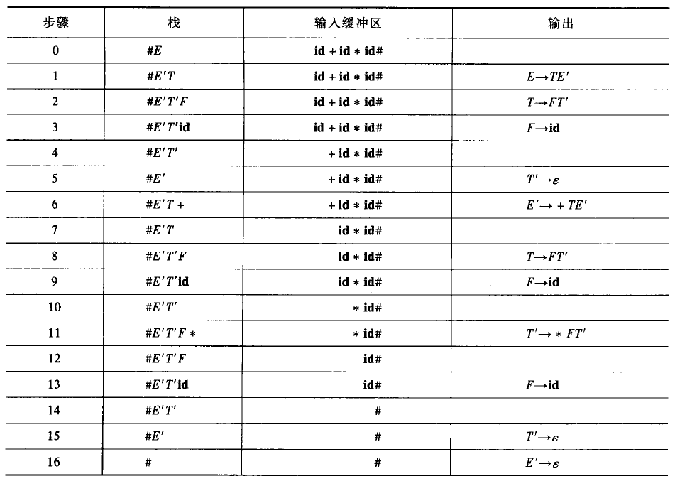
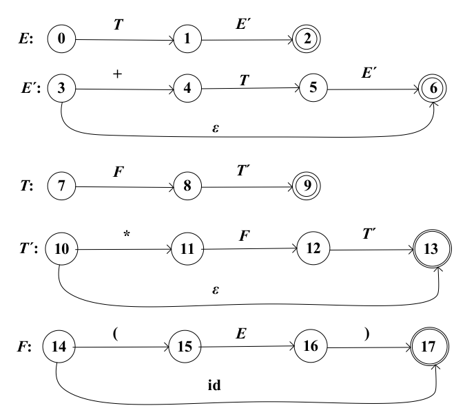
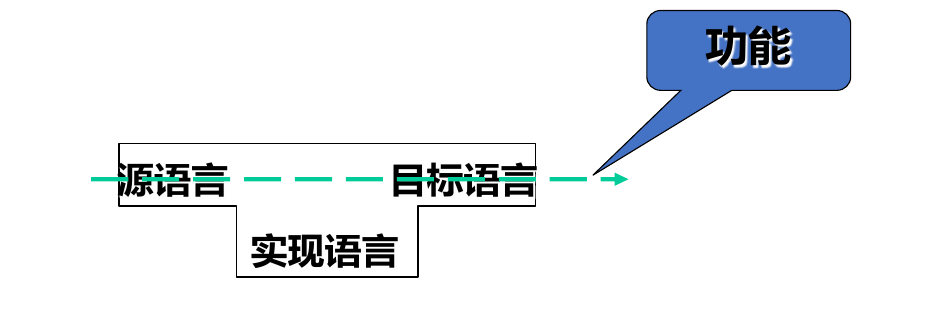

# 编译原理 3：自底向上的语法分析

我们在之前提到了 自顶向下的语法分析[^1]，它之所以「自顶向下」，是因为它的分析过程是从文法出发去「套」句子（输入的符号串）。这一节我们的分析是「自底向上」的，即从句子出发去「套」文法。具体来说，对于句子 $w$，我们从左到右扫描它，寻找它的一个最左归约。

在分析的过程中，如果当前句型的一个最左子串与某一产生式的右部匹配，我们就用这个产生式的左部代替那个子串。如果每一步都能合理地选择子串，最终只剩下一个文法开始符号，那么整个句子就是符合文法的。每次归约的子串称为相应句型的「句柄」，顾名思义就是这个句子「生长」的依附点。「找句柄」，就是分析过程的学问所在。

## 自底向上分析的移进-规约法

自底向上的分析主要使用一种叫做「移进-规约」法的分析方法，本小节会说明它的思路和过程。

### 移进-规约分析

与预测分析法的带栈自动机类似，移进-规约法也是一个带栈的自动机，它同样在一张分析表的指导下动作。

启动时，栈底元素为 $\#$。机器自左向右地扫描输入串 $w$，不停地将扫描到的符号压栈。与此同时，检查栈顶是否出现句柄 $\alpha$ 即某个产生式 $A\to\alpha$ 的右部，若出现则将句柄用 $A$ 进行替换。以下面的文法为例：

$$
\begin{aligned}
  E&\to E+E \\
  E&\to E*E \\
  E&\to (E) \\
  E&\to\mathbf{id}
\end{aligned}
$$

对句子 $\mathbf{id}+\mathbf{id}*\mathbf{id}$ 的移进-规约的过程如下：

|#步|栈|输入缓冲区|动作|
| -----| -----------------------| -----------------| -----------------------|
|1|$\#$|`id+id*id#`<br />|移进<br />|
|2|$\#\mathbf{id}$|`+id*id#`<br />|$E\to\mathbf{id}$|
|3|$\#E$<br />|`+id*id#`|移进<br />|
|4|$\#E+$|`id*id#`<br />|移进<br />|
|5|$\#E+\mathbf{id}$<br />|`*id#`|$E\to\mathbf{id}$<br />|
|6|$\#E+E$|`*id#`|$E\to E+E$|
|7|$\#E$|`*id#`|移进|
|8|$\#E*$|`id#`|移进<br />|
|9|$\#E*\mathbf{id}$|`#`|$E\to\mathbf{id}$|
|10|$\#E*E$|`#`|$E\to E*E$<br />|
|11|$\#E$|`#`|停机<br />|

当然，我们在上节已经提到这个文法是有二义性的，因此还存在一种与上述过程不同的「移进-规约」过程。

在整个移进-规约的过程中，一个关键问题是「如何判定栈顶出现了句柄」，或者说「如何确定句柄的起始位置和结束位置」。对这个问题的不同解决办法造就了不同的移进-规约分析法。

### 文法符号的优先级

正如表达式需要先计算乘除法后计算加减法一样，文法符号之间可能有优先关系，使得句柄内的各符号具有同样的优先级，但总是高于句柄外符号的优先级。用 $\equiv$ 表示优先级相同，用 $\nless$ 和 $\ngtr$ 表示优先级的大小关系，设现在有句型 $X_1X_2\cdots X_n$，若有

$$
X_1X_2\cdots X_{i-1}\nless X_i\equiv X_{i+1}\equiv\cdots\equiv X_{j-1}\equiv X_j\ngtr X_{j+1}X_{j+2}\cdots X_n
$$

此时 $X_iX_{i+1}\cdots X_j$ 就是句柄，句柄中的符号同时归约。如果某个文法各个符号之间的优先关系不冲突（确定），则利用这套优先关系可以识别任意句型的句柄，这样的文法称为「简单优先文法」，这种分析方法称为「简单优先分析法」。

再观察上面算术表达式的文法，发现其有一个特征：不存在哪个产生式的右部有两个相邻的语法变元。有这样的特征的文法称为「算符文法」。如果各终结符之间的优先关系不冲突，则称「算符优先文法」。

后文会深入介绍这些文法的细节。

## 算符优先分析法

所谓的「算符优先分析法」，是将句型中的终结符作为「算符」，然后定义算符之间的优先关系，利用这种关系寻找句柄来归约。在某个句型中相邻（允许中间有一个语法变元）的任意两个终结符 $a$ 和 $b$ 之间可能存在 $a\nless b$、$a\ngtr b$ 和 $a\equiv b$ 三种关系，在这样的关系之上，我们建立一套文法体系——「算符优先文法」。

考虑算术表达式文法 $G$：

$$
\begin{aligned}
  E&\to E+E \\
  E&\to E-E \\
  E&\to E*E \\
  E&\to E/E \\
  E&\to (E) \\
  E&\to\mathbf{id}
\end{aligned}
$$

其所有产生式的右部都没有两个语法变元直接相邻，因此它不会产生 $\cdots E_1E_2\cdots$ 这样的句型。这种文法我们称为算符文法。

另一方面，我们定义算符文法中的终结符归约顺序。假设 $G$ 不含 $\varepsilon$-产生式，$A$、$B$ 和 $C$ 都是 $G$ 的语法变元，$G$ 的任何一对终结符 $a$ 和 $b$ 的关系定义为：

* $a\equiv b$，当且仅当 $G$ 中有 $A\to\cdots ab\cdots$ 或 $A\to\cdots aBb\cdots$ 这样的产生式。
* $a\nless b$，当且仅当 $G$ 中有 $A\to\cdots aB\cdots$ 的产生式，且要么 $B\xRightarrow{+}b\cdots$ 要么 $B\xRightarrow{+}Cb\cdots$。
* $a\ngtr b$，当且仅当 $G$ 中有 $A\to\cdots Bb\cdots$ 的产生式，且要么 $B\xRightarrow{+}\cdots a$ 要么 $B\xRightarrow{+}\cdots aC$。
* $a$ 与 $b$ 无关，当且仅当 $a$ 和 $b$ 在 $G$ 的任何句型中都不相邻。

如果算符文法 $G$ 的任何一对终结符都满足且仅满足上述关系之一，称 $G$ 为算符优先文法。上面的算术表达式文法不是算符优先文法，因为其 $+$ 和 $*$ 的优先关系不能确定。

### 算符优先矩阵

算符优先矩阵是用来描述任意两个终结符之间优先级关系的矩阵，或者说，「表」。从上面的 $a$ 和 $b$ 关系可以知道，对于 $\nless$ 关系，我们需要找到 $A\to\cdots aB\cdots$ 中 $B$ 能推出的所有最左终结符。同理，对于 $\ngtr$ 关系，我们需要找到 $A\to\cdots Bb\cdots$ 中 $B$ 能推出的所有最右终结符。定义下面的两个集。

$$
\begin{aligned}
&   \mathrm{FIRSTOP}(B)=\{b|B\xRightarrow{+}b\cdots\,\text{或}\,B\xRightarrow{+}Cb\cdots ,b\in T, C\in V\} \\
 &  \mathrm{LASTOP}(B)=\{a|B\xRightarrow{+}\cdots a\,\text{或}\,B\xRightarrow{+}\cdots aC, a\in T, C\in V\}
\end{aligned}
$$

此时很容易求出所有的优先关系。假设某产生式右部形如 $\cdots aB\cdots$，则 $\forall b\in\mathrm{FIRSTOP}(B)$ 有 $a\nless b$。如果某产生式右部形如 $\cdots Bb\cdots$，则 $\forall c\in\mathrm{LASTOP}(B)$ 有 $\textcolor{red}{c\ngtr b}$。注意 $a\nless b$ 不代表 $b \ngtr a$。考虑完善后的算术表达式文法 $G_e$：

$$
\begin{aligned}
  E &\to T \\
  E &\to E + T\\
  E &\to E-T \\
  T&\to F \\
  T &\to T*F \\
  T &\to T/F \\
  F&\to (E) \\
  F&\to \mathbf{id}
\end{aligned}
$$

写出 $E$、$T$ 和 $F$ 的 $\mathrm{FIRSTOP}$ 和 $\mathrm{LASTOP}$ 集：

$$
\begin{aligned}
  & \mathrm{FIRSTOP}(E)=\{\mathbf{id}, (, *, /, +, -\} \\
  & \mathrm{FIRSTOP}(T)=\{\mathbf{id}, (, *, /\} \\
  & \mathrm{FIRSTOP}(F)=\{\mathbf{id}, (\} \\
  & \mathrm{LASTOP}(E)=\{\mathbf{id}, ), *, /, +, -\} \\
  & \mathrm{LASTOP}(T)=\{\mathbf{id}, ), *, /\} \\
  & \mathrm{LASTOP}(F)=\{\mathbf{id}, )\}
\end{aligned}
$$

其算符优先矩阵为：

|<br />|$+$|$-$|$*$|$/$<br />|$($|$)$|$\mathbf{id}$|
| -----------------| -------------| -------------| --------------| --------------| --------------| -------------| -----------------|
|$+$|$\ngtr$<br />|$\ngtr$<br />|$\nless$|$\nless$|$\nless$<br />|$\ngtr$<br />|$\nless$|
|$-$|$\ngtr$<br />|$\ngtr$<br />|$\nless$<br />|$\nless$<br />|$\nless$<br />|$\ngtr$<br />|$\nless$<br />|
|$*$|$\ngtr$<br />|$\ngtr$|$\ngtr$<br />|$\ngtr$<br />|$\nless$|$\ngtr$<br />|$\nless$<br />|
|$/$|$\ngtr$|$\ngtr$|$\ngtr$|$\ngtr$|$\nless$|$\ngtr$|$\nless$|
|$($|$\nless$|$\nless$|$\nless$|$\nless$|$\nless$|$\ngtr$|$\nless$|
|$)$|$\ngtr$|$\ngtr$|$\ngtr$|$\ngtr$||$\equiv$||
|$\mathbf{id}$|$\ngtr$|$\ngtr$|$\ngtr$|$\ngtr$||$\ngtr$<br />||

### 算符优先分析算法

借助前文的算符优先矩阵，我们可以判定栈顶符号和下一个输入符号之间的优先关系，进而判断栈顶符号是否是句柄的尾。如果是句柄尾（栈顶 $\ngtr$ 输入），就从栈顶开始向下找句柄头（下一个符号 $\nless$ 句柄头），在 $\nless$ 和 $\ngtr$ 之间的就是句柄，将句柄弹栈规约即可。

以上节使用的「完善」算术表达式为例，分析 $\mathbf{id}+\mathbf{id}$，它的分析过程如下表所示。

​

尽管能正确地分析句子，这种算法有着一些问题，如有时未规约真正的句柄，且并不能产生真正的最左规约。不过，它依然是一种有效的分析文法。

## LR 分析法

所谓 LR(k) 分析法是指：从左向右扫描输入字符串，构造最右推导的逆过程，每次向前扫描 $k$ 个字符。对应地，LR 分析器就是用来执行 LR 分析的程序。典型的 LR 分析器有四种：

* LR(0)：分析能力最弱，是其他分析器的基础。
* SLR(1)：分析能力稍强于 LR(0)，弱于 LR(1)。
* LR(1)：分析能力最强，代价最高。
* LALR(1)：能力和代价适中，可以应用于多数语言并有高效实现。

### LR 分析算法的过程

LR 分析法是一种基于状态的分析文法，它将句柄的识别过程划分为若干个「状态」，分析器根据当前的状态确定是否找到了句柄。栈顶符号和输入符号是状态转移的条件，状态是句柄识别「程度」的描述。自然地，一个长为 $n$ 的句柄识别需要 $(n+1)$ 个状态。在每个状态，识别到的句柄的那一部分就是当前句型的一个前缀，称为规范句型的「活前缀」。一个文法的规范句型的所有活前缀构成一个正则语言。LR 分析器原理上就是一个识别这种语言的 DFA。

具体来说，这个 DFA 由动作（action）表和转移（goto）表控制，二者合称 LR 分析表。该表给出每个状态下需要采取的动作（移进、规约、接受、报错）以及要转移的下一个状态。上面不同的 LR 分析器的差别，就是分析表的构造文法不同。

* 动作表表项 $\mathrm{action}[S_m, a_i]$ 指明，当栈顶状态为 $S_m$，输入符号为 $a_i$ 时，分析器应当执行的动作，即移进、规约、接受和报错四者之一。
* 转移表表项 $\mathrm{goto}[S_m, A]$ 指明，当栈顶状态为 $S_m$，且分析器刚刚规约出语法变元 $A$ 时，要转向的下一个状态。

与之前的自动机不同，除了分析栈外，还需要一个额外的「状态栈」来保存状态。LR 分析器的工作过程如下：

* 启动时，状态栈为 $S_0$ 即初始状态，分析栈为 $\#$ 即栈底。输入缓冲区为 $a_1a_2\cdots a_n\#$。
* 设某个时刻，状态栈为 $S_0S_1\cdots S_m$，分析栈为 $\#X_1X_2\cdots X_m$，缓冲区为 $a_ja_{j+1}\cdots a_n\#$，用当前输入符号 $a_j$ 查动作表，有：

  * 如果 $\mathrm{action}[S_m, a_j]=S_i$ 即移进，将 $a_j$ 和 $S_i$ 入栈。
  * 如果 $\mathrm{action}[S_m, a_j]=r_k$ 即规约，按第 $k$ 个产生式 $A\to X_{m-(l-1)}X_{m-(l-2)}\cdots X_m$ 规约。规约完成后，状态栈被削至 $S_0S_1\cdots S_{m-l}$，分析栈被削至 $\#X_1X_2\cdots X_{m-l}A$。这时，我们查转移表 $\mathrm{goto}[S_{m-l}, A]=S_j$，然后将 $S_j$ 压入状态栈。
  * 如果 $\mathrm{action}[S_m, a_j]=\mathrm{acc}$ 即接受，分析成功，停机。
  * 如果 $\mathrm{action}[S_m, a_j]=\mathrm{error}$ 即出错，则转错误处理。

前文已经说过，不同 LR 分析法的区别是那两张表不同。下面详细说明。

### LR(0) 分析法

考虑如下文法 $G$

$$
\begin{aligned}
  S&\to BB \\
  B&\to aB \\
  B&\to b
\end{aligned}
$$

它的 LR(0) 分析表如下所示。空白表示出错。

​

上表的一个特点是：执行规约动作（即表项为 $r_x$）时，与输入符号无关。这就是 LR(0) 中「0」的含义。它的能力非常弱，只能分析一些非常简单的文法。上面的 LR(0) 分析表分析串 $bab$ 的过程如下：

​

我们观察分析栈和输入缓冲区。显然，在任何一个时刻，它们都共同构成了一个完整的规范句型。而栈中的那部分，则是这个规范句型的一个前缀。这个前缀没有句柄右边的任何符号，称为「活前缀」。

对于一个产生式 $A\to\beta$，设它对应即将被规约的句柄，它与活前缀的关系有：

* 活前缀有句柄的所有符号，立即可以归约，记作 $A\to\beta.$。
* 活前缀完全没有句柄的符号，句柄还完全没有移进来，记作 $A\to.\beta$。
* 句柄的一部分在活前缀中，记作 $A\to\beta_1.\beta_2$。

称右部有圆点的产生式为「LR(0) 项目」。LR(0) 项目描述了活前缀的不同识别状态，即句柄的分析状态。利用所有的 LR(0) 项目，就能构造出识别规范句型前缀的 DFA。为了让分析器最终能收敛到一个确定的状态，增加产生式 $S'\to S$ 得到 $G$ 的增广文法 $G'$，它的全部 LR(0) 项目有 10 个，容易写出。

设 $A\to\alpha X\beta$ 是文法 $G=(V, T, P, S)$ 的一个产生式：

* $A\to\alpha X\beta.$ 称为「归约项目」，因为它相当于整个句柄已经移入，可以立即归约。
* $A\to\alpha.X\beta$ 如果 $X\in T$，称为「移进项目」；如果 $X\in V$，称为「待约项目」。

而在 $G$ 的增广文法中，$S'\to S.$ 用于最后一次规约，称为「接受项目」。

用 LR(0) 项目可以构造一个识别规范句型活前缀的 DFA。考虑 DFA 的初始状态 $I_0$，$S'\to.S$ 应当在 $I_0$ 中。而 $S\to.BB$ 实际上和 $S'\to.S$ 在同一个状态——在 $S'\to.S$ 时，不用识别任何符号，也是在 $S\to.BB$。称 $S\to.BB$ 是从 $S'\to.S$ 出发 $\varepsilon$-可达的。

同样，$B\to.aB$ 和 $B\to.b$ 是从 $S\to.BB$ 出发 $\varepsilon$-可达的。显然 $\varepsilon$-可达是有传递性的。将 $S'\to.S$ 的 $\varepsilon$-闭包中的所有项目加入状态 $I_0$。得到

$$
I_0=\mathrm{CLOSURE}(\{S'\to.S\})=\{S'\to.S, S\to.BB, B\to.aB, B\to.b\}
$$

$\varepsilon$-闭包的定义是：

$$
\mathrm{CLOSURE}(I)=I\cup\{B\to.\gamma|A\to\alpha.B\beta\in I, B\to\gamma\in P\}
$$

记 $I_0$ 为状态 0 即启动状态，在这个状态成功归约或者读入出不同的符号，将决定下一个状态向何处转移。具体地：

* 如果规约出 $S$，进入 $I_1=\mathrm{CLOSURE}(S'\to S.)$。这就是最终我们要进入的状态。
* 如果规约出 $B$，进入 $I_2=\mathrm{CLOSURE}(S\to B.B)$。
* 如果读入 $a$，进入 $I_3=\mathrm{CLOSURE}(B\to a.B)$。
* 如果读入 $b$，进入 $I_4=\mathrm{CLOSURE}(B\to b.)$。

算出 $I_i$ 并画出这些状态之间的关系：

​

称 $A\to\alpha X.\beta$ 是 $A\to\alpha.X\beta$ 的「后继项目」，定义「后继项目集」$\mathrm{GO}(I, X)=\mathrm{CLOSURE}(\{A\to\alpha X.\beta|\forall A\to\alpha.X\beta\in I\})$。$\mathrm{GO}$ 为项目集的「转移函数」。上面的 $I_1$—$I_6$ 就是后继项目集。记 $C=\{I_0, I_1, \cdots, I_6\}$ 为文法 $G$ 的 LR(0) 项目集规范族。

现在，我们已经构造出一台识别文法所有活前缀的 DFA。然而，我们的目标是构造 LR(0) 状态表，识别句型的 DFA 肯定要比这台识别前缀的 DFA 复杂，但它们的状态数是相同的。事实上，我们用下面的算法构造识别增广文法 $G'$ 的 $\mathrm{action}$ 表和 $\mathrm{goto}$ 表。

1. 令 $I_0=\mathrm{CLOSURE}(\{S'\to.S\})$，构造 $G'$ 的 LR(0) 项目集规范族 $C=\{I_0, I_1,\cdots, I_n\}$。
2. 令 $I_i$ 对应状态 $i$。状态 0 为初始状态。
3. $\forall k\in[0, n]$：

    1. 若 $A\to\alpha.a\beta\in I_k$ 且 $a\in T$ 且 $\mathrm{GO}(I_k, a)=I_j$，则 $\mathrm{action}[k, a]=S_j$。
    2. 若 $A\to\alpha.B\beta\in I_k$ 且 $B\in V$ 且 $\mathrm{GO}(I_k, B)=I_j$，则 $\mathrm{goto}[k, B]=S_j$。
    3. 若 $A\to\alpha.\in I_k$ 且 $A\to\alpha$ 为 $G$ 的第 $j$ 个产生式，则对 $\forall a\in T\cup\{\#\}$ 有 $\mathrm{action}[k, a]=r_j$。
    4. 若 $S'\to S.\in I_k$，则 $\mathrm{action}[k, \#]=\mathrm{acc}$。
4. 其他未填充的表项为 $\mathrm{error}$。

如果 $G$ 是 LR(0) 文法，那么上面构造的转移表是唯一的，反之会产生「移进-规约冲突」或「归约-归约冲突」。只有很少一部分文法是 LR(0) 文法。因此，有必要设计新的句型识别方式。

### SLR(1) 分析法

利用曾经提到过的 $\mathrm{FOLLOW}$ 集

$$
\mathrm{FOLLOW}(A)=\{a|S\xRightarrow{+}\cdots Aa\cdots, a\in\{\#\}\cup T\}
$$

将上面 LR(0) 算法的第 3 条改成：

> 若 $A\to \alpha.\in I_k$ 且 $A\to \alpha$ 为 $G$ 的第 $j$ 个产生式，则对 $\forall a\in\mathrm{FOLLOW}(A)$ 有 $\mathrm{action}[k, a]=r_j$。
>

这样得到的分析表称为 SLR(1) 分析表。能用这样的文法分析的文法叫做 SLR(1) 文法。大多数程序设计语言的语法成分都可以用 SLR(1) 文法来描述。

下面举一个例子。考虑下面的简单算术表达式文法 $G$~~（怎么又是你）~~：

$$
\begin{aligned}
  E&\to E+T \\
  E&\to T \\
  T&\to T*F \\
  T&\to F\\
  F&\to (E) \\
  F&\to \mathbf{id}
\end{aligned}
$$

首先得到增广文法 $G'$：

$$
\begin{aligned}
  E'&\to E \\
  E&\to E+T \\
  E&\to T \\
  T&\to T*F\\
  T&\to F \\
  F&\to (E) \\
  F&\to \mathbf{id}
\end{aligned}
$$

列出初始状态 $I_0$ 的 LR(0) 产生式：

* $I_0=\{E'\to.E, E\to.E+T, E\to.T, T\to.T*F, T\to.F, F\to.(E), F\to.\mathbf{id}\}$

然后列出转移后的各个状态：

* $I_0\xrightarrow{E}I_1=\{E'\to E., E\to E.+T\}$
* $I_0\xrightarrow{T}I_2=\{E\to T., T\to T.*F\}$
* $I_0\xrightarrow{F}I_3=\{T\to F.\}$
* $I_0\xrightarrow{(}I_4=\{F\to(.E), E\to.E+T, E\to.T, T\to.T*F, T\to.F, F\to.(E), F\to.\mathbf{id}\}$
* $I_0\xrightarrow{\mathbf{id}}I_5=\{F\to\mathbf{id}.\}$

再列出各个子状态转移之后的状态：

* $I_2\xrightarrow{*}I_6=\{T\to T*.F, F\to.(E), F\to.\mathbf{id}\}$
* $I_1\xrightarrow{+}I_7=\{E\to E+.T, T\to.T*F, T\to.F, F\to.(E), F\to.\mathbf{id}\}$
* $I_6\xrightarrow{F}I_8=\{T\to T*F.\}$
* $I_7\xrightarrow{T}I_9=\{E\to E+T., T\to T.*F\}$
* $I_4\xrightarrow{E}I_{10}=\{F\to(E.), E\to E.+T\}$
* $I_{10}\xrightarrow{)}I_{11}=\{F\to(E).\}$

再完善各个状态之间的转换，画出 DFA 状态图：

​

求出非终结符的 $\mathrm{FIRST}$ 集和 $\mathrm{FOLLOW}$ 集：

$$
\begin{aligned}
  &\mathrm{FIRST}(F)=\{\mathbf{id}, (\} \\
  &\mathrm{FIRST}(T)=\{\mathbf{id}, (\} \\
  &\mathrm{FIRST}(E)=\{\mathbf{id}, (\} \\
  &\mathrm{FOLLOW}(E)=\{), +, \#\} \\
  &\mathrm{FOLLOW}(T)=\{), +, \#, *\} \\
  &\mathrm{FOLLOW}(F)=\{), +, \#, *\}
\end{aligned}
$$

运行 SLR(1) 分析表的构造算法，可以得到下面的分析表。

​

### LR(1) 文法

假设文法 $G$ 是上下文无关的，如果存在规范推导 $S\xRightarrow{*}\delta Aw\Rightarrow \delta\alpha\beta w$，记 $a$ 是 $w$ 的首字母，则称 $[A\to\alpha.\beta, a]$ 对前缀 $\delta\alpha$ 是有效的。如果 $w=\varepsilon$，则 $a=\#$，$[A\to\alpha.\beta, a]$ 称为 $G$ 的 LR(1) 项目，$a$ 称为「搜索符」或「展望符」。

与 LR(0) 分析法类似，我们构造 DFA 来识别文法全部的活前缀，DFA 的每个状态也用 LR(1) 项目集表示。如果 $[A\to\alpha.B\beta, a]$ 对活前缀 $\delta\alpha$ 是有效的，即存在规范推导 $S\xRightarrow{*}\delta Aax\Rightarrow\delta\alpha B\beta ax$，假定 $\beta ax\xRightarrow{*}by$，则对任意 $B\to\eta$ 的产生式有 $S\xRightarrow{*}\delta\alpha Bby\Rightarrow\delta\alpha\eta by$，于是 $[B\to.\eta, b]$ 对 $\delta\alpha$ 有效，$b$ 是 $\beta ax$ 的首符号。此时，$[A\to\alpha.B\beta, a]$ 和 $[B\to.\eta, b]$ 表示相同的句柄识别进度，即属于同一个项目集。

定义 LR(1) 闭包：

$$
\mathrm{CLOSURE}(I)=\{[B\to.\eta, b]|\exist[A\to\alpha.B\beta, a]\in\mathrm{CLOSURE}(I), B\to\eta\in P, b\in\mathrm{FIRST}(\beta a)\}
$$

定义转移函数：

$$
\mathrm{GO}(I, X)=\mathrm{CLOSURE}(\{[A\to\alpha X.\beta, a]|\forall[A\to\alpha.X\beta, a]\in I\})
$$

用下面的算法构造 LR(1) 分析表：

1. 令 $I_0=\mathrm{CLOSURE}(\{[S'\to.S, \#]\})$，构造 $G'$ 的 LR(1) 项目集规范族 $C=\{I_0, I_1, \cdots, I_n\}$。
2. 令 $I_i$ 对应状态 $i$，状态 0 为初始状态。
3. $\forall k\in[0, n]$  

    1. 若 $[A\to\alpha.a\beta, b]\in I_k$ 且 $a\in T$ 且 $\mathrm{GO}(I_k, a)=I_j$，则 $\mathrm{action}[k, a]=S_j$。
    2. 若 $\mathrm{GO}(I_k, B)=I_j$，且 $B\in V$，则 $\mathrm{goto}[K, B]=j$。
    3. 若 $[A\to\alpha., a]\in I_k$，且 $A\to\alpha$ 是 $G'$ 的第 $j$ 个产生式，则 $\mathrm{action}[k, a]=r_j$。
    4. 若 $[S'\to S., \#]\in I_k$，则 $\mathrm{action}[k, \#]=\mathrm{acc}$。
4. 其他未填充的表项为 $\mathrm{error}$。

### LR 分析的基本步骤

1. 编写增广文法，求 $\mathrm{FOLLOW}$ 集。
2. 求识别所有活前缀的 DFA。
3. 构造 LR 分析表。

## 小结

* 自底向上的语法分析，即从给定的符号串 $w$ 出发，自底向上地为其建立一棵语法分析树——即从输入符号串出发寻找一个 $w$ 的最左规约。
* 移进-规约分析是最基本的一种分析方式。利用句型中文法符号的「优先级」来判定被规约对象是否形成，这种方法叫「优先法」。利用分析进展的状态来判定，则称为「状态法」。
* 算符优先分析法是一种优先法，通过定义算符之间的优先关系来确定移进和规约，需要维护一张算符优先关系表。
* LR 分析法则利用识别活前缀的 DFA 来设计分析过程中的状态，是一种状态法。取决于分析过程中的读入信息量，分为 LR(0)，SLR(1)，LR(1) 几种方法。

*本节笔记到此结束。*


[^1]: # 编译原理 2：自顶向下的语法分析

    编译原理 1：编译器结构与词法分析[^2] 将输入的源代码字符串变成「单词」序列和符号表，相当于「看懂」源程序。而语法分析则需要在词法分析的结果之上，按照给定的文法，构造出一棵「语法树」，相当于理清源程序的结构。

    所谓「自顶向下的语法分析」指的是，语法分析的过程是从文法的开始符号出发，寻找一个最左推导。无疑，这是一个「试探」的过程——通过对文法的产生式不断组合尝试，找到一个最终能「套」上形式的推导。这种分析方法存在一些问题，在实际应用它前，我们需要对文法进行一些改造。

    ## 自顶向下分析存在的问题

    ### 二义性问题

    由于文法构造过程中的不严谨，一个句子在某一文法中可能有两棵或更多不同的语法树，这称为文法的二义性。例如下面的表达式文法：

    $$
    E\to\mathbf{id}|c|E+E|E-E|E*E|E/E|(E)
    $$

    那么对于句子 $\mathbf{id}+\mathbf{id}*\mathbf{id}$，是无法区分「先算加」还是「先算乘」两件事的。对于这个句子，先算加和先算乘就对应着两棵不同的语法树，此文法是二义性的。

    对于二义性的消除，可以通过重新构造文法来解决。通过引入新的语法变元，可以「强制」确定文法的产生顺序，从而消除二义性。如上面的表达式可以改成

    $$
    \begin{aligned}
      E &\to E+T|E-T|T \\
      T &\to T*F|T/F|F\\
      F &\to c|\mathbf{id}|(E)
    \end{aligned}
    $$

    来消除二义性。

    ### 无穷左递归问题

    如果文法 $G$ 中存在推导 $A\xRightarrow{+}\alpha A\beta$，称文法 $G$ 是「递归」的。如果 $\alpha=\varepsilon$，称「左递归」；如果推导至少要两步，称「间接递归」，反之若产生式中有 $A\to\alpha A\beta$，称「直接递归」。

    如果文法 $G$ 是左递归的，那么会出现无穷推导问题，如对于文法

    $$
    E\to E+T
    $$

    就会产生如下的无限循环：

    $$
    E\Rightarrow E+T\Rightarrow E+T+T\Rightarrow\cdots
    $$

    可以通过将左递归转化成右递归来消除它们。对于直接左递归产生式 $A\to A\alpha_1|A\alpha_2|\cdots|A\alpha_m|\beta_1|\beta_2|\cdots|\beta_n$（$\beta_i$ 不以 $A$ 开头），可以将它替换为如下的右递归产生式组：

    $$
    \begin{aligned}
      A &\to \beta_1 A'|\beta_2A'|\cdots|\beta_nA'\\
      A' &\to \alpha_1 A'|\alpha_2A'|\cdots|\alpha_mA'|\varepsilon
    \end{aligned}
    $$

    而对于间接左递归，我们进行下面的过程。对于没有循环推导 $A\xRightarrow{*}A$ 和 $\varepsilon$-产生式 $A\to\varepsilon$ 的文法 $G$，用下面的算法消除所有左递归：

    1. 将 $G$ 中的语法变元用 $A_1, A_2,\cdots,A_n$ 重新命名
    2. 执行

        ```Scala
        for (i <- 1 to n) {
          for (j <- 1 to (i - 1)) {
            对 A_i -> A_jb，将 A_j 代入
          }
          消除 A_i 中的所有直接左递归
        }
        ```

    例如，对于文法：

    $$
    \begin{aligned}
      S&\to Ac|c\\
      A&\to Bb|b \\
      B&\to Sa|a
    \end{aligned}
    $$

    显然它是间接左递归的（$S\xRightarrow{*}Sabc$）。记 $S, A, B$ 分别为 $A_1, A_2, A_3$。先处理 $S$，即 $i=1$，有

    $$
    \begin{aligned}
      j=2\Rightarrow S&\to Bbc|bc|c \\
      j=3 \Rightarrow S&\to Sabc|abc|bc|c \\
      \text{消除左递归}\Rightarrow S&\to abcS'|bcS'|cS' \\
      S'&\to abcS'|\varepsilon
    \end{aligned}
    $$

    此时 $S$ 的产生式已经不含有 $A$ 和 $B$，它们不可达，故 $A\to Bb|b$ 和 $B\to Sa|a$ 删去。最终化简结果就是

    $$
    \begin{aligned}S&\to abcS'|bcS'|cS' \\
      S'&\to abcS'|\varepsilon\end{aligned}
    $$

    ### 回溯问题

    前文说过，自顶向下的分析过程是「试探」的过程。试探就有可能探错，因此当试探不成功时，回到上一步推导看是否还有其他候选式的过程就叫做「回溯」。

    例如，考虑前面的表达式文法，对 $\mathbf{id} + \mathbf{id} * \mathbf{id}$ 进行推导。从开始符号 $E$ 出发，按产生式的顺序进行试探，有

    $$
    \begin{aligned}
      & E\Rightarrow T\\
      & E\Rightarrow T \Rightarrow F\\
      & E\Rightarrow T\Rightarrow F\Rightarrow (E)
    \end{aligned}
    $$

    第三行得到的句型 $(E)$ 的第一个字符 $($ 不能与输入串 $\mathbf{id}+\mathbf{id}*\mathbf{id}$ 的任何一个前缀匹配，所以需要回溯到第二行 $E\Rightarrow T\Rightarrow F$，然后选用下一个 $F$ 的产生式 $F\to\mathbf{id}$ 进行匹配。当然这种匹配也是错误的，之后需要不断重复「试探」过程，直到找到一个完整的 $\mathbf{id} + \mathbf{id}* \mathbf{id}$ 的推导为止。

    显然，这样不停地回溯对资源的占用是显著的。我们对文法进行改造来减少回溯的次数。这个过程就是「提取左因子」。将具有相同前缀的产生式进行处理，来推迟「试探」的发生。具体来说，对每个语法变元 $A$，找出它的所有候选式的最长公共前缀 $\alpha$，有 $A\to\alpha\beta_1|\alpha\beta_2|\cdots|\alpha\beta_n|\gamma_1|\gamma_2|\cdots|\gamma_m$，将其改成

    $$
    \begin{aligned}
      A&\to\alpha A'|\gamma_1|\gamma_2|\cdots|\gamma_m\\
      A'&\to\beta_1|\beta_2|\cdots|\beta_n
    \end{aligned}
    $$

    重复上述过程，就能使得所有的产生式都没有两个候选式具有相同的前缀。

    ## LL(1) 文法

    前文提到，要想进行自顶向下的语法分析，对文法本身有很多的要求。同时，前文在介绍回溯时介绍的那种「试探」分析方法是「不确定」的，代价高、效率低。引入一种「确定」的语法分析方法，在这样的背景下显得尤其重要。在那之前，先说明两种「符号集」的概念。

    ### 首符号集 FIRST(α) 和后随符号集 FOLLOW(A)

    设 $\alpha$ 是文法 $G=(V, T, P, S)$ 的符号串，即 $\alpha\in(V\cup T)^*$。对 $\alpha$ 的首符号集 $\mathrm{FIRST}(\alpha)$ 定义如下：

    $$
    \mathrm{FIRST}(\alpha)=\{a|\alpha\xRightarrow{*}a\beta, a\in T, \beta\in(V\cup T)^*\}
    $$

    用朴素的语言描述，首符号集就是「**顺着我继续推，能推出的所有式子的最左侧终结符**」。同时，若 $\alpha\xRightarrow{*}\varepsilon$，则 $\varepsilon\in\mathrm{FIRST}(\alpha)$。

    再引入一个「后随符号集」的概念。设 $A$ 是 $G$ 的语法变元即 $A\in V$，对 $A$ 的后随符号集定义如下：

    $$
    \mathrm{FOLLOW}(A)=\{a|S\xRightarrow{*}\alpha Aa\beta, a\in T, \alpha, \beta\in (V\cup T)^*\}
    $$

    再用朴素的语言描述，后随符号集就是「**从开始符号 $S$ 开始，能推出的式子中，跟在 $A$ 后面的终结符**」。同时，若 $A$ 本身就是某个句型的最右符号，那么句子的结束符号 $\#$ 也在 $\mathrm{FOLLOW}(A)$ 中。

    > 规定所有输入的单词序列都是以 $\#$ 结束的，可以理解为文件尾 `EOF`。
    >

    ### LL(1) 文法的引入

    考虑 $A$ 是文法 $G$ 的某一语法变元，候选式为 $\alpha_i, i=1, 2,\cdots, m$。若 $\alpha_i$ 都不能推出 $\varepsilon$（即 $\varepsilon\not\in\mathrm{FIRST}(\alpha_i)$），且若对任意输入字符 $a$，$a\in\mathrm{FIRST}(\alpha_i)$ 最多只有一个成立（即，最多只有一个候选式能产生出 $a$ 开头的式子），那么显然当遇到 $a$ 时，产生式的选择是很容易的——找出那个使得 $a\in\mathrm{FIRST}(\alpha_i)$ 成立的 $i$，如果找不到就说明不存在合理的推导。

    根据这一分析，扩展到一般情况（不再谈论具体的 $a$），对于文法 $G$ 若有 $A\to\alpha_1|\alpha_2|\cdots|\alpha_m$，且

    $$
    \left\{
    \begin{aligned}
      & \varepsilon\not\in\mathrm{FIRST}(\alpha_1)\cup\mathrm{FIRST}(\alpha_2)\cup\cdots\mathrm{FIRST}(\alpha_m) \\
      & \mathrm{FIRST}(\alpha_i)\cap\mathrm{FIRST}(\alpha_j)=\varnothing, \forall i\neq j\in[1, m]
    \end{aligned}
    \right.
    $$

    则进行确定的自顶向下分析是容易的。只要根据输入 $a$ 是否在当前句型的最左语法变元 $A$ 的各候选式的首符号集中即可进行分析。

    但是，当存在 $\alpha$ 能推出 $\varepsilon$ 时，问题会变得复杂。我们无法抉择「这一步凑出 $a$」和「这一步用 $\varepsilon$ 顶住，下一步再凑出 $a$」。这时，我们可以借助后随符号集。如果某个 $A$ 的候选 $\alpha_j$ 能推出 $\varepsilon$，但也只有 $\alpha_j$ 能产生出 $a$ 开头的式子，如果有 $a\in\mathrm{FOLLOW}(A)$，那就可以选 $\alpha_j$。

    扩展到一般情况，对文法 $G$ 若有 $A\to\alpha_1|\alpha_2|\cdots|\alpha_m$，且如果有 $\alpha_j\xRightarrow{*}\varepsilon$ 就有 $\forall i\in[1, m], i\ne j, \mathrm{FIRST}(\alpha_i)\cap\mathrm{FOLLOW}(A)=\varnothing$，那么也可以进行确定的自顶向下的分析。

    将两种情况合并，得到能进行确定的自顶向下分析文法的充要条件：$G$ 的任意两个有相同左部的产生式 $A\to\alpha|\beta$ 满足：

    * **第 1 条**：若 $\alpha$ 和 $\beta$ 都不能推导出 $\varepsilon$，则 $\mathrm{FIRST}(\alpha)\cap\mathrm{FIRST}(\beta)=\varnothing$。
    * **第 2 条**：$\alpha$ 和 $\beta$ 至多只有一个能推导出 $\varepsilon$。
    * **第 3 条**：若 $\beta\xRightarrow{*}\varepsilon$，则 $\mathrm{FIRST}(\alpha)\cap\mathrm{FOLLOW}(A)=\varnothing$。

    将满足这些条件的文法称为 LL(1) 文法，即用于「自左向右扫描，产生最左推导，每次读入一个字符」的文法。LL(1) 文法没有二义性，不含左递归，可以进行确定的自顶向下分析。

    ### LL(1) 文法的判定

    判定一个文法是否是 LL(1) 文法，先要写出它所有的语法变元的首字符集和后随字符集。以下面的文法为例（保留加法和乘法的表达式）：

    $$
    \begin{aligned}
      E&=TE'\\
      E'&=+TE'|\varepsilon \\
      T&=FT' \\
      T'&=*FT'|\varepsilon \\
      F&=\mathbf{id}|(E)
    \end{aligned}
    $$

    对 $\mathrm{FIRST}$ 集，先从终结符开始写：

    $$
    \begin{aligned}
      & \mathrm{FIRST}(\mathbf{id})=\{\mathbf{id}\} \\
      & \mathrm{FIRST}(()=\{(\} \\
      & \mathrm{FIRST}())=\{)\} \\
      & \mathrm{FIRST}(+)=\{+\} \\
      & \mathrm{FIRST}(*)=\{*\} \\
    \end{aligned}
    $$

    接着，对于每一个产生式，它的 $\mathrm{FIRST}$ 集是它右部各个候选式最左元素的 $\mathrm{FIRST}$ 集的并。如对于 $F$，有

    $$
    \begin{aligned}
      \mathrm{FIRST}(F)=\mathrm{FIRST}(\mathbf{id})\cup\mathrm{FIRST}(()=\{\mathbf{id}, (\}
    \end{aligned}
    $$

    同理

    $$
    \begin{aligned}
      & \mathrm{FIRST}(T')=\mathrm{FIRST}(*)\cup\{\varepsilon\}=\{*, \varepsilon\} \\
      & \mathrm{FIRST}(E')=\{+,\varepsilon\} \\
      & \mathrm{FIRST}(T)=\mathrm{FIRST}(F)=\{\mathbf{id}, (\}\\
      & \mathrm{FIRST}(E)=\mathrm{FIRST}(T)=\{\mathbf{id}, (\}
    \end{aligned}
    $$

    而 $\mathrm{FOLLOW}$ 集的计算略显麻烦。对于 $G=(V, T, P, S)$，我们执行下面的算法：

    1. $\forall X\in V$，$\mathrm{FOLLOW}=\varnothing$。
    2. $\mathrm{FOLLOW}(S)=\{\#\}$。
    3. 对 $\forall A\in V$，重复操作直到不变：

        1. 若有 $A\to \alpha\textcolor{red}{B} \textcolor{blue}{\beta}$，则 $\mathrm{FOLLOW}(\textcolor{red}B)$ 在原来的基础上并一个 $\mathrm{FIRST}(\textcolor{blue}\beta)-\{\varepsilon\}$。
        2. 若有 $\textcolor{purple}A\to\alpha \textcolor{red}B$ 或 $\textcolor{purple}A\to\alpha \textcolor{red}B\beta$ 且 $\beta\xRightarrow{*}\varepsilon$，则 $\mathrm{FOLLOW}(\textcolor{red}B)$ 在原来的基础上并一个 $\mathrm{FOLLOW}(\textcolor{purple}A)$。

    仍然以上面的例子为例。首先所有变元的 $\mathrm{FOLLOW}$ 集都是 $\varnothing$，但 $E$ 的是 $\{\#\}$。

    对于每一个语法变元，观察每个产生式的右部去「找」它们：

    * 对于 $E$，其只在 $F\to(E)$ 中出现，符合格式 $A\to\alpha B\beta$，故 $\mathrm{FOLLOW}(E)$ 并上 $\mathrm{FIRST}(\beta)-\{\varepsilon\}$ 得到 $\{\#, )\}$。
    * 对于 $E'$，有两次出现：

      * $E\to TE'$，符合格式 $A\to\alpha B$，所以并上 $\mathrm{FOLLOW}(E)$ 有 $\{\#, )\}$。
      * $E'\to+TE'$，符合格式 $A\to\alpha B$，按理说要并上 $\mathrm{FOLLOW}(E')$ 但不用自己并自己了。
    * 对于 $T$，有两次出现：

      * $E\to TE'$，符合格式 $A\to\alpha B\beta$（$\beta\xRightarrow{*}\varepsilon$）。先并上 $\mathrm{FIRST}(E')-\{\varepsilon\}$（第一条 $\alpha B\beta$），再并上 $\mathrm{FOLLOW}(A)$（第二条）。
      * $E'\to+TE'$，在上条基础上并上 $\mathrm{FOLLOW}(E')$。
    * 对于 $T'$，并上 $\mathrm{FOLLOW}(T)$。分析略。
    * 对于 $F$，并上 $\mathrm{FIRST}(T')$、$\mathrm{FOLLOW}(T)$ 和 $\mathrm{FOLLOW}(T')$。分析略。

    容易写出各个集合具体的内容。

    在写出各个 $\mathrm{FIRST}$ 和 $\mathrm{FOLLOW}$ 集后，我们就能简单地用定义来判定一个文法是否是 LL(1) 文法了。还是以上面的例子为例，我们只要关注候选式多于一个的产生式。有

    * $E'\to+TE'|\varepsilon$，满足 $\mathrm{FIRST}(+TE')=\mathrm{FIRST}(+)=+\not\in\mathrm{FOLLOW}(E')$，满足第 2+3 条。
    * $T'\to*FT'|\varepsilon$，同样满足 $\mathrm{FIRST}(*FT')\not\in\mathrm{FOLLOW}(T')$，满足 2+3 条。
    * $F\to(E)|\mathbf{id}$，满足 $\mathrm{FIRST}((E))\cap\mathrm{FIRST}(\mathbf{id})=\varnothing$，满足第 1 条。

    所以上面例子的简化表达式文法是 LL(1) 文法。

    ## 预测分析法

    预测分析法是一种对 LL(1) 文法执行确定的自顶向下分析的方法。

    ### 预测分析法的过程

    预测分析法的分析过程可以类比成一台带有栈的自动机：在分析过程中，系统维护一张「分析表」（从文法构造而来）和一个栈。系统每读入一个字符，就根据分析表对栈顶元素进行操作。栈顶元素就是当前分析的最左语法变元。

    以上面的简化表达式文法为例。它的分析表如下（构造方法后文提及）：

    |栈顶⬇️读入➡️<br />|$\mathbf{id}$<br />|$+$<br />|$*$|$($|$)$<br />|$\#$|
    | --------------------| ----------------------| ----------------------| ---------------| --------------| ----------------------| --------------------|
    |$E$|$\to TE'$|||$\to TE'$|||
    |$E'$||$\to+TE'$|||$\to\varepsilon$|$\to\varepsilon$|
    |$T$|$\to FT'$|||$\to FT'$|||
    |$T'$||$\to\varepsilon$<br />|$\to*FT'$<br />||$\to\varepsilon$<br />|$\to\varepsilon$|
    |$F$|$\to\mathbf{id}$<br />|||$\to(E)$<br />|||

    现在我们读入串 $\mathbf{id}+\mathbf{id}*\mathbf{id}$。起始时，栈底为 $\#$，栈中有一个元素即起始变元 $E$。每读入一个字符，就在表格中根据当前的「栈顶」和「读入」将栈顶元素进行对应的替换。靠左方的符号在栈的上方。

    这个替换是可以进行多次的，直到栈顶符号和当前输入符号相同时，它们才能「消去」，此时这个符号的归约完成。下表是整个过程分析的过程。

    ​

    ### 分析表的构造

    显然，预测分析法的关键是如何从文法自动、高效地构造出分析表。事实上，构造它的算法非常简单。对于文法 $G$ 的每个产生式 $A\to\alpha$，执行：

    1. 对 $\forall a\in\mathrm{FIRST}(\alpha)$，将 $A\to\alpha$ 填入 $M[A, a]$，即表格中「栈顶 $A$ 输入 $a$」的格子。
    2. 如果 $\varepsilon\in\mathrm{FIRST}(\alpha)$，则对 $\forall a\in \mathrm{FOLLOW}(A)$，将 $A\to\alpha$ 填入 $M[A, a]$。
    3. 如果 $\varepsilon\in\mathrm{FIRST}(\alpha)$ 且 $\#\in\mathrm{FOLLOW}(A)$，则将 $A\to\alpha$ 填入 $M[A, \#]$。

    观察我们的的简单表达式文法，容易写出和上文一样的分析表。事实上，就是我们之前对 LL(1) 文法分析过程的规范化记录。

    ## 递归下降分析法

    所谓「递归下降分析法」，是指根据每个候选式的结构，为文法的每个语法变元编写一个子处理程序来识别其对应的语法成分。例如，对于产生式 $E'\to+TE'$，它的处理程序即是

    ```Scala
    def E'() = {
      match('+')
      T()
      E'()
    }
    ```

    显然这样的程序是可以递归调用的。递归下降分析法也仅适用于 LL(1) 文法。

    ### 语法图

    将产生式描述的「产生」过程描述成状态机，这些状态机的状态图就称为「语法图」。上面的表达式方法的语法图如下：

    ​

    过多的递归会降低性能，我们可以通过化简语法图来减少递归的次数。化简之后的语法图为：

    ​

    ### 递归下降过程

    在启动时，机器状态为状态 0（即起始符号的第一个状态），输入指针指向第一个字符。

    在某个时刻，机器在状态 $s$，状态 $s$ 到状态 $t$ 有一条标记为 $X$ 的边。

    * 如果 $X$ 是终止符 $a$，且指针刚好指向的也是 $a$，则指针移动，进入状态 $t$。
    * 如果 $X$ 是语法变元 $A$，则指针不动，状态跳转到 $A$ 的初始状态。现在，重复这些过程，直到状态进入 $A$ 的终止状态，就立即转移到 $t$ 状态。
    * 如果 $X$ 是 $\varepsilon$，则指针不动，直接进入状态 $t$。

    以 $\mathbf{id}+\mathbf{id}*\mathbf{id}$ 为例：

    1. 状态 0，指向 $\mathbf{id}$，到状态 3 有 $T$ 标记的边，转移到状态 7。

        1. 状态 7，指向 $\mathbf{id}$，到状态 10 有 $F$ 标记的边，转移到状态 14。

            1. 状态 14，指向 $\mathbf{id}$，转移到状态 17，指针前移。
        2. 状态 10，指向 $+$，$\varepsilon$ 转移到状态 13。
    2. 状态 3，指向 $+$，转移到状态 0，指针前移。
    3. 状态 0，指向 $\mathbf{id}$，转移到状态 7。

        1. 状态 7，指向 $\mathbf{id}$，到状态 10 有 $F$ 标记的边，转移到状态 14。

            1. 状态 14，指向 $\mathbf{id}$，转移到状态 17，指针前移。
        2. 状态 10，指向 $*$，转移到状态 7，指针前移。
        3. 状态 7，指向 $\mathbf{id}$，转移到状态 14。

            1. 状态 14，指向 $\mathbf{id}$，转移到状态 17，指针移动到字符串尾。
        4. 状态 10，转移到状态 13
    4. 状态 3，转移到状态 6，结束。

    ## 小结

    * 自顶向下分析法是从文法的起点开始，构造出给定句子的一个最左推导，需要解决文法二义性问题、回溯问题和无穷左递归问题。
    * LL(1) 是一类文法，它可以进行确定的自顶向下分析。利用 $\mathrm{FIRST}$ 集和 $\mathrm{FOLLOW}$ 集可以判定一个文法是否是 LL(1) 文法。
    * 预测分析法和递归下降分析法是两种适用于 LL(1) 文法的确定自顶向下分析法。

    *本节笔记到此结束。*


[^2]: # 编译原理 1：编译器结构与词法分析

    ## 编译器的结构

    ​

    * 词法分析器从左到右扫描组成源程序的字符串，并将其转换成单词（记号-token）串；同时查词法错误，进行标识符登记——符号表管理。
    * 语法分析器的功能是「组词成句」，分层给出程序的组成结构，指出语法错误，制导语义翻译。
    * 语义分析器分析由语法分析器识别出来的语法成分的语义，获取标识符的属性，进行语义检查，并对子程序和变量进行静态绑定。
    * 中间代码生成器以中间代码的形式实现对语义分析结果进行表示。
    * 代码优化器对中间代码进行优化处理，使程序运行能够尽量节省存储空间，更有效地利用机器资源。
    * 目标代码生成器完成从中间代码到目标机器上的机器指令代码或汇编代码的转换。

    ## 编译程序的生成

    ### T 形图

    ​

    T 形图左边是「源语言」，如 C 语言；右边是「目标语言」，如「x86 机器码」；下方是「用来完成这个转换过程的语言」，如「x86 汇编」。

    ## 从字符流到单词序列

    一段高级语言代码，送入编译器后首先会被进行「词法分析」，将输入的程序代码（字符串）转化成与之「等价」的数据结构——单词序列。词法分析器的输入是一个「平滑的字符流」。空格 ` `、制表符 `\t` 和换行 `\n` 及 `\r` 都是字符。例如：

    ```C
    #include <stdio.h>
    int main() {
      int a = 10;
      printf("%d\n", a);
      return 0;
    }
    ```

    就是一个字符流。语法分析器的任务是把它分解成下面的一组「单词」：`#include` `<` `stdio.h` `>` `int` `main` `(` `)` `{` `int` `a` `=` `10` `;` `printf` `(` `"` `%d` `"` `)` `,` `a` `)` `;` `return` `0` `;` `}`。容易知道，词法分析器的工作，就是先根据语言的词法规则来识别和组合单词，检查词法，将无意义的空格、换行等剔除，同时忽略注释。词法分析器输出的是与原有代码等价的序列。

    ### 单词（Token）

    单词是程序语言中具有独立意义的最小语法单位。分为下面的类型：

    * 关键字：如 `if` `for` 等，又称为「基本字」。
    * 标识符：如 `int a;` 中的 `a`，是用来表示变量、函数等名字的单词。
    * 常数：以字面形式给出的量，如 `12` `3.14` `'z'` `"HIT"` 等。
    * 运算符：如算术运算符 `+` `-` `/`，逻辑运算符 `||` `&&` `^`，关系运算符 `>` `<=` `!=` 等。
    * 分界符：如行尾分号 `;`，分隔用逗号 `,` 和各种括号 `{()}` 等。

    ### 单词的描述

    在组织上，单词由「种别」和「属性值」两个部分组成。种别即这个单词的种类，如「关键字」「标识符」「常数」等；「属性值」则根据种别而有不同，如常数的属性值就是这个数本身，而运算符就没有属性值。

    例如，对于代码

    ```C
    if (cnt > 7) result = 3.14;
    ```

    下面是对它的单词序列的一种可能的描述：

    ```plaintext
    (if, 0)
    (left_parenthesis, 0)
    (id, -> cnt)
    (greater_than, 0)
    (const, 7)
    (id, -> result)
    (assign, 0)
    (const, 3.14)
    (semicolon, 0)
    ```

    ## 正则文法与正则表达式

    文法 $G$ 是一个四元组 $(V, T, P, S)$，其中

    * $V$ 是「变元」的有穷集。
    * $T$ 是「终结符」的有穷集。在上面的例子中，具体的 `if` `greater_than` 等都是终结符。
    * $P$ 是「产生式」的有穷集。一个产生式包含：

      * 一个变元，称为产生式的「头」。
      * 一个产生符号 $\to$。
      * 一个 $(V\cup T)^*$ 中的串，称为产生式的「体」。
    * $S$ 是「初始符号」，$S\in V$，是文法开始的地方。

    正则文法要求，对 $P$ 中的产生式 $\alpha\to\beta$，均具有形式 $A\to w$ 或 $A\to wB$（$A\to Bw$），其中 $A, B\in V$，$w\in T^+$。例如，表示 Pascal 语言中的「标识符」，可以用下面的正则文法：

    $$
    \begin{aligned}
      \lang\mathrm{id}\rang&\to A|B|\cdots|Y|Z|a|b|\cdots|y|z \\
      \lang\mathrm{id}\rang&\to\lang\mathrm{id}\rang a|\lang\mathrm{id}\rang b|\cdots|\lang\mathrm{id}\rang z \\
      \lang\mathrm{id}\rang&\to\lang\mathrm{id}\rang A|\lang\mathrm{id}\rang B|\cdots|\lang\mathrm{id}\rang Z \\
      \lang\mathrm{id}\rang&\to\lang\mathrm{id}\rang0|\lang\mathrm{id}\rang1|\cdots|\lang\mathrm{id}\rang9 \\
    \end{aligned}
    $$

    用这样的产生式表示文法很不方便，因此人们发明了正则表达式。上面的方法可以用下面的表达式表示：

    $$
    \mathrm{letter}(\mathrm{letter}|\mathrm{digit})^*
    $$

    进一步使用字符类扩展 $\mathrm{letter}$ 和 $\mathrm{digit}$，得到今天计算机中常用的正则表达式：

    ```plaintext
    [A-Za-z][A-Za-z0-9]*
    ```

    可以证明正则文法与正则表达式的表达能力等价。下面是正则表达式与状态机的转换图。

    ​

    ## 小结

    * 单词的识别相当于正则语言的识别。
    * 词法的等价描述形式有正则文法、有穷状态自动机、正则表达式，其中有穷状态自动机可以用状态转换图表示。
