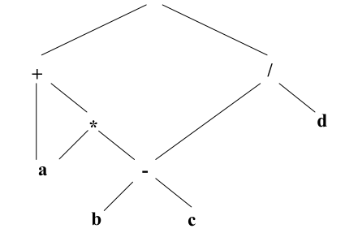
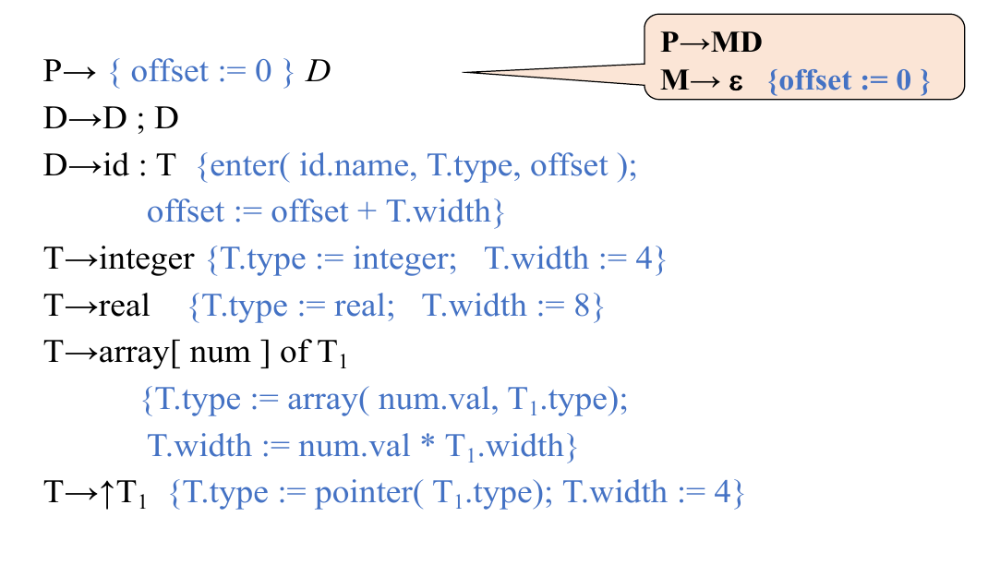
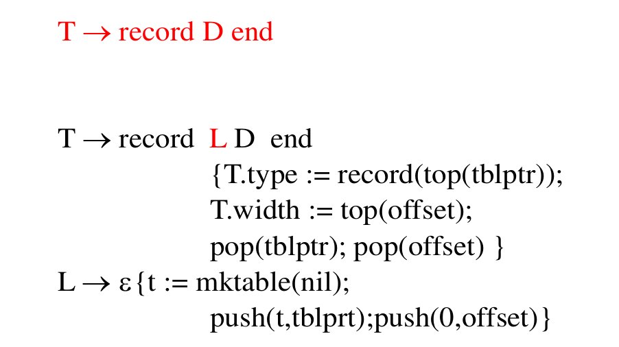
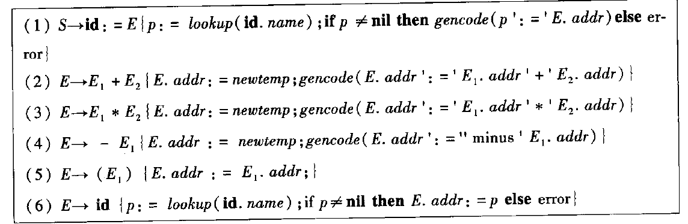
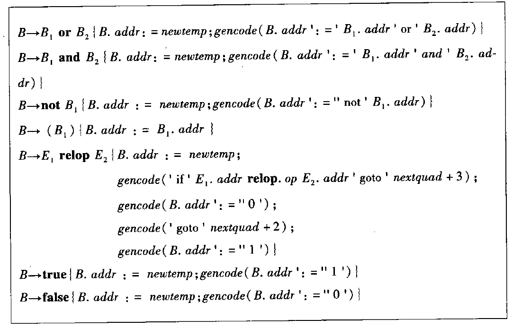

# 编译原理 5：中间代码生成

在完成一系列对源码的词法分析、句法分析、语义分析后，我们将利用这些分析的结果，开始生成中间代码。这些中间代码具有统一的格式，与原来的程序码行使完全一样的功能。它们是连接编译器「前端」和「后端」之间的「桥梁」。

## 中间代码的表示形式

### 逆波兰表示

即后缀表示法，将运算符放置在式子的最后。如：

```Plaintext
a b c * b d * + :=
```

即是

```Plaintext
a := a * b + c * d
```

的后缀表示。后缀表示不需要使用括号，利用一个栈，就可以很容易地对表达式进行求值。

### 三地址码和四元式

三地址码是一种指令形式，记录两个操作数地址和一个结果地址。地址即是临时变量或常量、符号。

四元式是一种三地址码的格式，在三个地址的基础上加上操作。并不是所有四元式都一定会有四个部分。

例如：

```x86asm
(MOV, a, 8, )       // a <- 8
(MOV, b, 5, )       // b <- 5
(SUB, $0, 3, a)   // $0 <- 3 - a
(MOV, c, $0, )      // c <- $0
(RET, , , c)
```

### 图表示

利用 DAG 来表示中间代码。在 DAG 中，每个节点对应一个运算符，代表一个子表达式。它的子节点与该运算符的运算对象相对应，而叶节点代表变量或者常量。

例如，表达式 `a + a * (b - c) - (b - c) / d`：

​

### 生成中间代码

中间代码的生成采用制导定义的方法，在产生式中搭配相应「生成中间代码」的语义规则。

## 声明语句的翻译

所谓声明语句，指的是为程序中的变量和常量名指定类型的语句。在翻译过程中，需要进行类型检查和辅助翻译，在符号表中记录被说明对象的属性，为执行作准备。

考虑下面的 Pascal 语言声明语句文法。与 C 这样的语言不同，Pascal 是结构化的语言，每个过程（函数）所使用的变量都要在这个过程开始的时候声明出来。

```Pascal
(* 一个程序 *)
program 程序名字(input, output);
var
变量1, 变量2: 变量类型; (* 所有全局变量都要定义在这里 *)
begin
  (* 程序本体 *)
end

(* 一个函数 *)
procedure 函数（过程）名字(参数: 类型);
var
局部变量: 类型;
begin
  (* 函数（过程）本体 *)
end
```

抽象出 Pascal 语言的声明文法如下：

$$
\begin{aligned}
  P&\to\mathbf{prog}\ \mathbf{id}(\mathbf{input}, \mathbf{output}) D;S \\
  D&\to D;D|List:T|\mathbf{proc}\ \mathbf{id}\ D ;S \\
  List&\to List,\mathbf{id}|\mathbf{id} \\
  T&\to\mathbf{integer}|\mathbf{real}|\mathbf{array}\,C\,\mathrm{of}\,T|*T|\mathbf{record}\ D\cdots\\
  C&\to[\mathbf{num}]C|\varepsilon
\end{aligned}
$$

稍加解释：

* $S$ 表示程序本体，略去。
* $P$ 表示一个程序。$D$ 是声明列表，它可以由 $List$ 即多个声明组成，也可以是对函数 $\mathbf{proc}$ 的声明。
* $T$ 是类型符号，支持 `integer`、`real` 以及数组和 record（相当于 C 的结构体）。

### 程序内声明语句的翻译

定义下面的辅助函数、语义属性和全局变量：

* 文法变量 $T$ 的语义属性：

  * type：类型
  * width：位宽
* 辅助子程序

  * enter：填符号表
  * array：处理数组类型
* 全局变量：

  * offset：栈偏移量

对声明语句引入下面的翻译方案

​

就能实现在进行分析时完成符号表的填充。

### 函数中声明语句的翻译

所谓「函数过程中的声明语句」，如：

```C
int func() {
  int a, b;   // <-- This
  float c, d; // <-- And this
  return 0;
}

int main() {
  int a, b;   // <-- Not this
  return 0;
}
```

显然，`func()` 内的变量和 `main()` 内的变量不能用同一张符号表——不然它们会打架；同时，如果有多个函数被定义，它们的符号表也不能相同。那么，在进行语义分析的过程中，如果遇到「这里定义了一个函数」的情况，就应当冻结当前的符号表处理，转而开始新的翻译。（上面的例子不太好的一点是，C 语言不允许在函数内定义函数，因此是遇不到「半路需要建新表」的情况的）

考虑下面的 Pascal 文法。

$$
\begin{aligned}
  P&\to \mathbf{prog}\ \mathbf{id}(\mathbf{input}, \mathbf{output})\ D; S \\
  D&\to D; D|\mathbf{id}:T|\textcolor{red}{\mathbf{proc}\ \mathbf{id}\ D; S}
\end{aligned}
$$

上面的红色部分就是 Pascal 定义函数 / 过程的位置。对于这门语言，它将函数和过程和变量一同定义。

### 记录 / 结构体的翻译

对记录（`record`）或者结构体（`sturct`）的翻译有以下要点：

* 为每个结构体类型单独构造一张符号表。
* 将域名信息（名字、类型、字节数）填入到该记录的符号表中。
* 所有域都处理完后，用 `offset` 域记录所有数据对象的宽度总和。
* `T.type` 来自于该结构体的符号表的指针。

​

## 赋值语句的翻译

考虑使用 `:=` 表示赋值。典型的赋值语句文法为

$$
\begin{aligned}
   S&\to Left := E\\
  E&\to E+E|E*E|-E|(E)|Left \\
  Left&\to Elist]|\mathbf{id} \\
  Elist&\to Elist, E|\mathbf{id}[E\\
\end{aligned}
$$

### 简单赋值语句

先不考虑数组，定义下面的辅助函数：

* `lookup(id.name)`：在符号表中查找名字 `id.name` 对应的表项。
* `gencode()` 生成三地址码。
* `newtemp()` 生成一个新的临时变量名。

下面的翻译模式能进行简单赋值语句的翻译：

​

## 控制结构的翻译

### 布尔表达式的翻译

考虑下面的布尔表达式

$$
B\to B\ \mathbf{or}\ B|B\ \mathbf{and}\ B|\mathbf{not}\ B|(B)|E\ \mathbf{relop}\ E|\mathbf{true}|\mathbf{false}
$$

​

其他没有什么好解释的，其对于关系运算的翻译是：

```plaintext
100 if a relop b goto 103
101 answer = 0 // 假
102 goto 104   // 出口
103 answer = 1 // 真出口
104 ...
```

### 常见控制结构的翻译

1. if-then 型

    ```plaintext
      if (condition) goto true
      goto next
    true:
      // do something...
    next:
      // continue!
    ```
2. if-then-else 型

    ```plaintext
      if (condition) goto true
      goto false
    true:
      // do something...
      goto next
    false:
      // do something else...
    next:
      // continue!
    ```

3. while-do 型

    ```plaintext
    begin:
      if (condition) goto true
      goto next
    true:
      // do something...
      goto begin
    next:
      // continue!
    ```

### 回填

进行上面的分析时存在一个问题：我们不能预知未来，因此，在翻译时无法确定之后跳转终点的具体位置。为了解决这个问题，引入回填技术。其关键是用链表记录「没有记录目标标号的转移指令」的标号，以便回头再填。例如，对于式子

$$
B\to B_1\ \mathrm{or}\ B_2
$$

先引入一个虚拟文法变元 $M\to\varepsilon$，有 $B\to B_1\ M\ \mathrm{or}\ B_2$。然后，为 $B$ 定义下面的翻译方案：

```plaintext
backpatch(B1.falselist, M.quad);
B.falselist = B2.falselist;
B.truelist = merge(B1.truelist, B2.truelist);
```

而 $M$ 的翻译方案只是记下下条指令的地址即

```plaintext
M.quad = nextquad;
```

例如，现在翻译 `a<b or c>d`。对于 `a<b`，其生成两条代码：

```plaintext
100 if a<b goto _
101 goto _
```

`a<b` 作为 $B_1$，它的 `truelist` 现在有 `100`，而 `falselist` 现在有 `101`。对于 $M$，其记录 `nextquad` 即 `102`，而 `c>d` 则翻译成下面的两条代码，`truelist` 为 `102`，`falselist` 为 `103`。

```plaintext
102 if c>d goto _
103 goto _
```

现在开始回填。先将 `M.quad` 填到 `B1.falselist` 中，即将编号 `102` 填到 `101` 中的空位，所以有

```plaintext
100 if a<b goto _
101 goto 102
102 if c>d goto _
103 goto _
```

然后填写这整个式子的 `truelist` 和 `falselist`。其中，`or` 语句的 `falselist` 是 $B_2$ 的 `falselist`，而 `truelist` 是 $B_1$ 和 $B_2$ 的 `truelist` 之和。因此 `truelist` 为 `100` 和 `102`，而 `falselist` 为 `103`。

*本节笔记到此结束。*
