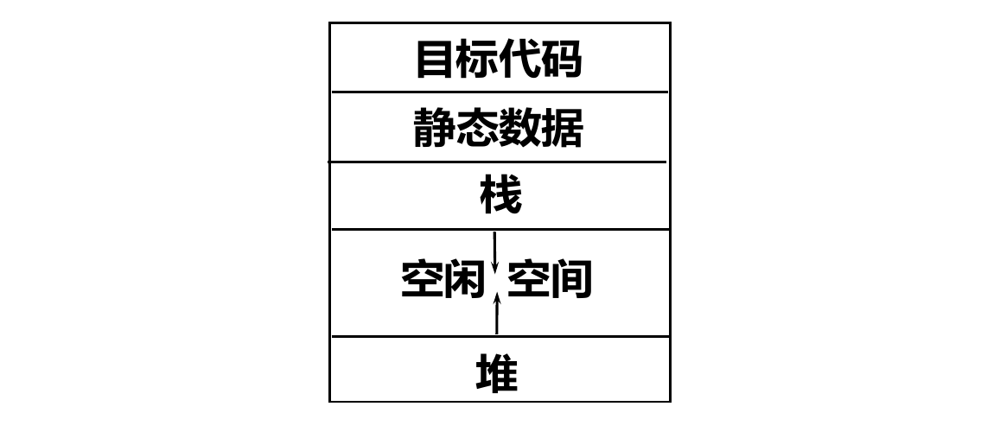

# 编译原理 6：编译器后端

## 作用域

所谓「`x` 的作用域」是这样的一段区域，在该区域中，`x` 的引用均指向 `x` 的这一声明。如果一种程序设计语言，在编译时就能确定某个声明的作用域，称此语言使用静态作用域；反之，作用域在运行时才能确定的语言，称为使用动态作用域。

## 过程的传参方式

这里的「过程」包含「函数」「过程」和「方法」。出现在过程定义中的某些标识符具有特殊的意义，称为该过程的形式参数（形参）。在调用过程时，真正传入过程的称为实在参数（实参）。根据过程获得实参方式的不同，分为下面几种方式：

### 传值

将实参的值计算出来后单向、确定地传入。例如下面的 `swap()` 函数

```C
void swap(int a, int b) {
  int t = a;
  a = b;
  b = t;
}
```

并不能起到交换变量的作用：因为 `a` 和 `b` 的值是单向传入 `swap()` 函数体的，交换它们并没有交换函数调用外的实际变量。

### 传地址

将实参的地址以传值的方式传入。例如 C 语言中使用指针实现的 `swap()` 函数

```C
void swap(int *a, int *b) {
  int t = *a;
  *a = *b;
  *b = t;
}
```

就能实现函数外变量的交换，因为函数内能通过地址访问到实际的参数。

### 传值结果

将上面两种方式结合，比较少见。具体来说，调用前将实参计算并以传值方式传入，但同时也把地址传入。过程结束时，再将形参复制回实参位置。此种文法的效果上和传地址类似，都能使得过程外变量的值改变。

### 传名

传名是一种特殊的传递参数的方法，它将过程体内对形参的引用「替换」为实参。例如，在 Scala 中定义一个传名引用的函数：

```Scala
def func(x: => Int): Unit = {
  println(x)
  println(x)
}
```

现在调用 `func(a + b + 2)`，这就相当于执行了两次 `println(a + b + 2)`。如果定义一个函数将某全局变量自增再返回：

```Scala
def increaseAndReturn(): Int = {
  inc = inc + 1
  inc
}
```

调用 `func(increaseAndReturn())`，会等价于执行 `println(increaseAndReturn())` 两次，造成 `inc` 自增 2 次。

## 运行时存储组织

### 内存分段

现代操作系统使用虚拟内存技术管理进程的内存使用。因此，对于程序来说，其可见的是一整段连续地址空间。在典型的操作系统上，程序的内存空间分为这些段：

​

其中：

* 目标代码段（`.text`）是编译后的程序码所在的区域。
* 静态数据段包含大小确定的数据对象。在 UNIX 系统上，它可以进一步分为只读已初始化段 `.rodata`（如常量）、可变已初始化段 `.data`（如已初始化的全局变量）、未初始化段 `.bss`（如未初始化全局变量）等。
* 栈区：管理过程的活动。
* 堆区：可自由申请和释放的空间。

### 局部数据的组织

多数时候，机器更愿意进行自然访问——即，对于占用 $n$ 个字节的变量，在 $n$ 字节对齐的地址上访问它。为了实现自然访问，机器会在排布内存时留下一些「空洞」，这就是局部数据的组织。

### 存储分配策略

* 静态存储分配（Fortran）：编译时就确定好所有存储空间的分配，不允许递归调用，不允许动态建立数据结构。
* 栈式存储分配（C）：通过运行栈记录活动，使用调用序列和返回序列维护调用状态，在栈中存储局部数据和临时变量。

## 指令开销

x86 体系结构的特色产品。指令本身开销是 1，多一个立即数再多 1 份开销。

*本节笔记到此结束。*
