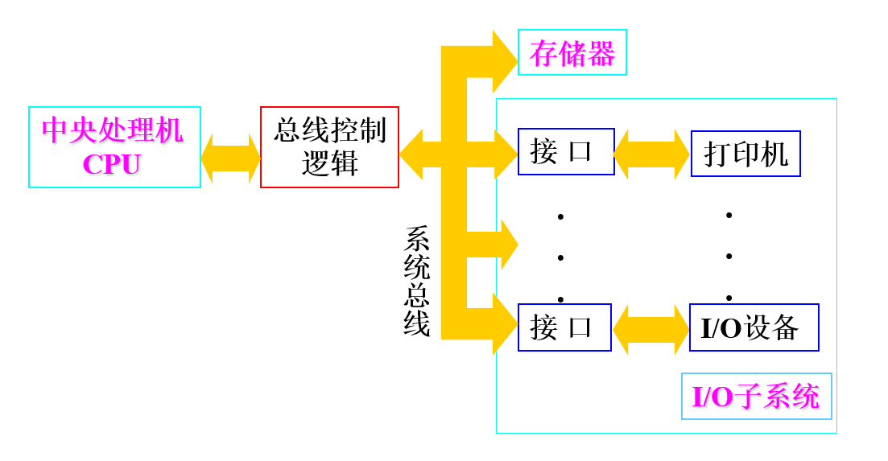
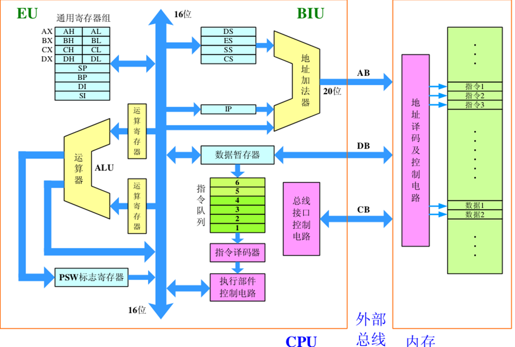

# 第一讲 硬件一览

## 一 硬件总览

微型计算机硬件主要由中央处理机、存储器、系统总线、I/O接口电路和I/O设备组成。

* 中央处理机

    集成运算器、控制器和寄存器组，完成算数和逻辑运算以及控制工作。

* 存储器

    主存（内存），CPU通过总线读写，有ROM和RAM。辅存（外存），CPU通过I/O接口读写。

* 总线

    * 数据总线（双向总线）
    * 地址总线（单向总线），直接寻址范围为 $2^n$，8086总线为 20 位
    * 控制总线（双向总线）

* I/O接口电路

    I/O接口电路中每个寄存器统一编号，称为I/O端口地址或端口号，地址空间为 64KB，共 65536 个 I/O 地址，端口地址范围为 0000-FFFFH

* I/O设备

    输入输出设备

## 二 中央处理机与寄存器

### 1、中央处理机

CPU 功能上可分为**总线接口部件（BIU）**和**执行部件（EU）**。前者负责CPU与存储器、I/O端口传送数据，后者负责指令执行和数据运算。

* 总线接口部件

    其含有段寄存器（4个16位寄存器）、指令指针寄存器（16位）、地址加法器（形成20位地址）、指令队列（6字节）和总线接口控制电路。

* 执行部件

    通用寄存器（数据寄存器和指针与变址寄存器）、标志寄存器（FR）、算术逻辑部件（ALU）和执行部件控制电路。

### 2、寄存器组

#### （1）通用寄存器

**数据寄存器**用来保存操作数或运算结果：

| 寄存器名称              | 功能                                                 |
| ----------------------- | ---------------------------------------------------- |
| AX（Accumulator）累加器 | 算数逻辑运算，与外设传送信息                         |
| BX（Base）基址寄存器    | 存放存储器地址                                       |
| CX（Count）计数器       | 循环和串操作计数器，CL移位指定位数                   |
| DX（Data）数据寄存器    | 存放双字数据高16位，乘除运算的参数，存放外设端口地址 |

**变址寄存器**常用于存放某个存储单元偏移位置

| 寄存器名称                                | 功能                       |
| ----------------------------------------- | -------------------------- |
| SI（Source Index Reg）源变址寄存器        | 与DS连用，确定存储单元位置 |
| DI（Destination Index Reg）目的变址寄存器 | 与DS或ES连用，确定单元地址 |

> 注：变址寄存器不可分割成 8 位寄存器

**指针寄存器**常用来访问栈内存储单元

| 寄存器名称                        | 功能                          |
| --------------------------------- | ----------------------------- |
| SP（Stack Pointer）堆栈指针寄存器 | 通过 SS:SP  来访问栈顶        |
| BP（Base Pointer）基址指针寄存器  | 通过 SS:SP 来访问栈内存储单元 |

#### （2）专用寄存器

**指令指针寄存器 IP （Instruction Pointer）**保存下一次从主存中取出指令的偏移地址。

**标志寄存器 FR/PSW （Program Status Word）** 含有**状态标志**和**控制标志**

状态标志用来记录程序运行结果的状态信息，指令执行结束后会改变状态标志

| 标志名称               | 标志功能                                                     |
| ---------------------- | ------------------------------------------------------------ |
| CF（Carry）进位标志    | 运算过程中有借位或进位时置 1，用于多字节运算、移位、比较大小 |
| ZF（Zero）零标志       | 运算结果为 0 则置 0，反之置 1                                |
| SF（Sign）符号标志     | **有符号数运算**的结果若高位为 1 则置 1，反之置 0            |
| PF（Parity）奇偶标志   | 运算结果**最低8位**中 1 的个数为偶数个时置 1，反之 0         |
| OF（Overflow）溢出标志 | 若算数运算结果有溢出则置 1，反之 0（即算数运算结果是否正确） |

控制标志可用指令设定，用于控制处理器执行指令的方式

| 标志名称                           | 标志功能                                        |
| ---------------------------------- | ----------------------------------------------- |
| DF（Direction）方向标志            | 串操作中控制地址变化方向，DF=0 时地址增加       |
| IF（Interrupt-enable）中断允许标志 | IF=1允许中断，否则禁止中断                      |
| TF（Trap Flag）陷阱标志            | TF=1，处理器单步执行指令，产生编号为1的内部中断 |

#### （4）段寄存器

有 SS、DS、CS、ES，略。

## 三 访问内存

8086/8088 的存储空间为 $2^{20}=1$MB，而其内部为16位寄存器，只能寻址 $2^{16}=64$KB，采用内存分段的方式来访问内存空间。

1. 8086/8088把1MB分成若干逻辑段，每个逻辑段最大为 64KB，可用 16 位地址表示。
2. 设定段起始地址，段起始地址的格式为 0XXXX0H。某一段的开始必须使段起始地址。

综上，使用逻辑段来划分存储空间，逻辑段的起始地址必须为段起始地址，而每一段的存储空间最大为 64KB，可以直接访问。因此，使用**段起始地址+段内偏移地址（EA/Offset）**的方式可以在16位寄存器的限制下访问到20位的**物理地址（PA）**。

物理地址计算公式
$$
PA=(SA<<4)+EA
$$
其中 SA 为段地址。

> 注意：内存访问存在**内存对齐（memory alignment）**的问题。8086的16位数据线每个内存周期依次读取偶单元和奇单元，每次一个字节。若字地址为偶单元，则1个内存周期即可读取，否则需要2个内存周期。若双字地址为偶单元，需要2个内存周期，否则需要3个。