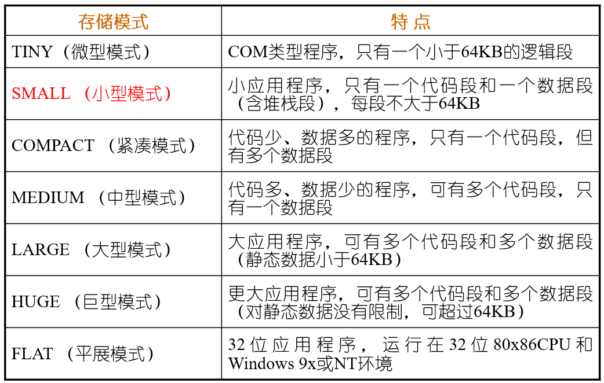

# 第三讲 汇编语言基础格式

## 一 汇编程序功能

将汇编语言编写的源程序翻译成目标程序的过程称为**汇编**，完成汇编任务的程序称为**汇编程序**

> 注：.obj 文件已经是二进制文件，但其与库文件或其他目标文件连接之后才能形成可执行文件

## 二 （伪）指令语句基本格式

伪指令汇编后不产生目标机器码，而每条指令语句都产生对应的机器码；伪指令语句对应的操作在汇编后完成，而指令语句对应操作在运行时完成。

两者的格式：

* 指令语句：`[标号名:] 操作码 [操作数] [;注释]`
* 伪指令语句：`[变量名] 伪操作码 [操作数] [;注释]`

各语言单位：

* 操作项：操作项为指令、伪指令、宏指令的操作码，又称助记符
* 名字项：名字项为标号名、变量名等，可由字母、数字、特殊字符（?、\.、@、-、\$）组成。数字不能为首项，\. 仅能用作首项、单独的 ? 不能作为名字。
* 标号：<u>表示指令所在单元地址，在代码段中定义使用</u>。其可用 `LABEL` 或 `EQU` 伪指令定义，常用作 `CALL` 指令或转移指令操作数字段
* 变量：<u>在数据段、附加段和堆栈段中定义。</u>其为数字，数据区和存储区的首地址
    * 属性：变量和标号具有段属性、偏移属性和类型属性。段属性为所在段；偏移属性为所在地址距离段基址的偏移量；类型属性有段内引用 `NEAR`、段外引用 `FAR`、`BYTE`、`WORD`、`DWORD`、`FWORD`、`QWORD`、`TBYTE`
* 常量：指在汇编器确定的没有任何属性的纯数值，主要用于立即数和伪指令赋初值，有数值常量、字符串常量和符号常量（指EQU伪指令或赋值语句“=”定义过的符号名）。数值常量基数后缀为 "d、b、o/q、h"

### 三 伪指令语句

伪指令不负责程序的运行，而负责目标代码的生成，主要功能有：逻辑段的定义、存储模式定义、数据定义、存储器分配、指示程序开始结束等

常用伪指令：

* 段定义伪指令：略。不要忘记存在 `assume 段寄存器: nothing` 伪指令，其用于取消远端寄存器的指定

* 存储模式伪指令：

    其通常模式为 `.MODEL 存储模式 [,语言类型][,操作系统类型][,堆栈选项]`

    存储模式：tiny、small、medium、compact、large、huge、flag

    语言类型：C、BASIC、PASCAL等

    操作系统：OS_DOS（默认）或OS_OS2

    堆栈选项：NEARSTACK将堆栈段和数据段组合至一个DGROUP段中，FARSTACK不进行组合。存储模式为Compact、Large、Huge时默认为 FARSTACK，否则为 NEARSTACK

    

    使用存储模式伪指令可以使用简化段定义但必须有 `.MODEL` 语句，若只有 `.code` 、`.stack`、`.code` 则可以省略 `assume` 语句

* 段组定义伪操作：`GroupName Group segname1, segname2,...`，

* 数据定义及存储器分配伪操作：助记符 `DB`、`DW`、`DD`、`DF`、`DQ`、`DT`

* 复制操作符：`RepeatCount dup (num1,num2,...)` 可嵌套

* PTR伪指令：用于指定操作数的数据类型，格式为 `type PTR 变量或常量`

* LABEL伪操作：指定操作数的数据类型，格式为 `name LABEL type`

* 表达式赋值伪操作：为表达式新定义一个名字，表达式可以为任何有效操作数格式、或可求出常数的表达式、或助记符，格式为`ExprName EQU expr`。功能与 `=` 相同，但 `=` 允许重复定义

* 地址计数器 $：其表示数据或代码的地址。当 `$` 用在指令中时，其表示本条指令第一个字节的地址，若其在伪指令的参数字段中时，其表示当前数据的地址。

* ORG伪指令：设定当前地址计数器的值，指定存放指令或数据的位置。`ORG expr`，表达式需可计算出数值

* 基数控制伪操作：`.radix expr` ，需要注意，当从 10 进制改为 16 进制时，若原来的 16 进制之后有字母 D，则需在该数后面加上 H

## 四 表达式操作符

汇编指令中的操作数项可以为常数、寄存器、标号、变量或表达式。表达式是常数、寄存器、标号、变量以及一些操作符组成的序列，有数字表达式和地址表达式两种。

表达式常见运算符：

* 算数运算符：+、-、\*、/、Mod

* 关系运算符：EQ、NE、LT、LE、GT、GE，若为真返回 0FFFFH，否则返回 00000H

* 逻辑和移位操作符：AND、OR、XOR、NOT

* 数值回送操作符：TYPE、LENGTH、SIZE、OFFSET、SEG。对于TYPE，其返回值如下表

    | DB   | DW   | DD   | DF   | DQ   | DT   | NEAR | FAR  | 常数 |
    | ---- | ---- | ---- | ---- | ---- | ---- | ---- | ---- | ---- |
    | 1    | 2    | 4    | 6    | 8    | 10   | -1   | -2   | 0    |

* 属性操作符：SHORT、HIGH、LOW、HIGHWORD、LOWWORD，其操作对象均需为立即数

