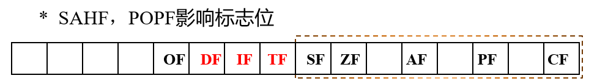
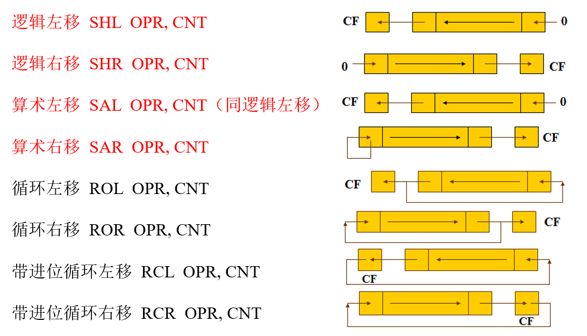

# 第四讲 指令

## 一 数据传送指令

* MOV DST，SRC

    功能：（DST）<-（SRC）

    操作数：操作数不能同时为段寄存器和存储器，立即数不能直接送至段寄存器，DST不得为CS和立即数

* PUSH SRC

    功能：（SP）<-（SP）-2，（（SP+1），（SP））<-（SRC）

    操作数：必须为字类型，寄存器，存储器

* POP DST

    功能：（DST）<-（（SP+1），（SP）），（SP）<-（SP+2）

    操作数：子类型的寄存器或存储器，DST不得为CS

* PUSHA

    功能：AX、CX、DX、BX、SP、BP、SI、DI依次入栈

    操作数：无

* POPA

    类比 PUSHA 即可

* XCHG OPR1，OPR2

    功能：（OPR1）<->（OPR2）

    操作数：两个操作数中必须有一个为寄存器，不得为段寄存器

* XLAT（换码指令）

    功能：（AL）<-（（AL）+（BX）），可用于代码转换，如0-9转7段数码管

    操作数：无

* LEA REG，SRC

    功能：（REG）<-SRC的有效地址

    操作数：SRC为存储器，REG不得为段存储器

* LDS REG，SRC

    功能：（REG）<-（SRC），（DS）<-（SRC+2）

    操作数：同上

* LES REG，SRC

    功能：（REG）<-（SRC），（ES）<-（SRC+2）

    操作数：同上

* LAHF

    功能：（AH）<-（FLAGS的低字节）

* SAHF

    功能：（FLAGS的低字节）<-（AH）

* PUSHF

    功能：（SP）<-（SP）-2，（（SP+1），（SP））<-（FLAGS）

* POPF

    功能：与上相反

    

* CBW

    功能：若（AL）最高有效位为0，则（AH）<-00H，否则（AH）<-0FFH

* CWD

    功能：若（AX）最高有效位为0，则（DX）<-0000H，否则（DX）<-0FFFFH

## 二 算数指令

除特殊说明以下指令的操作数：与 MOV 语句操作数条件相同，同时操作数不允许为段寄存器

除特殊说明以下指令影响的标志位：影响OF，CF，SF，ZF

* ADD DST，SRC

    功能：（DST）<-（DST）+（SRC）

* ADC DST，SRC

    功能：（DST）<-（DST）+（SRC）+CF

* INC OPR

    功能：（OPR）<-（OPR）+1

    操作数：OPR为寄存器或存储器，且不能为段寄存器

    标志位：同上，但不影响CF

* SUB DST，SRC

    功能：（DST）<-（DST）-（SRC）

* SBB DST，SRC

    功能：（DST）<-（DST）-（SRC）-CF

* DEC OPR

    功能：（OPR）<-（OPR）-1

    操作数：OPR为寄存器或存储器，且不能为段寄存器

    标志位：不影响CF

* NEG OPR

    功能：（OPR）<-0FFFFH-（OPR）+1，可用来求相反数

    操作数：可微寄存器或存储器，不允许为段寄存器

    标志位：若操作数为0，则CF为0，否则为1；若操作数为-128或-32768，则OF为1，否则为0

* CMP OPR1，OPR2

    功能：（OPR1）-（OPR2）

* MUL SRC

    功能：（AX）<-（AL）\*（SRC）或（DX，AX）<（AX）\*（SRC）

    操作数：寄存器或存储器，不得为段寄存器和立即数

    标志位：如果乘积的高一半为0，则（CF，OF）=（0,0）否则（CF，OF）=（1,1）

* IMUL SRC

    功能：同上，但其为带符号乘法

    操作数：寄存器或存储器，不得为段寄存器和立即数

    标志位：如果乘积的高一半是低一半的成绩扩展，则（CF，OF）=（0,0）否则（CF，OF）=（1,1）

* DIV SRC

    功能：（AL）<-（AX）/（SRC），（AH）<-（AX）%（SRC）或

    （AX）<-（DX，AX）/（SRC），（DX）<-（DX，AX）%（SRC）

    操作数：同乘法

    标志位：不影响标志位

* IDIV SRC

    同上，该指令为带符号除法

## 三 逻辑指令

以下指令除特殊说明外会将 CF，OF 标志位置 0，根据运算结果设置 SF，ZF，PF，功能比较简单，不再介绍。除特殊说明外，其操作数均不允许出现段寄存器，其余和MOV条件相同

* NOT OPR

    操作数：OPR 不能为立即数，段寄存器

    标志位：不影响标志位

* AND DST，SRC

* OR DST，SRC

* XOR DST，SRC

* TEST OPR1，OPR2

    功能：（OPR1）AND（OPR2）

除特殊说明外，对于下列指令，其OPR操作数可用除立即数之外的任何寻址方式，当CNT=1时，可以使用立即数，否则CNT必须为CL。对于条件标志位，CF等于移入数值；当CNT=1时且最高有效位的值发生变化时，OF=1，若CNT=1且最高有效位值不变化时，OF=0；根据结果设置SF，ZF，PF

* SHL OPR，CNT

* SHR OPR，CNT

* SAL OPR，CNT

* SAR OPR，CNT

* ROL OPR，CNT

* ROR OPR，CNT

* RCL OPR，CNT

    不影响标志位SF，ZF，PF，AF

* RCR OPR，CNT

    不影响标志位SF，ZF，PF，AF

    

## 四 串处理指令

* REP

    功能：串处理前缀，与MOVS、CMPS、SCAS、LODS、STOS等联用，格式为 REPoperation_expr，每执行一次  expr，CX 减一，直到CX为0为止

* MOVS/MOVSB/MOVSW DST，SRC

    功能：（DST）<-（SRC），（DI）<-（DI）±bytes，（SI）<-（SI）±bytes

    操作数：默认为 DST 为 ES：[DI]，SRC 为 DS：[SI]，仅允许改变 SRC 的段前缀

    标志位：不影响

    注：使用 MOVS 时需指定操作数类型（字节或字）

* STOS/STOSB/STOSW DST

    功能：（DST）<-（AL/AX/EAX），（DI）<-（DI）±bytes

    操作数：默认为 ES：[DI]，相信我，你也改不了的。

* LODS/LODSB/LODSW SRC

    功能：（AL/AX/EAX）<-（（SI）），（SI）<-（SI）±bytes

    操作数：默认为 ES：[SI]，可以修改 ES 为 DS

* REPE/REPZ  expr

    功能：当 CX 不为 0 且 ZF 不为 0 时循环执行其后的表达式，同时 CX 减一，其后表达式可以为 CMPS 和 SCAS

* REPNE/REPNZ expr

    功能：当 CX 不为 0 且 ZF 等于 0 时循环执行其后的表达式，同时 CX 减一，其后表达式可以为 CMPS 和 SCAS

* CMPS/CMPSB/CMPSW SRC，DST

    功能：执行 （（SI））-（（DI）），并设置标志位，同时 （SI）和（DI）相应增加或减小

* SCAS/SCASB/SCASW DST

    功能：执行（AL）-（（DI）），并设置标志位，同时（DI）相应增加或减小

## 五 处理机控制与杂项控制指令

处理机控制指令：

* CLC：CF置0
* STC：CF置1
* CMC：CF求反
* CLD：DF置0
* STD：DF置1
* CLI：IF置0
* STI：IF置1

CPU 控制指令：

* NOP：不执行任何操作，但占用一个字节存储单元，占用指令执行周期用于调试
* HLT：使CPU暂停工作等待外部中断