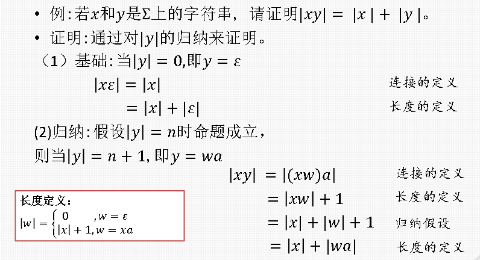

# 课程基础

# 什么是形式语言与自动机

## 定义

形式语言：形式化描述的字母表上的字符串的集合

## 定义方式

* 通过一定的规则进行描述，根据这些规则能产生相应的符号串
* 通过抽象化的自动机去识别  
  该语言由该自动机所能识别的所有符号串组成  
  自动机的本质：$当前状态+输入\rightarrow 下一个状态$

# 基础知识

## 字母表

符号的非空有穷集

* 例：$\Sigma = {0,1}$

## 字符串

### 字符串

由某字母表中符号组成的有穷序列，又称为句子

* 例：若$\Sigma=\{ 0,1 \}$，那么$0,1,00,1001$是$\Sigma$上的字符串

### 空串

有0个字符的串，记为$\varepsilon$​

### 符号的使用规定

* 字母表：$\Sigma，\Gamma，...$​
* 字符：$a，b，c，...$​
* 字符串：$w，x，y，z，...$​
* 集合：$A，B，C，...$​

### 字符串的长度

字符串中符号所占位置的个数，记为$\vert \cdot \vert$​

我们使用递归定义，如果字母表为$\Sigma$，可以递归定义为：

$$
\vert w\vert = 
\begin{cases}
\begin{aligned}
&0,\quad &w=\varepsilon \\
&\vert x \vert + 1,&w=xa
\end{aligned}
\end{cases}
$$

其中$a \in \Sigma$，$w$和$x$是$\Sigma$中字符组成的字符串

### 字符串的拼接

首尾相连，递归定义为

$$
xy = 
\begin{cases}
\begin{aligned}
&x,\quad &y=\varepsilon \\
&(xz)a ,&y=za
\end{aligned}
\end{cases}
$$

其中$a\in \Sigma$，且$x,y,z$都是字符串

* 特别的，对任何字符串$x$，有$\varepsilon \cdot x = x\cdot \varepsilon = x$

### 字符串的n次幂

字符串$x$的n次幂$(n\ge 0)$，递归定义为

$$
x^n=\begin{cases}
\begin{aligned}
&\varepsilon,\quad &n=0\\
&x^{n-1}x, \quad& n\gt 0
\end{aligned}
\end{cases}
$$

* $(ba)^2=(ba)^1ba=(ba)^0baba=\varepsilon baba=baba$

## 集合

### 基本运算

* 交运算：$A\cap B = \{ x\vert x\in A \space and \space x\in B \}$
* 并运算：$A\cup B = \{ x\vert x\in A \space or \space x\in B \}$​
* 差运算：$A- B = \{ x\vert x\in A \space and \space x\notin B \}$
* 幂运算：$A^n = \begin{cases}\begin{aligned}&\{ \varepsilon \},&\quad n=0\\&A^{n-1}A, &n\ge1 \end{aligned}\end{cases}$  

  * 如果$\Sigma$是字母表，则$\Sigma^n$代表$\Sigma$上长度为n的字符串的集合
* 连接运算：$A  B = \{ w\vert w=xy, x\in A \space and \space x\in B \}$
* 笛卡尔积：$A \times B = \{ (x,y)\vert x\in A \space and \space x\in B \}$
* 幂集：$2^A=\{B\vert B\subseteq A\}$，即A的子集构成的集合

### 克林闭包

$$
\Sigma^*=\bigcup_{i=0}^\infty \Sigma^i
$$

克林闭包则是将$\Sigma$上所有长度的字符串放在一个集合中

### 正闭包

$$
\Sigma^+=\bigcup_{i=1}^\infty \Sigma^i
$$

$i$的下标从**1**开始，意为将$\Sigma$上长度至少为**1**的字符串放在一个集合中

显然，我们有

$$
\Sigma^*=\Sigma^+ \cup \{\varepsilon\}
$$

# 基本的数学证明方法

## 演绎法

* 大前提：已知的一般性原理
* 小前提：所证明对象的特殊性
* 结论：根据一般性原理，对特殊情况做出判断

例：所有奇数都不能被2整除(大前提)，2100+1是奇数(小前提)，则2100+1不能被2整除(结论)

## 归纳法

由两部分组成：

* 基础：基本的元素定义
* 归纳：指出用已有元素来构造新元素的规则

​

## 反证法

步骤如下：

* 假设反命题成立
* 推理出矛盾的结果
* 指出反命题不成立，原命题成立
