# 有穷状态自动机

有穷自动机（Finite Automaton，FA）可以分为确定型的有穷自动机（DFA）和非确定型的有穷自动机（NFA）两种

# 确定的有穷自动机

## 有穷自动机抽象装置

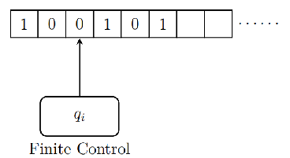​

* 一个输入带、一个读头、一个有穷控制器
* 控制器根据**读入的字符**和**当前状态**，进行**状态转移**，然后读头进行下一个字符的读取

## 形式化定义

$DFA\space A=(Q,\Sigma,\delta,q_0,F)$

* $Q$：有穷状态集
* $\Sigma$：有穷输入符号集
* $\delta$：$Q\times \Sigma \rightarrow Q$，状态转移函数
* $q_0 \in Q$：初始状态
* $F \subseteq Q$：终结状态集

## 状态转移的表示

### 状态转移图

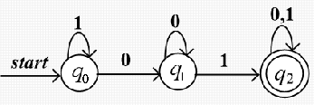​

* 每个状态q对应一个节点，用圆圈表示
* 状态转移$\delta(q,a)=p$为一条从$q$到$p$且标记为输入字符$a$的有向边
* 开始状态$q_0$用一个标有$start$的箭头表示
* 接受状态的节点，用**双圆圈**表示

### 状态转移表

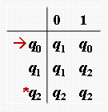​

* 每个状态$q$对应一行，每个输入字符对应一列
* 若有$\delta(q,a)=p$，用第$q$行第$a$列中填入的$p$表示
* **开始状态**$q0$**​**前，标记箭头用**$\rightarrow$**​**表示**
* **接受状态**$q\in F$**​**前，标记星号**$*$**​**表示**

### 扩展状态转移函数

使用**递归定义**，是状态转移函数的扩展，接受的范围从**字符**扩大到了**字符串**

$$
\hat{\delta}(q,w)=\begin{cases}
&q,&w=\varepsilon \\
&\delta(\hat{\delta}(q,x),a),&w=xa
\end{cases}
$$

其中，$a$是字符，$w$和$x$是字符串

它的操作过程是，对于每个字符串$w$，将其分解成$xa$，对于当前的状态，先将$x$作为输入进行处理，最后再处理$a$，重复上述的过程，可以将字符串分解，最内层是$\varepsilon$，第二层是字符串的第一个字符，......，最外层是最后一个字符，计算的时候从内到外计算即可

对于字符串$w=a_0a_1a_2...a_n$，我们有：

$$
\begin{aligned}
\hat{\delta}(q,w)=&\delta(\hat{\delta}(q,a_0a_1...a_{n-1}),a_n)\\
=&...\\
=&\delta(\delta(...\delta(\hat{\delta}(q,\varepsilon),a0)...),a_{n-1}),a_n)
\end{aligned}
$$

## DFA的语言

定义$DFA\space\space D=(Q,\Sigma,\delta,q_0,F)$，则$D$识别的语言是

$$
L(D)=\{w\in \Sigma^*\vert\hat{\delta}(q_0,w)\in F \}
$$

首先$\Sigma^*$代表$\Sigma$上的所有句子，$\hat{\delta}(q_0,w)\in F$的意思是，对于字符串$w$，可以通过状态转移最终进入结束状态

* 如果语言$L$是某个$DFA\space\space D$识别的语言，则称其为**正则语言**

## 特殊的DFA

$\varnothing$和$\{\varepsilon\}$都是正则语言

### 识别$\varnothing$的DFA

* 不设置接受状态即可

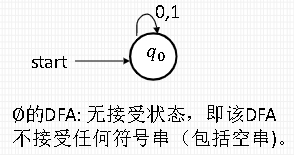​

### 识别$\{\varepsilon\}$的DFA

* 一开始就是接受状态，接受了字符则不再是接受状态

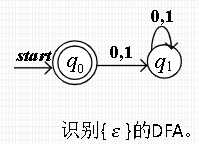​

# 非确定有穷自动机

## 形式化定义

$NFA\space A=(Q,\Sigma,\delta,q_0,F)$

* $Q$：有穷状态集
* $\Sigma$：有穷输入符号集
* $\delta$：$Q\times \Sigma \rightarrow 2^Q$，状态转移函数
* $q_0 \in Q$：初始状态
* $F \subseteq Q$：终结状态集

## 状态转移的表示

* 例：接受全部以01结尾的串的NFA

### 状态转移图

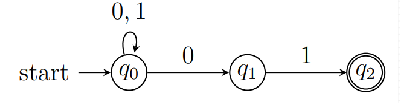​

### 状态转移表

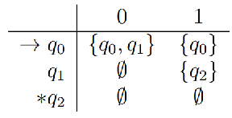

### 扩展状态转移函数

与$DFA$类似，扩展$\delta$到字符串，定义状态扩展转移函数$\hat{\delta}:Q\times \Sigma^* \rightarrow 2^Q$为

$$
\hat{\delta}(q,w)=\begin{cases}
&\{q\},&w=\varepsilon \\
&\bigcup_{p\in \hat{\delta}(q,x)}\delta(p,a),&w=xa
\end{cases}
$$

如果输入字符为abc，初始状态是q0，经过a可以到达q1,q2，那么我们有：

$$
\hat{\delta}(q_0,\varepsilon)=\{q_0\}
\\
\hat{\delta}(q_0,a)=\bigcup_{p\in \hat{\delta}(q_0,\varepsilon)}\delta(p,a)=\{q1,q2\}
$$

然后依次递推即可

## DFA与NFA对比

**虽然有种种区别，但是DFA和NFA表示语言的能力是等价的**

|区别|DFA|NFA|
| ----------| ----------------------------------------------------------| ------------------------------------------------------------------------|
|状态转移|状态的转移是确定的 一次状态转移只会转移到一个确定的状态|状态的转移是非确定的 一次状态转移可能转移到多个状态，产生多条转移路径|
|符号处理|**对于每一个状态，都需要明确定义对于各个可能的输入符号的状态转移**|**不需要明确地定义所有的状态转移**（未定义会进入dead state）|
|设计难度|有时设计较复杂|通常比DFA更为容易设计|
|接受状态|最后所处的状态在接受状态集F中时才接受符号串|最后所处的状态集中有某个状态在接受状态集F中时，才接受符号串|

## NFA的语言

定义$NFA\space\space N=(Q,\Sigma,\delta,q_0,F)$，则$N$识别的语言是

$$
L(D)=\{w\in \Sigma^*\vert\hat{\delta}(q_0,w)\cap F\neq \varnothing \}
$$

## NFA与DFA的等价性

* 定理：如果语言L能被NFA接受，当且仅当L被DFA接受

### 构造方法：子集构造法

子集构造法解决的是$NFA\Rightarrow DFA$的问题

来源：$NFA\space \space N=(Q_N,\Sigma,\delta_N,q_0,F_N)$

目标：$DFA\space\space D=(Q_D,\Sigma,\delta_D,{q_0},F_D)$  

* **构造方法**

$Q_D=2^{Q_N}$

$F_D=\{S\vert S\subset Q_N,S\cap F_N \ne \varnothing\}$  

$\forall S \subset Q_N,\forall a\in \Sigma,\delta_D(S,a)=\bigcup_{p\in S}\delta_N(p,a)$  

**上述构造方法的解释为：**

DFA的状态集是NFA状态集的幂集

DFA的接受状态集是NFA状态集的子集，其与$F_N$交集不为空

假设DFA的某个状态是$\{q_1,q_2,q_3\}$，输入符号$a$，那么$\delta_D(\{q_1,q_2,q_3\},a)$是$\delta_N(q_i,a)$的并集$(i=1,2,3)$  

* 在构造出来的DFA中，$\{q_1,q_2,q_3\}$表示的是一个**状态**，而不是一个**集合**

### 实际操作的注意点

**每次只需要考虑新的状态集即可，不需要把所有的状态都列出，否则当NFA状态多的时候，DFA的状态将指数级增长**

# 带空转移的非确定有穷自动机

## $\varepsilon-NFA$的定义

* 简化NFA的构造
* **<u>明确地</u>**定义了至少一个空转移
* 状态表中多了$\varepsilon$的一列
* 与$NFA$的定义只差了$\delta$：$\delta :Q \times (\Sigma \cup \varepsilon)\rightarrow 2^Q$，这正好对应了上一条

> 除非特别申明，不再明确区分$\varepsilon-NFA$和$NFA$，而是都称为NFA

* 示例：接受倒数三个字符至少有一个是1的$NFA$和$\varepsilon-NFA$的状态转移图表：

  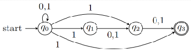​  
  ​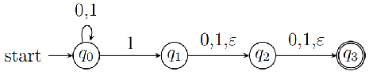  
  ​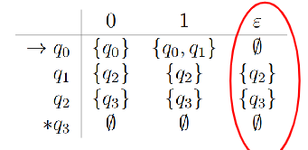​

  上面的NFA的构造思路是，每接受一个字符，$q_0$根据当前字符的类型进入到两个状态：

  * 这个字符不是倒数三个字符，返回$q_0$进行继续处理
  * 这个字符是倒数的字符，进入到处理对应情况的状态中

## 状态的$\varepsilon$-闭包

闭包的函数是$ECLOSE()$

### 状态闭包的递归定义

* $q\in ECLOSE(q)$$，即包含该状态本身$
* $\forall p \in ECLOSE(q)，若r\in \delta(p,\varepsilon)，则r\in ECLOSE(q)$

> 可以理解为，以一个点为起点的所有空转移路径所经过点组成的集合

### 状态集闭包的定义

* $ECLOSE(S)=\bigcup_{q\in S}ECLOSE(q)$

即一个状态集S的$\varepsilon$-闭包为S里面每个状态的$\varepsilon$-闭包的并集

### 闭包示例

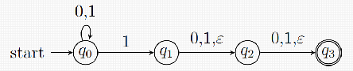​

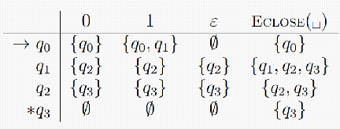​

## 扩展转移函数

与$NFA$类似，扩展$\delta$到字符串，定义状态扩展转移函数$\hat{\delta}:Q\times \Sigma^* \rightarrow 2^Q$为

$$
\hat{\delta}(q,w)=\begin{cases}
&ECLOSE(q),&w=\varepsilon \\
&ECLOSE(\bigcup_{p\in \hat{\delta}(q,x)}\delta(p,a)),&w=xa
\end{cases}
$$

其和$NFA$的没有什么区别，只是在$NFA$的**<u>状态转移函数每一步求解之后</u>**进行了一次闭包运算

## 接受的语言

定义$\varepsilon -NFA\space\space E=(Q,\Sigma,\delta,q_0,F)$，则$E$识别的语言是

$$
L(E)=\{w\in \Sigma^*\vert\hat{\delta}(q_0,w)\cap F\neq \varnothing \}
$$

**和NFA定义一模一样**

## $\varepsilon-NFA$和$DFA$的等价性

* 如果语言L被$\varepsilon-NFA$接受，当且仅当L被$DFA$接受

### 子集构造法

这次的子集构造法解决的是$\varepsilon-NFA\Rightarrow DFA$的问题

来源：$\varepsilon-NFA\space \space E=(Q_E,\Sigma,\delta_E,q_E,F_E)$

目标：$DFA\space\space D=(Q_D,\Sigma,\delta_D,{q_0},F_D)$

* **构造方法**

$Q_D=2^{Q_E}$  

$q_D=ECLOSE(q_E)$

$F_D=\{S\vert S\subseteq Q_E,S\cap F_E \ne \varnothing\}$

$\begin{aligned}\forall S \subset Q_E,\forall a\in \Sigma,\delta_D(S,a)=&\\ &ECLOSE(\bigcup_{p\in S}\delta_E(p,a))\end{aligned}$

**和NFA到DFA的子集构造法不同的是：**

* 初始状态是一个**空闭包**
* 对DFA某个状态集中的所有状态，找出他们通过字符a可达的状态组成的集合后，要对这个集合使用**空闭包**

### 改进的子集构造法

**每次只需要考虑新的状态集即可，不需要把所有的状态都列出**

### 子集构造法示例

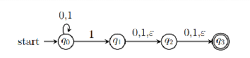​

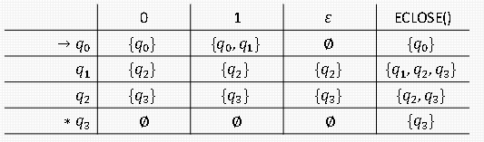​​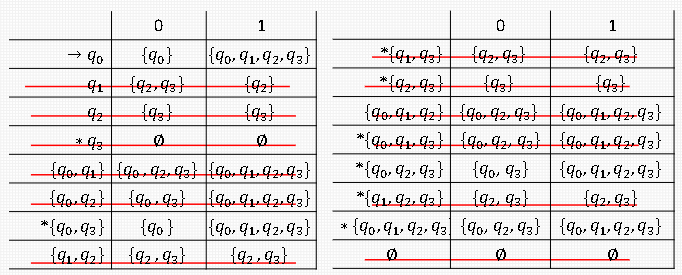​

**无论是先计算可达状态的闭包，还是求出可达状态的集合然后取闭包，结果是一样的**

‍
