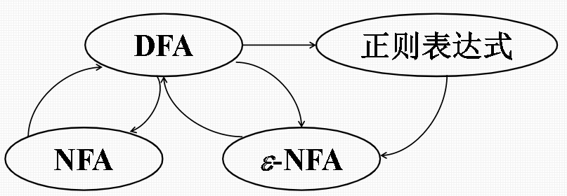
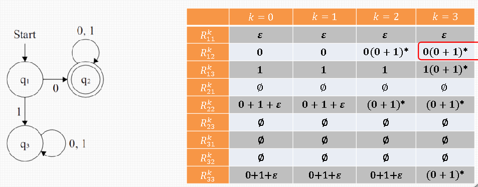
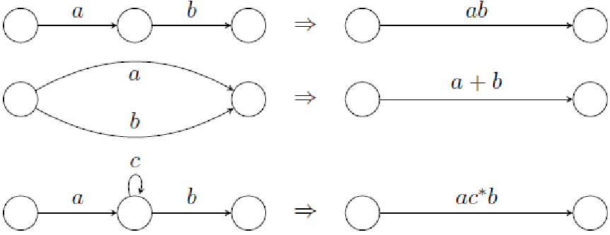
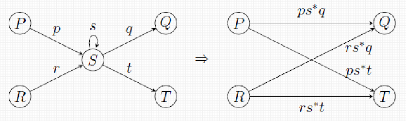
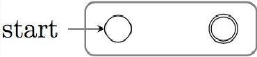
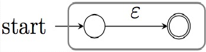
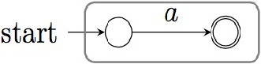
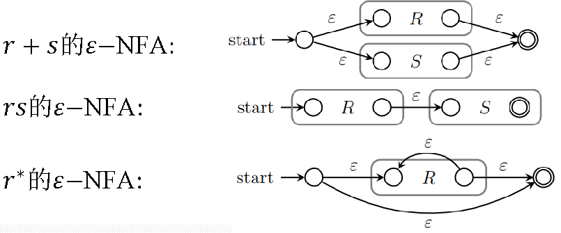

# 正则表达式和正则语言

# 正则表达式

## 正则表达式的递归定义

### 语言的运算

* 设$L$和$M$是两个语言，那么

并：$L\cup M = \{w \vert w\in L\space or\space w\in M \}$

连接：$L\cdot M = \{w \vert w=xy,x\in L \space and\space y\in M \}$

幂：$L^0=\{\varepsilon\},L^1=L,L^n=L^{n-1}\cdot L$

克林闭包：$L^*=\bigcup_{i=0}^\infty L^i$  

> 注意0次幂的结果是长度为0的串构成的集合，也就是包含空字符的集合

* 特殊地，对空语言$\varnothing$

$\varnothing^0=\{\varepsilon\},\space \varnothing^n=\varnothing,\varnothing^*={\varepsilon}$  

这是比较好理解的，因为对语言来说，0次幂表示没有语言的集合参与连接运算，所以会返回一个缺省值$\{\varepsilon\}$，而*代表克林闭包，是包括0次幂的情况的，但是空语言自己和自己做连接运算是什么也得不到的

### 正则表达式的递归定义

* **基础1：**$\varnothing$是一个正则表达式，表示空语言$\varnothing$​
* **基础2：**$\varepsilon$是一个正则表达式，表示语言$\{\varepsilon\}$
* **基础3：**对于任意一个符号a，a是一个正则表达式，表示语言{a}，其有一个长度为1的字符串

在归纳前，我们规定下面归纳的条件是：E1和E2是正则表达式，或E是正则表达式

* **归纳1：**$E_1+E_2$是正则表达式，且$L(E_1+E_2)=L(E_1) \cup L(E_2)$
* **归纳2：**$E_1E_2$是正则表达式，且$L(E_1E_2)=L(E_1)L(E_2)$
* **归纳3：**$E^*$是正则表达式
* **归纳4：**$(E)$是正则表达式，表示语言$L(E)$

### 正则表达式运算符的优先级

$()\space \gt * \space \gt \space \cdot \gt \space +$  

$例1：1+01^*=1+(0(1^*))=\{1,0,01,011,0111,...\}$

$例2：(a+b)^*(a+bb)中，a\rightarrow\{a\},b\rightarrow\{b\},\{a+b\}=\{a\}\cup \{b\},(a+b)^*=\{a,b\}^*，故L((a+b)^*(a+bb))=\{a,bb,aa,abb,ba,bbb\}$  

例2语言中的字符串w满足，w由a和b组成，仅由a或bb结尾

# 有穷自动机和正则表达式

## 自动机和正则表达式的关系

​

* 对于一个$DFA$所能识别的语言，都存在一个**正则表达式**表示它
* 任何一个**正则表达式**表示的语言，都可以由一个$\varepsilon-NFA$识别

## 由自动机到正则表达式

* 若$L=L(A)$是某$DFA\space\space A$的语言，那么存在正则表达式$R$满足$L=L(R)$

证明方法有递归法和状态消除法

### 递归法

* 定义k-路径$R_{i,j}^{(k)}$​表示从i到j但中间节点状态编号不超过k的全部路径的字符串集
* $R_{i,j}^{(k)}=\{x\vert \hat{\delta}(i,x)=j,x经过的状态除两端外都不超过k \}$

运算的若干简化规则：

* $(\varepsilon+E)^*=E^*$
* $E_1+E_1E_2^*=E_1E_2^*$
* $\varnothing E_1 = E_1\varnothing = \varnothing$
* $\varnothing + E_1 = E_1 +\varnothing = E_1$​

#### 归纳基础

$k=0,i=j$时，$R_{i,j}^{(0)}$至少有一个空字符$\varepsilon$

$k=0,i\neq j$时，$R_{i,j}^{(0)}$最小的情况是$\varnothing$  

#### 递归关系

$R_{i,j}^{(k)}=R_{i,j}^{(k-1)}+R_{i,k}^{(k-1)}(R_{k,k}^{(k-1)})R_{k,j}^{(k-1)}$  

在具体求解的过程中，如果题目有$n$个状态，我们尽量使这些状态的下标从$1$开始，即$q_1,q_2,q_3,...q_n$，一共$n$个状态，然后我们需要一张表，并逐列计算，其中行代表$k=0,1,...,n$，列代表$R_{i,j}^k$，设开始状态为$q_x$，结束状态为$q_y$，状态数为$n$，那么我们期望从表中定位的是$R_{x,y}^{(n)}$​

* 例子

​

### 状态消除法

细节比较多，主要是删除原来的路径后要补上等价的路径

​

* 为被删除状态的每个“入”和“出”路径的组合补一条等价的新路径

​

对于节点$S$，两入两出，故删除了节点$S$之后要补$4$条路径，其自身循环的回路要另外考虑（即$S$自身到自身的循环，需要接入到补入的路径中）

* 一些细节，使用状态消除法时，需要增加两个状态，代替原来的初始状态和结束状态，并通过空转移与原来的初始状态和结束状态相连接

> 这部分的细节比较多，需要结合具体题目

## 由正则表达式到自动机

* **定理：每个正则表达式定义的语言，都可以被有穷自动机识别**
* **定理的另一种表述：对于任意正则表达式R，都存在与其等价的**$\varepsilon$$-NFA \space \space A$，即$L(A)=L(R)$，且$A$满足：

  * 仅有一个接受状态
  * 没有进入开始状态的边
  * 没有离开接受状态的边
* 归纳基础

  * 正则表达式$\varnothing$  

    
  * 正则表达式$\varepsilon$  

    
  * 正则表达式a

    ​																							
* 归纳递推：若r和s为正则表达式，他们对应的$\varepsilon-NFA$分别为R和S

  ​

* 在实际构造$\varepsilon-NFA$时，注意不需要把这里的方框画上，这里的方框只是方便作区分

# 正则表达式的代数定律

## 结合律和交换律

* $L+M=M+L$​
* $(L+M)+N=L+(M+N)$
* $(LM)N=L(MN)$
* $LM\neq ML$

## 单位元与零元

* $\varnothing + L = L+\varnothing =L$
* $\varepsilon L = L\varepsilon = L$
* $\varnothing L = L\varnothing =\varnothing$​

## 分配

* $L(M+N)=LM+LN$​
* $(M+N)L=ML+NL$  

  例：$0+01^*=0\varepsilon +01^*=0(\varepsilon + 1^*)=01^*$

## 幂等

* $L+L=L$​

## 闭包

* $(L^*)^*=L^*$
* $\varnothing^*=\varepsilon$​
* $\varepsilon^*=\varepsilon$​
* $LL^*=L^*L$
* $(L+\varepsilon)^*=L^*$​

# 正则语言的泵引理

## 泵引理

* 泵引理：如果语言$L$是正则的，那么存在正整数$N$，对$w\in L$，只要$\vert w \vert \geq N$，就可以将$w$分为三部分$w=xyz$，满足：

  * $y\neq \varepsilon (或\vert y \vert \gt 0)$​
  * $\vert xy \vert \leq N$​
  * $\forall k \geq 0, xy^kz \in L$​

    > 即中间的串循环0到∞次，所得的串仍然属于该正则语言
    >

* 泵引理是正则语言判定的**必要条件**，但**不是充分条件**

## 泵引理的使用

* **使用泵引理证明某个语言**$L$**​**不是正则的

  * 假设语言$L$是正则的，则一定存在正整数$N$，对$w\in L (\vert w \vert \geq N)$满足泵引理
  * 选取$L$中某个满足长度要求的符号串$w$，分解$w=xyz$​
  * 证明存在某个$k \geq 0$，使得$xy^kz \notin L$​
  * 则由泵引理，如果$L$是正则语言，那么$xy^kz\in L$​
  * 存在矛盾，得出结论：语言$L$不是正则的

在证明$L=\{ a^{n!} \vert n \gt 0 \}$不是正则的时候，注意到不等式：

$(N+1)!+N\lt(N+1)!+(N+1)!\le(N+2)!$  

> 这里和之后的上下文无关语言的泵引理都要多结合一点题目看，才有感觉

# 正则语言的封闭性

## 总览

正则语言$L$和$M$，在这些运算下封闭：

* 并：$L\cup M$，连接：$L\cdot M$，闭包：$L^*$​
* 补：$\overline{L}$​
* 交：$L\cap M$​
* 差：$L-M$​
* 反转：$L^R=\{w^R \vert w\in L\}$
* 同态：$h(L)=\{ h(w) \vert w\in L,  h:\Sigma \rightarrow \Gamma^* \}$
* 逆同态：$h^{-1}(L)=\{ w\in\Sigma^* \vert h(w)\in L\subset \Gamma^*,h:\Sigma \rightarrow \Gamma^* \}$

展开地讲，如果$L$和$M$是正则语言，那么一定存在正则表达式$r$和$m$去表示它们，即$L=L(r)$，$M=L(m)$​

### 并、连接、闭包

* $L\cup M = L(r+m),L\cdot M = L(rm), L^* = L(r^*)$

### 补

* 如果$L$是$\Sigma$上的正则语言，那么$\overline{L}=\Sigma^*-L$也是正则的，即把$L$对应的字符串从$\Sigma^*$上去掉

如果要证明一个语言**不是正则的**，如果从正面使用泵引理不好下手，可以利用补运算的封闭性，看它的补集是否是正则的

### 交

* 如果$L$和$M$是正则语言，那么$L\cap M$也是正则语言

> 其证明只需要利用$L\cap M = \overline{\overline{L}\cup \overline{M} }$即可

* 使用方法

通常的用法是，如果已知某种语言$L_1$不是正则的，使用封闭性证明另一种语言$L_2$也不是正则的，这时候我们需要寻找到一个正则的语言$L_3$，满足$L2\cap L3 =L1$，如果$L_2$正则，因为$L_3$正则，根据封闭性$L_1$一定正则，矛盾，故$L_2$不正则

在寻找$L_3$时，可以根据之前得到的封闭性来寻找正则表达式

* 特例

**若**$L_1$**​**和**$L_2$**​**都不是正则的，**$L_1\cap L_2$**​**可能是正则的**

例：$L_1=\{0^n1^n\vert n\geq0\}$，$L_2=\{a^nb^n\vert n\geq0\}$，$L_1\cap L_2 =\{\varepsilon\}$是正则语言

### 差

* 如果$L$和$M$是正则语言，那么$L-M$也是正则语言（$L-M=L\cap \overline{M}$）

### 反转

* 定义：字符串$w=a_1a_2...a_n$的反转记为$w^R$，定义为$w^R=a_na_{n-1}...a_1$​
* 定义：语言$L$的反转，记为$L^R=\{w^R\in\Sigma^*\vert w\in L \}$

### 同态

* 定义：若$\Sigma$和$\Gamma$是两个字母表，同态函数定义为$h:\Sigma \rightarrow \Gamma^*$，即$\forall a \in \Sigma,h(a)\in \Gamma^*$，即将$\Sigma$上的**符号**映射为$\Gamma$上的**符号串**
* 扩展$h$的定义：

  * $h(\varepsilon) = \varepsilon$
  * $h(xa)=h(x)h(a)$
  * 对$\forall L \subseteq \Sigma^*$，$h(L)=\{h(w)\vert w\in L\}$（$L$是语言）
  * 为了便于代换，我们还可以得出结论：

    * $h(a^*)=(h(a))^*$

* 例

  * 定义$h(0)=ab,h(1)=\varepsilon$
  * $h(0011)=h(0)h(0)h(1)h(1)=abab\varepsilon \varepsilon=abab$​
  * $h(1^*0+0^*1)=(h(1))^*h(0)+(h(0))^*h(1)=(ab)^*$​

### 逆同态

从符号串的定义出发

* $h^{-1}(y)=x\space(y\in \Gamma^*,x\in \Sigma^*,h(x)=y)$，如果一个我们有$\Sigma$上的字符串$x$可以通过同态的定义到达$y$，那么逆同态就是将这个过程逆转（这是笔者自己推导的公式，仅作理解用）
* $h^{-1}(L)=\{w\in\Sigma^* \vert h(w)\in L\},\space h:\Sigma\rightarrow\Gamma^*,L\subseteq \Gamma^*,w\in \Sigma^*$，即对于$L$中的每个字符串$h(w)$，寻找到其在$\Sigma$上的原像$w$构成的集合

# 正则语言的判定性质

## 正则语言中典型的3个判定问题

* 串$w$是否属于某语言
* 某语言是否为空？是否无穷？
* 两种方式描述的语言是否等价？

## 非空性和无穷性

对于具有$n$个状态的有穷自动机$M$接受的集合$S$：

* $S$是**非空的**，当且仅当$M$接受某个长度小于$n$的串
* $S$是**无穷的**，当且仅当$M$接受某个长度为$m$的串，$n\leq m \lt 2n$

## 等价性

* **存在**算法，判定两个有穷自动机是否等价（接受的语言相同）

# 自动机的最小化

* 给定一个$DFA$可以找出一个等价的（描述同一语言）具有最小状态数的$DFA$​
* 描述某个语言$L$的最小化的$DFA$​是唯一的

## 状态等价的定义

* $DFA\space\space A=(Q,\Sigma,\delta,q_0,F)$中的两个状态$p$和$q$，对$\forall w \in \Sigma^*:\hat{\delta}(p,w)\in F \Leftrightarrow \hat{\delta}(q,w)\in F$，则这两个状态是等价的

状态等价的定义只关心这两个串**要么都被接受，要么都被拒绝**，而不关心他们各自处于什么状态

## 填表法

* 填表算法寻找$DFA$中的全部**可区分**的状态对：

  * 基础：如果$p\in F$而$q\notin F$，则$[p,q]$是可区分的
  * 递推：如果某个$a\in \Sigma$，有$[r=\delta (p,a),s=\delta (q,a)]$是可区分的，那$[p,q]$是可区分的
  * 递推式的意义是，如果某一状态对能通过某个字符到达一个可区分的状态对，则这个状态对是可区分的
* 操作步骤

  * 记$DFA \space\space d1$的状态为$A,B,C,...,H$，画一个下三角的表，其列标是$B,C,...,H$，行标是$A,B,C,...,G$​**，表从第二个状态开始，最后一个状态结束；行标从第一个状态开始，倒数第二个状态结束，使得画完这个表之后，不存在有[A,A]这种自己和自己组成了状态对的情况**
  * 直接标记终态和非终态之间的状态对，即在表格中画一个$X$表示可以区分
  * 对于$\forall a \in \Sigma$，维护经过$a$到达终态和非终态的两个状态对集合，这两个集合内元素之间是可区分的
  * 依次检查剩下不可区分的状态对，用不同的输入进行检验
  * 根据表将状态集进行划分，得到不同的块，块中的状态是等价的，构造新的$DFA \space \space d_2$，其开始状态为包含$d_1$开始状态的块，结束状态为包含$d_1$结束状态的块，转移函数为块之间的转移，此时$d_2$是$d_1$的最小化$DFA$

‍
