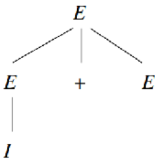
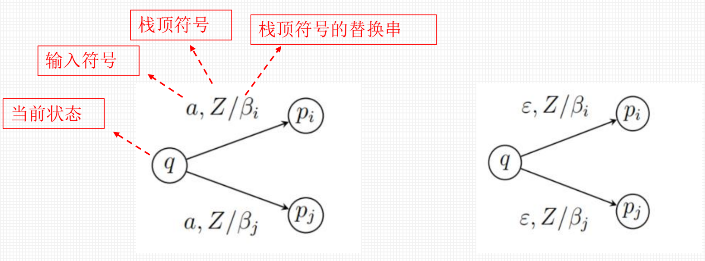
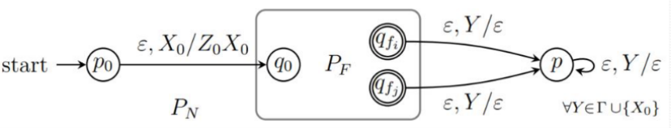
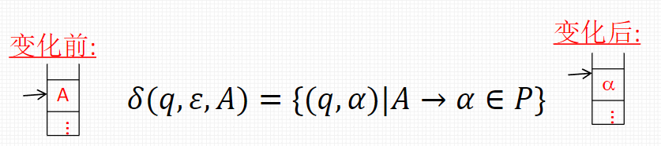
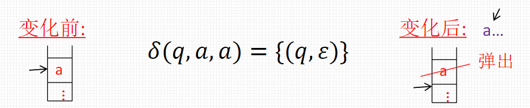
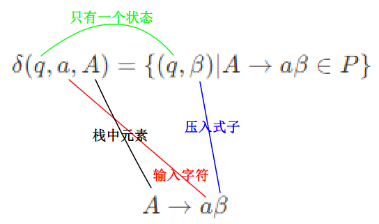

# 上下文无关文法和下推自动机

# 上下文无关文法

上下文无关文法可以表示**大多数程序设计语言**的语法，尤其是程序中**配对**或者**嵌套**的结构，应用领域有**程序语言的设计、编译器的实现、XML的格式类型定义DTD**

## 形式定义

上下文无关文法$(CFG)$，$G$是一个四元组

$$
G=(V,T,P,S)
$$

* **字母定义**

$V$：变元的有穷集

$T$：终结符的有穷集，$V\cap T = \varnothing$​

$P$：产生式的有穷集：**左部**$\rightarrow$​**体/右部**$\in (V\cup T)^*$  

$S$：初始符号

* **简化表达**

多个$A$的产生式$A\rightarrow \alpha_1,A\rightarrow\alpha_2,...,A\rightarrow \alpha_n$简写为$A\rightarrow \alpha_1\vert\alpha_2\vert\alpha_3\vert...\vert\alpha_n$​

变元$A$的全体产生式称为$A$产生式

* **归约和派生**

**归约**：字符串到文法变元的分析过程，自底向上，从产生式的体向头

**派生**：文法变元到字符串的分析过程，自顶向下，从产生式的头向体

$\alpha A \beta \stackrel{\Rightarrow}{_G}\alpha\gamma\beta$：当$A\rightarrow \gamma \in P$时，称为$\alpha A \beta$可派生出$\alpha \gamma \beta$，也称$\alpha \gamma \beta$可归约为$\alpha A \beta$

$\alpha A \beta \Rightarrow\alpha\gamma\beta$：$G$在已知情况下，可以省略

$\alpha A \beta \underset{G}{\stackrel{*}{\Rightarrow}}\alpha\gamma\beta$：经过$0$步或多步派生

$\alpha A \beta \underset{G}{\stackrel{i}{\Rightarrow}}\alpha\gamma\beta$：恰好经过$i$步派生

$\underset{lm}{\stackrel{}{\Rightarrow}},\underset{lm}{\stackrel{*}{\Rightarrow}}$：最左派生，即派生过程中仅替换符号串**最左边的变元**

$\underset{rm}{\stackrel{}{\Rightarrow}},\underset{rm}{\stackrel{*}{\Rightarrow}}$：最右派生

$A\stackrel{*}{\Rightarrow}w当且仅当A\underset{lm}{\stackrel{*}{\Rightarrow}}w，当且仅当A\underset{rm}{\stackrel{*}{\Rightarrow}}w$

## 语法分析树

用来表示派生，可以从树中看出整个派生过程和最终产生的符号串

**例**：

* **定义**

1. 每个内节点是变元符号$\in V$
2. 每个叶子节点$\in V\cup T\cup\{\varepsilon\}$
3. 若某个内节点标记是$A$，其子节点从左到右为

    $$
    X_1,X_2,X_3,...X_n
    $$

    则$A\rightarrow X_1,X_2,X_3,...,X_n$是$P$的一个产生式

* **相关定理和结论**

语法分析树的全部**叶节点**从左到右连接起来，称为该树的**产物**或**结果**，如果根节点是**初始符号**$\mathbf{S}$，叶节点是**终结符**，那么该树的产物属于$\mathbf{L(G)}$

**若某个**$\mathbf{X_i}$**​**为**$\varepsilon$**​**，则**$\mathbf{X_i}$**​**一定是**$\mathbf{A}$**​**唯一的子节点，且**$\mathbf{A\rightarrow \varepsilon}$**​**是一个产生式（ * ）

* **等价定义，对**$CFG\space \space G =(V,T,P,S),A\in V$，以下命题等价：
  * 文法$G$中存在以$A$为根节点，产物为$\alpha$的语法分析树
  * $A\stackrel{*}{\Rightarrow}w$​
  * $A\underset{lm}{\stackrel{*}{\Rightarrow}}w$​
  * $A\underset{rm}{\stackrel{*}{\Rightarrow}}w$​

## 文法和语言的歧义性

* 若$CFG\space\space G$使某些符号串有两棵**不同**的语法分析树，则该文法是歧义的，有些文法的歧义性可以通过**重新设计文法**来消除
* 如果上下文无关语言$L$的所有文法都是有歧义的，则称$L$是固有歧义的

  * 例：$L=\{a^ib^jc^k\vert i=j\space or\space j=k\}$是固有歧义的
* 「 判定任何给定$CFG\space \space G$是否是有歧义的 」是一个不可判定问题

## 文法的化简

* **定理：每个不带**$\varepsilon$**​**的**$\mathbf{CFL}$**​**都可以由一个不带无用符号，**$\varepsilon-$**​**产生式和单元产生式的文法来定义

* 文法化简的可靠顺序

  * 消除$\varepsilon-$产生式
  * 消除单元产生式
  * 消除非产生的无用符号
  * 消除非可达的无用符号

### 消除$\varepsilon-$产生式

注意，对于$CFG \space \space L$，消除了$\varepsilon-$产生式之后，该文法对应的语言为$L-\{\varepsilon\}$，若空串本身不在该语言中，则$L=L-\{\varepsilon\}$  

* **确定可空变元**

  * 若$A\rightarrow \varepsilon$，则$A$是可空的
  * 若$B\rightarrow \alpha$，且$\alpha$中每个符号都是可空的，则$B$是可空的
* **替换产生式，对含有可空变元的一条产生式**$\mathbf{A\rightarrow X_1,X_2,...,X_n}$​**，用**​***一组***​**产生式**$\mathbf{A\rightarrow Y_1,Y_2,...,Y_n}$​**代替**

  * 若$X_i$不是可空的，则$Y_i$为$X_i$​
  * 若$X_i$是可空的，则$Y_i$为$X_i$或$\varepsilon$​
  * $Y_i$不全为$\varepsilon$​

> 注意最后要先删除所有的$\varepsilon$-产生式，如果题目明确要求了化简后还要保留语言中的空串，则再加个产生式$S\rightarrow \varepsilon$即可，根据题意决定操作

### 消除单元产生式

* **确定单元对**：如果有$A\stackrel{*}{\Rightarrow}B$，则称$[A,B]$为单元对（注意这里的$A$和$B$都是单个**变元**）

  * 若$A\rightarrow B\in P$则$[A,B]$是单元对
  * 若$[A,B]$和$[B,C]$都是单元对，则$[A,C]$是单元对
* **消除单元产生式**

  * 删除全部形为$A\rightarrow B$的单元产生式
  * 对每个单元对$[A,B]$，将$B$的产生式复制给$A$​

### 消除无用符号

若$S\stackrel{*}{\Rightarrow}\alpha X\beta$，则$X$是可达的，若$\alpha X\beta \stackrel{*}{\Rightarrow} w(w\in T^*)$，则$X$是产生的

如果$X$既是产生的，也是可达的，则$X$是有用的，注意这里的$\mathbf{X\in (V \cup T)}$

* 计算"产生的"符号集

  * $T$中符号都是产生的
  * 对产生式$A\rightarrow\alpha \in P$且$\alpha$中符号**都是产生的**，则$A$是产生的
* 计算"可达的"符号集

  * 符号$S$是可达的
  * 对产生式$A\rightarrow \alpha \in P$且$A$是可达的，则$\alpha$中符号**都是可达的**
* 删除全部含有"非产生的"和"非可达的"符号的产生式

## 文法的范式

### 乔姆斯基范式CNF

* 定义：每个不带$\varepsilon$的$CFL$都可以由这样的$CFG\space\space G$定义，$G$中每个产生式的形式都为：

  $$
  A\rightarrow BC\space或\space A\rightarrow a
  $$

  其中$A,B,C$是变元，$a$是终结符

* **转换方法**

1. 设文法不带无用符号，$\varepsilon-$产生式和单元产生式（任何文法都可以化简成这种形式）
2. 考虑文法每个形式为$A\rightarrow X_1,X_2,...X_m(m\geq 2)$的产生式，若$X_i$为终结符$a$，则引入新变元$C_a$替换$X_i$并增加新产生式$C_a\rightarrow a$
3. 所有产生式的形式变成$A\rightarrow B_1,B_2,...,B_m(m\geq2)$和$B_i$（即$C_a$）$\rightarrow a$
4. 对于$A\rightarrow B_1B_2,...,B_m(m\geq 2)$，引入新变元$D_1,D_2,...,D_{m-2}$，即替换为一组级联产生式

    $$
    A\rightarrow B_1D_1,D_1\rightarrow B_2D_2,...,D_{m-2}\rightarrow B_{m-1}B_m
    $$

  

### 格雷巴赫范式GNF

* 定义：每个不带$\varepsilon$的$CFL$都可以由这样的$CFG\space \space G$定义，$G$中每个产生式的形式都为

  $$
  A\rightarrow a\alpha
  $$

  其中$A$是变元，$a$是终结符，$\alpha$是**零或多个**变元的串

关于$GNF$，要记住的是，其每个产生式都会引入一个**终结符**，长度为**n**的串的派生恰好是**n**步

# 下推自动机

## 形式定义

* **定义下推自动机（PDA）P为七元组**

  $$
  P=(Q,\Sigma,\Gamma,\delta,q_0,Z_0,F)
  $$

  * $Q$：有穷状态集
  * $\Sigma$：有穷输入符号集
  * $\Gamma$：有穷栈符号集
  * $\delta:Q \times (\Sigma\cup\{\varepsilon\})\times \Gamma \rightarrow2^{Q\times \Gamma^*}$：状态转移函数
  * $q_0 \in Q$：初始状态
  * $Z_0$：初始栈底符号
  * $F\subseteq Q$：接受状态集

* $PDA$**​**的动作

若$q,p_i \in Q (1 \leq i \leq m), a \in \Sigma \cup \{\varepsilon\}, Z\in \Gamma, \beta_i \in \Gamma^*$，则$\delta(q,a,Z)$表示如下的动作：

$$
\delta(q,a,Z)=\{(p_1,\beta_1),(p_2,\beta_2),...,(p_m,\beta_m)\} \\或\\\delta(q,\varepsilon,Z)=\{(p_1,\beta_1),(p_2,\beta_2),...,(p_m,\beta_m)\}
$$

* **状态转移图**

​

* **瞬时描述**

$(q,aw,Z\alpha)\vdash_p (p,w,\beta\alpha)$：在状态$q$从当前符号串$aw$中消耗$a$(可为$\varepsilon$\)，转移到状态$p$，同时用$\beta$(可为$\varepsilon$\)替换栈顶的$Z$，余下的符号串为$w$

$(q,aw,Z\alpha)\vdash (p,w,\beta\alpha)$：所指$PDA$明确时，可以忽略角标$p$

$(q,aw,Z\alpha)\vdash^{*} (p,w,\beta\alpha)$：经过**零个或多个动作**进行转移

## 终态方式和空栈方式的转换

首先明确两种方式的区别：

* **终态方式：**$L(P)=\{w\vert (q_0,w,Z_0\vdash^*(p,\varepsilon,\gamma),p\in F\}$  
  * 检查符号串是否消耗完
  * 检查是否进入了接受状态
* **空栈方式：**$N(P)=\{w\vert (q_0,w,Z_0\vdash^*(p,\varepsilon,\varepsilon)\}$  

  * 检查符号串是否消耗完
  * 检查栈是否已清空

* **定理**  
  如果PDA $𝑃_𝐹$以终态方式接受语言𝐿, 那么一定存在PDA $𝑃_𝑁$以空栈方式接受𝐿  
  如果PDA $𝑃_𝑁$以空栈方式接受语言𝐿, 那么一定存在PDA $𝑃_𝐹$以终态方式接受𝐿  
  证明略

### 从终态方式到空栈方式

​

* 设$P_F=(Q,\Sigma,\Gamma,\delta_F,q_0,Z_0,F)$  

  构造$P_N=(Q\cup\{p_0,p\},\Sigma,\Gamma \cup\{X_0\},\delta_N,p_0,X_0,\varnothing)$​*~即添加了新的开始状态~*$q_0$~、消除状态~*$q$*~​*~~和一个栈符号~*$X_0$*
* 先将$P_F$的栈底符号$Z_0$压栈  
  $\delta_N(p_0,\varepsilon,X_0)=\{(q_0,Z_0X_0)\}$​
* 模拟$P_F$的动作  
  $\delta_N(q,a,Y)$包含$\delta_F(q,a,Y)$的全部元素
* 从$q_f \in F$开始弹出栈中符号  
  $\delta_N(q_f,\varepsilon,Y)$包含$(p,\varepsilon)$​
* 状态$p$时，弹出全部栈中符号，即$\forall Y \in \Gamma \cup \{X_0\}$  
  $\delta_N(p,\varepsilon,Y)=\{(p,\varepsilon)\}$

### 从空栈方式到终态方式

​

* 设$P_N=(Q,\Sigma,\Gamma,\delta_N,q_0,Z_0,\varnothing)$  
  构造$P_F=(Q\cup\{p_0,p_f\},\Sigma,\Gamma\cup\{X_0\},\delta_F, p_0,X_0,\{p_f\})$
* 开始时，将$P_N$栈底符号$Z_0$压栈  
  $\delta_F(p_0,\varepsilon,X_0)=\{(q_0,Z_0X_0)\}$
* 模拟$P_N$的动作  
  $\delta_F(q,a,Y)$包含$\delta_N(q,a,Y)$的全部元素
* $\forall q\in Q$，看到$P_F$的栈底$X_0$，则转移到新的终态$p_f$  
  $\delta_F(q,\varepsilon,X_0)=\{(p_f,\varepsilon)\}$

## 下推自动机和文法的等价性

### 任意CFG到PDA

* 定理：对任何$CFL \space\space L$，一定存在$PDA \space \space P$，使得$L=N(P)$

* 构造方法  
  给定$CFG\space\space G = (V,T,P,S)$  
  构造$PDA\space\space P_N=(\{q\},T,V\cup T,\delta,q,S,\varnothing)$  

  其中$\delta$：

  1. 对每个变元$A$，输入空串，压入产生式：$\delta(q,\varepsilon,A)=\{(q,\alpha)\vert A\rightarrow \alpha\in P\}$
  2. 对每个终结符$a$，输入字符，弹出字符$a$：$\delta(q,a,a)=\{(q,\varepsilon)\}$​

这种方法构造出来的$PDA$在实际识别的时候会产生大量的**dead paths**，识别时只针对正确的路径分析即可

### GNF到PDA

* 构造方法

如果有$GNF$格式的$CFG\space\space G = (V,T,P,S)$，那么构造$PDA\space \space P_N=\{\{q\},T,V,\delta,q,S,\varnothing\}$  

对**每个产生式**$A\rightarrow a\beta$，定义$\delta$为：

$$
\delta(q,a,A)=\{(q,\beta)\vert A\rightarrow a\beta\in P\}
$$

他们之间的关系是这样的：

### PDA到CFG

如果$PDA\space \space P_N=(Q,\Sigma,\Gamma,\delta,q_0,Z_0,\varnothing)$，有$L=N(P)$（即$P_N$以空栈方式接受$L$）  
那么可以构造$CFG\space\space G =(V,\Sigma ,P,S)$，其中：

变元$V=\{[qXp]\space \vert \space p,q\in Q, X\in \Gamma\}\cup\{S\}$  

产生式集合$P$包括：

1. $\forall p \in Q$，构造产生式$S\rightarrow [q_0Z_0p]$
2. $\forall (p,Y_1,Y_2,...,Y_n) \in \delta(q,a,X)$，构造$\vert Q\vert^n$个产生式

    $$
    [qXr_n]\rightarrow a[pY_1r_1][r_1Y_2r_2]...[r_{n-1}Y_nr_n]\\其中a\in \Sigma \cup\{\varepsilon\};\quad X,Y_i\in\Gamma;\quad r_i是Q中任意一个状态
    $$
3. $\forall (p,Y_1Y_2...Y_n) \in \delta(q,a,X)$，若$Y_1Y_2...Y_n=\varepsilon$，则有产生式$[qXp]\rightarrow a$（这代表着从状态$q$完全弹出栈符号$X$到状态$p$，只需要接受一个符号$a$）

* 通常我们在完成了上述步骤之后，还需要**消除无用符号**，这是因为，在上面的过程中我们多次地**假定所有状态之间相互可达**，假如某个状态$q_i$是不能到达$q_j$的，但是我们在构造产生式时还是会用到状态$[q_iXq_j]$，因此是需要消除无用符号的
* PPT上的例题是没有消除$\varepsilon$-产生式的
* 此外，为了化简方便，可以进一步使用$A,B,...$替换这些看起来复杂的变元

#### 细节方面

在构造的过程中，大量地使用了「穷举」的思想，需要后续来消除无用的符号

## 确定型下推自动机

* 定义，如果$PDA\space\space P=(Q,\Sigma,\Gamma,\delta,q_0,Z_0,F)$满足：

  * 对于任何的$(q,a,X)$组合，$q\in Q, a\in \Sigma \cup \{\varepsilon\},X\in \Gamma ,\delta(q,a,X)$至多有一个转移
  * 如果$\delta(q,a,X)$对于某个$a\in \Sigma$是有定义的，则$(q,\varepsilon,X)=\varnothing$​
* 上面的定义可以从两个方面考虑：

  * 在确定某个状态$q$、某个栈顶符号$X$和输入字符$a$下，状态转移的结果数量最多一个
  * 在确定某个状态$q$、某个栈顶符号$X$下，不可能既能接受终结符$a$进行状态转移，又可以接受空字符$\varepsilon$进行状态转移

* 表示语言的能力上$DFA\Leftrightarrow NFA$，但是$DPDA$和$PDA$不等价

* **终态方式**

$DPDA$以终态方式接受的语言也被称为$DCFL$（确定的上下文无关语言）

$RL \subset DCFL$（正则语言真包含于$DCFL$）

$DCFL$应用于：

1. 非固有歧义语言的真子集
2. 著名语法分析器YACC的基础$LR(k)$文法是$DCFL$的子集

* **空栈方式**

定义：语言$L$中不存在字符串$x$和$y$，使$x$是$y$的前缀，则$L$具有前缀性质

定理：如果$L=N(P)$，即被某个$DPDA\space\space P$以空栈方式接受，当且仅当$L$有前缀性质，且存在以终态方式接受的$DPDA \space \space P'$使$L=L(P')$​

$DPDA\space \space P$的$N(P)$更有限，不能接受$0^*$

* $DPDA$与歧义文法

定理：$DPDA\space\space P$，语言$L=L(P)$，那么$L$有无歧义的$CFG$

定理：$DPDA\space\space P$，语言$L=N(P)$，那么$L$有无歧义的$CFG$
