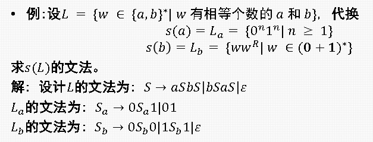
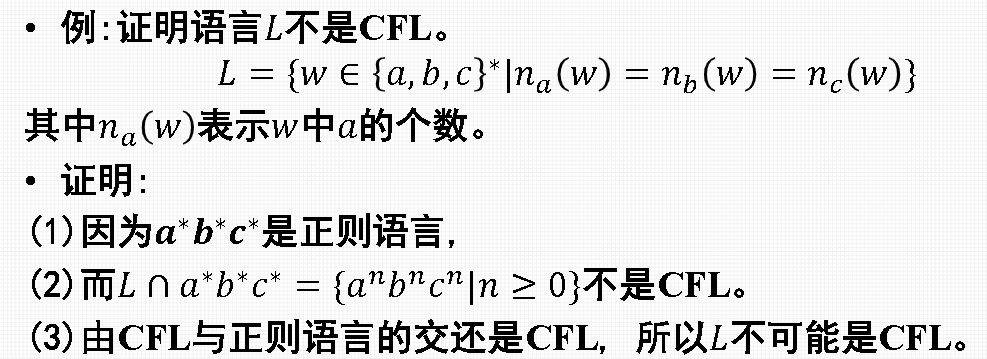
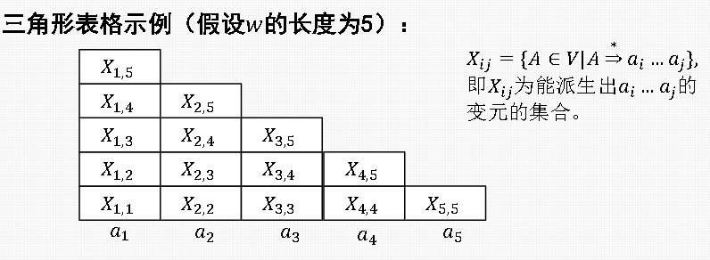
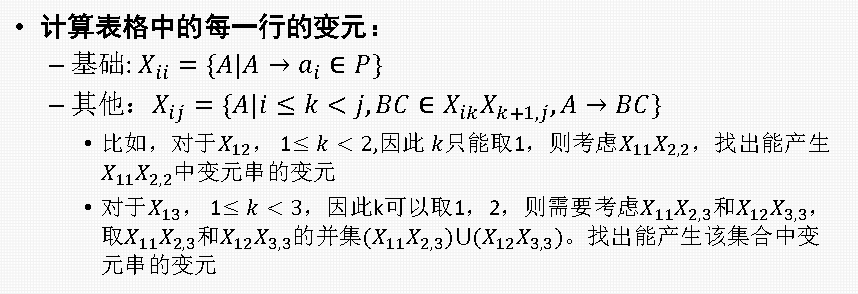
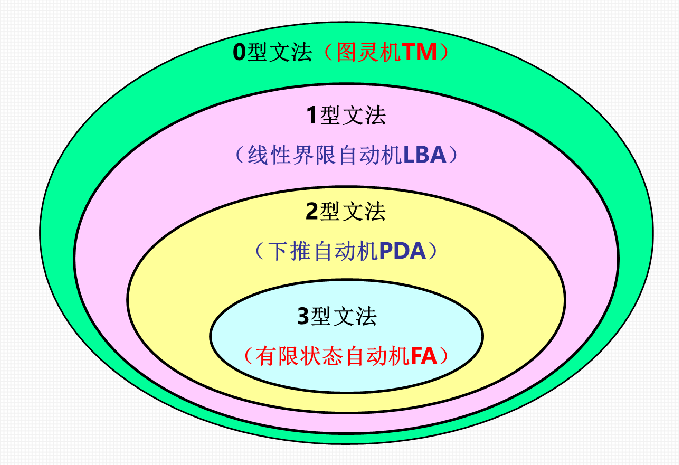

# 上下文无关语言的性质

# 泵引理及应用

* 如果语言$L$是$CFL$，那么存在正整数$N$，对$\forall z \in L$只要$\vert z\vert \geq N$，就可以将$z$分为五部分$z=uvwxy$，满足：

  * $vx\neq \varepsilon$（或$\vert vx\vert \ge 0$）
  * $\vert vwx \vert \leq N$
  * $\forall i \geq 0, uv^iwx^iy\in L$

* **使用步骤**

1. 假设$L$是$CFL$，那么存在正整数$N$，对$\forall z \in L(\vert z\vert \geq N )$满足泵引理
2. 取满足条件的$z$​
3. 由泵引理，将$z$分为$z=uvwxy$，且有$\vert vwx \vert \leq N$且$vx\neq \varepsilon$​
4. 对$i$取值，使得$uv^iwx^iy\notin L$​接受（$i$通常可取0）
5. 假设不成立，故$L$不是$CFL$​

同样的，泵引理也只是$CFL$的**必要条件**而不是**充分条件**

# 上下文无关语言的封闭性

## 基础：代换

* 定义：两个字母表$\Sigma$到$\Gamma$的函数$s:\Sigma \rightarrow 2^{\Gamma^*}$，即$\Sigma$中的一个字符$a$在$s$的作用下为$\Gamma$上的一个语言$L_a$，即$s(a)=L_a$​
* 扩展$s$的定义到字符串：

  $$
  s(\varepsilon)=\varepsilon \\s(xa)=s(x)s(a)
  $$
* 扩展$s$的定义到语言，对$\forall L \subset \Sigma^*$  

  $$
  s(L)=\bigcup_{x\in L}s(x)
  $$

可以看出，对字符串的扩展定义无非就是把**两种语言进行拼接**，对语言的扩展定义无非是把语言里的**所有字符串经**$s$**​**映射后取并集**

* 构造方法

定理：$\Sigma$上的$CFL\space\space L$和代换$s$，且每个$a\in \Sigma$的$s(a)$都是$CFL$，则$s(L)$也是$CFL$​

设$CFL\space\space L$的文法$G=(V,T,P,S)$，每个$s(a)的文法G_a=（V_a,T_a,P_a,S_a)$，则$s(L)$的文法可以构造为

$$
G'=(V',T',P',S)
$$

其中：

1. $V'=V\cup (\bigcup_{a\in T}V_a)$
2. $T'=\bigcup_{a\in T}T_a$

实际上，这两个条件在写题的时候不需要过多关注，主要关注的是产生式的集合$P'$，其包括

* 每个$P_a$中的产生式
* $P$的产生式，但是将其中的每个终结符$a$替换成文法$G_a$的开始符号$S_a$

附例：

​

## 封闭性运算

上下文无关语言对**「并/连接/闭包/同态/逆同态/反转」**是封闭的

这部分的证明比较繁琐，但大多都是基于「代换」进行证明的，然后要注意的就是这些运算的定义，可以参考「正则语言的封闭性」一节，这里注重讨论「交补」运算的封闭性

* $CFL$在交运算下不封闭，典型的例子是

  $$
  \{0^n1^n2^i\}\cap\{0^i1^n2^n\}=\{0^n1^n2^n\}\neq CFL\quad(n\geq 1,i\geq1)
  $$
* $CFL$在补运算下不封闭，因为在$L1\cap L2 = \overline{\overline{L1}\cup\overline{L2}}$中，如果补运算封闭，那么交运算也封闭，而交运算是不封闭的
* 若$L$是$CFL$而$R$是正则语言，则$L\cap R$是$CFL$​

  * 这个定理通常用来证明某个语言不是$CFL$​
  * 使用方法是，令该$L$与构造的$RL$相交，使得结果明显不是一个$CFL$
  * 说明，因为$CFL\cap RL =CFL$，根据定理，原$L$不是$CFL$​

​

上面的例子使用的是典型的非$CFL$的$RL:a^*b^*c^*$  

# 上下文无关语言的判定问题

* 空性：只需要判断文法的开始符号$S$是否是**非产生**的
* 有穷性和无穷性：用不带无用符号和$\varepsilon$-产生式的$CNF$范式文法的产生式画有向图，变元为顶点，如果有$A\rightarrow BC$，则从A到B和C各画一条有向边，如果图中没有循环，则$L$有穷；如果有循环，则$L$无穷
* 成员性：$CYK$算法

## CYK算法

对于$CNF \space \space G$，$CYK$算法可以检查字符串$w=a_1a_2...a_n$是否属于语言$L(G)$，步骤如下（没错我偷懒了）：

1. 画三角形表格  
    													
2. 
3. 最后，检查是否满足$S\in X_{1,5}$

# 乔姆斯基文法体系

对于文法$G=(V,T,P,S)$，符号串$\alpha \in (V\cup T)^*V(V\cup T)^*,\beta \in (V\cup T)^*$，产生式形如

$$
\alpha \rightarrow \beta
$$

即每个产生式左部$\alpha$中至少有一个变元，定义：

* 3型文法：$\alpha \rightarrow \beta$都形如$A\rightarrow aB$或$A\rightarrow a$或$A\rightarrow \varepsilon$（$A,B\in V;a\in T$​）
* 2型文法：$\alpha \in V$​
* 1型文法：$\vert \alpha \vert \leq \vert \beta \vert$​
* 0型文法：没有限制

其中3型文法是正则文法，2型文法是上下文无关文法，1型文法是上下文有关文法

​
